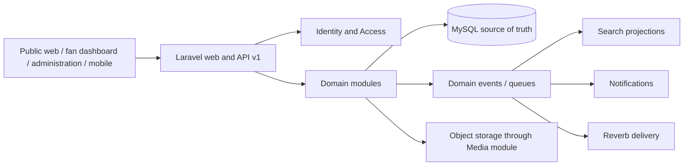

# Platform Architecture

## Selected style

The platform is a **single-deployment modular monolith**: one Laravel application, one relational database, domain-owned tables and namespaces, synchronous calls through explicit domain interfaces, and asynchronous integration through recorded domain events. Multiple universes are catalog data, not tenants. No module may bypass another module's write actions to mutate its tables.

## Repository-specific conventions

| Concern         | Selected convention                                                                                                                 | Use / avoid                                                                                                | Repository example                                           |
| --------------- | ----------------------------------------------------------------------------------------------------------------------------------- | ---------------------------------------------------------------------------------------------------------- | ------------------------------------------------------------ |
| Namespace       | `App\\Domain\\{Module}` for domain actions, queries, events, values; existing `App\\Models` may remain during incremental migration | Group new product behavior by owner; do not package each module or create service providers without need   | `App\\Domain\\Catalog\\Actions\\PublishWork`                 |
| Models          | Persistence, casts, relationships, local scopes only                                                                                | Keep orchestration out of models                                                                           | `Universe` retains relationships; publication uses an action |
| Actions         | One transactional command with policy-aware caller                                                                                  | Mutating use cases; not simple reads                                                                       | `ApproveRevision`, `SendMessage`                             |
| Queries         | Dedicated query objects for reusable filtering/pagination                                                                           | Complex lists/search; not a repository wrapper around every Eloquent call                                  | `VisibleWorksForViewer`                                      |
| Services        | Stateless domain calculation spanning entities                                                                                      | Spoiler decision, rights decision; never request state in Octane singleton                                 | `SpoilerVisibilityService`                                   |
| Validation      | Form Requests at HTTP boundary plus invariants in actions/value objects                                                             | Never trust frontend or API token ability alone                                                            | catalog work request validates type and parent compatibility |
| API             | `/api/v1`, Resources, existing envelope/request ID, cursor pagination for feeds                                                     | No raw models or breaking v1 changes                                                                       | `WorkResource`, `MessageResource`                            |
| Authorization   | policies for records, gates for global capabilities, verified middleware                                                            | UI visibility is only convenience                                                                          | existing `UniversePolicy`                                    |
| Transactions    | One transaction per aggregate mutation; dispatch after commit                                                                       | Never hold a transaction across storage/network calls                                                      | revision approval then `ContentPublished` after commit       |
| Events          | Past-tense immutable facts with scalar IDs; listeners idempotent                                                                    | Cross-module reactions, not hidden synchronous invariants                                                  | `WorkPublished`, `ViewingProgressUpdated`                    |
| Jobs            | queues for media, indexing, deliveries, digests and imports                                                                         | Never queue authorization decisions or primary writes without idempotency                                  | `IndexSearchDocument`                                        |
| Audit           | existing `AuditLogger`; security/editorial/moderation/rights events required                                                        | No secrets, raw message bodies, IPs, or arbitrary PII                                                      | `editorial.revision_approved`                                |
| Errors          | domain exceptions mapped to stable API codes; safe Inertia validation/errors                                                        | Never expose SQL or internal exception text                                                                | existing v1 exception contract                               |
| Enums           | PHP backed enums, lowercase stable DB/API values                                                                                    | Stable finite workflow values; avoid native DB enum for frequently evolving taxonomies in later migrations | `PublicationStatus` evolves via a new editorial enum         |
| Values          | immutable classes for spoiler boundary, canonical URL, rights decision, cursor                                                      | Invariant-rich concepts; avoid ceremony for IDs                                                            | `SpoilerDecision`                                            |
| Storage         | private-by-default object storage; Media owns derivatives and signed access                                                         | Never accept user-controlled disk/path or rehost third-party video                                         | media asset plus external embed records                      |
| Cache           | cache projections only with tagged/versioned invalidation when supported                                                            | Never cache authorization without user/version key                                                         | public work page by revision ID                              |
| Pagination      | cursor for feeds/messages/activity; length-aware for bounded admin lists                                                            | Never unbounded collections                                                                                | `(published_at,id)` feed cursor                              |
| Rate limits     | named limits per risk and actor/device/IP                                                                                           | Writes, search, messages, uploads, auth; not a single global limit                                         | builds on `api-v1` and `api-v1-public`                       |
| Deletion        | soft delete user-facing mutable content; archive editorial catalog; hard delete disposable pivots                                   | Legal/audit evidence is restricted/retained, not cascaded away                                             | a work archives; a reaction hard-deletes                     |
| Privacy         | collect minimum data, scoped moderator views, documented retention                                                                  | No presence heartbeat history or private message text in analytics                                         | yearly recap uses aggregates                                 |
| Localization    | base record plus `{entity}_translations(locale, ...)` for public editorial text                                                     | Do not put every translation in JSON                                                                       | `work_translations`                                          |
| Testing         | Pest feature tests for policy/workflow/API and unit tests for decisions; factories only rights-safe synthetic data                  | No copyrighted fixtures                                                                                    | spoiler decision matrix                                      |
| Frontend typing | Wayfinder for routes, explicit Resource/Page prop TS types, generated schemas only after a chosen tool                              | No handwritten hardcoded URLs                                                                              | existing `@/actions`, `@/routes` pattern                     |

## Communication rules

Synchronous dependencies point toward foundations: all modules may depend on Identity authorization and Platform audit; product modules may read Catalog identifiers; Spoiler Safety may read Catalog and User Journey; Search and Notifications consume published events and call policy/spoiler projections. Community does not write Catalog or Lore. Messaging, Watch Rooms, and Case Boards reference stable IDs and expose their own actions. Cross-module database foreign keys are allowed for durable identity/catalog references, but cross-module writes are forbidden.

The web, API, jobs, and broadcasts call the same application actions. Mobile receives no privileged alternate path. Search indexes and notification payloads are rebuildable projections; MySQL remains authoritative.

## Non-goals

No microservices, event sourcing, CQRS read database, graph database, multi-tenancy, paid search vendor, automatic third-party ingestion, or copyrighted media hosting is selected. These require measured scale or legal/operational evidence.
