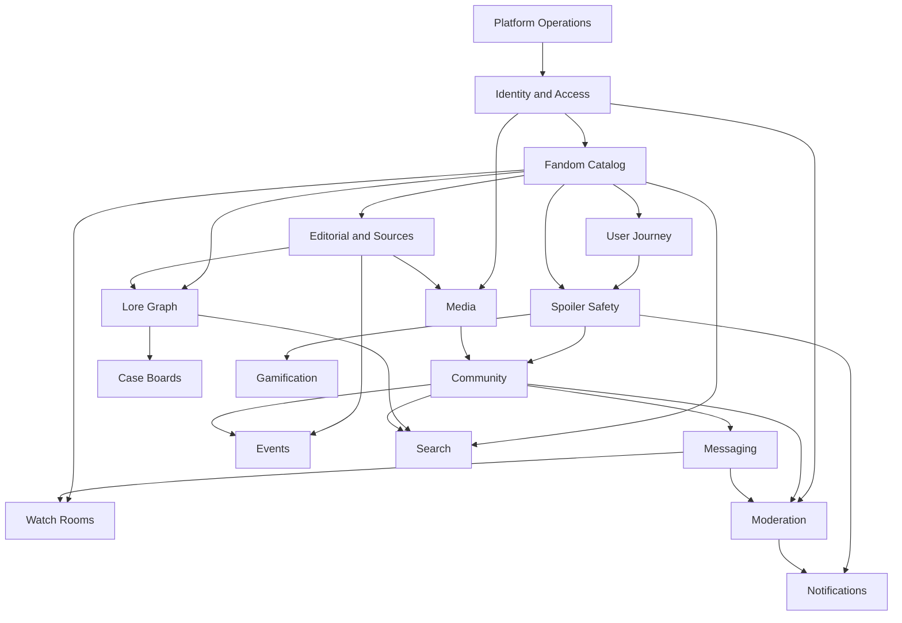

# Module Boundaries

The platform has 17 modules. “Interface” means an application action/query contract, not a remote service.

| Module                   | Owns                                                                                        | Allowed dependencies                                          | Forbidden dependencies                                | Public interfaces and events                                               | Security / scale boundary                                                                |
| ------------------------ | ------------------------------------------------------------------------------------------- | ------------------------------------------------------------- | ----------------------------------------------------- | -------------------------------------------------------------------------- | ---------------------------------------------------------------------------------------- |
| Identity and Access      | users, profiles, roles, permissions, privacy, blocks, mutes, restrictions, sessions/tokens  | Platform Operations                                           | product-table writes                                  | `CanUser`, `BlockUser`; `UserRestricted`, `UserBlocked`                    | policies, verified state, least-data moderator views; hot block checks cached by version |
| Fandom Catalog           | universes, franchises, works, seasons, episodes, releases, orders, translations             | Identity, Editorial                                           | Community writes                                      | `PublishWork`, `ResolveViewingOrder`; `WorkPublished`                      | public/draft policy; read-heavy cached projections                                       |
| Lore and Knowledge Graph | lore entities/extensions, aliases, appearances, relationship assertions, timelines          | Catalog, Editorial, Spoilers                                  | Community claims becoming canon directly              | `TraverseRelationships`, `ApproveClaim`; `LoreEntityPublished`             | reviewed assertions; indexed adjacency traversal                                         |
| Editorial and Sources    | sources, licenses, citations, claims, revisions, reviews, publication, rights/takedown      | Identity, Catalog identifiers, Platform audit                 | granting unknown rights; moderation replacement       | `SubmitRevision`, `RightsDecision`; `ContentPublished`, `RightsRestricted` | contributor/reviewer separation; immutable attribution trail                             |
| Spoiler Safety           | constraints, boundaries, visibility decisions, corrections                                  | Catalog, User Journey                                         | frontend-only decisions                               | `DecideVisibility`; `SpoilerClassificationChanged`                         | backend redaction before serialization; conservative unknown fallback                    |
| Media                    | assets, embeds, variants, attribution, processing/moderation                                | Identity, Editorial                                           | domain publication decisions; remote video downloads  | `AttachMedia`, `AuthorizeMedia`; `MediaReady`, `MediaRestricted`           | signed private access, MIME/size validation, async processing                            |
| User Journey             | progress, rewatches, watchlists, ratings, favourites, notes, preferences, recap aggregates  | Identity, Catalog, Lore IDs                                   | editorial status changes                              | `RecordProgress`, `Favourite`; `ViewingProgressUpdated`                    | owner/private policies; high-volume keyed upserts                                        |
| Community                | posts, comments, reactions, polls, tags, mentions, feeds, Bunkers                           | Identity, Spoilers, Media, Moderation interfaces              | platform role mutation; Catalog/Lore writes           | `PublishPost`, `JoinBunker`; `PostPublished`, `MentionCreated`             | membership/visibility policies; cursor feeds and anti-spam                               |
| Messaging and Presence   | conversations, participants, messages, versions, receipts, persistent attachments/reactions | Identity blocks/mutes, Media, Moderation                      | ephemeral heartbeat persistence; bypassing membership | `SendMessage`, `MarkRead`; `MessageSent`                                   | participant authorization on every request/channel; partition-ready messages             |
| Watch Rooms              | rooms, sessions, participants, invites, sync snapshots, reactions, polls                    | Identity, Catalog, Messaging room conversation                | hosting/control of copyrighted playback               | `JoinRoom`, `UpdatePlayback`; `RoomStateChanged`                           | host/moderator roles; ephemeral high-rate sync via Reverb                                |
| Case Boards and Theories | boards, collaborators, evidence, connections, layout, revisions, publication                | Identity, Catalog/Lore references, Editorial citations, Media | asserting fan theory as canon                         | `UpdateBoard`, `PublishTheory`; `BoardPublished`                           | board membership and immutable published revisions                                       |
| Gamification             | quizzes, attempts, achievements, XP ledger, challenges, streaks                             | Identity, Catalog/Lore, Spoilers                              | editable executable business logic                    | `SubmitAttempt`, `AwardAchievement`; `ExperienceAwarded`                   | server scoring, idempotent awards, anti-cheat/rate limits                                |
| Events                   | event records, venues, schedules, guests, attendance, itineraries, meetups                  | Identity, Editorial sources, Community/Media references       | ticket sales unless separately authorized             | `VerifyEvent`, `AttendEvent`; `EventPublished`                             | provenance labels, meetup safety and scoped visibility                                   |
| Moderation and Trust     | reports, cases, evidence, actions, restrictions, appeals, assignments                       | Identity, all subject IDs, Platform audit                     | unrestricted browsing of unrelated private data       | `ReportSubject`, `ApplyRestriction`; `ContentRestricted`, `AppealDecided`  | case-scoped access, immutable evidence hashes, dual control for severe actions           |
| Notifications            | stable notification records, preferences, channel deliveries/digests/devices                | Identity, Spoilers; consumes events                           | using PHP serialized class as client contract         | `Notify`, `MarkRead`; `NotificationDelivered`                              | spoiler-safe rendering before persistence/delivery; retry isolation                      |
| Search and Discovery     | search documents, suggestions, trends, analytics projections                                | consumes public events; Spoilers/Policies at query            | source-of-truth writes                                | `Search`, `Reindex`; `SearchPerformed`                                     | permission/spoiler filters before results; eventual consistency                          |
| Platform Operations      | flags, settings, audit logs, analytics events, health/job diagnostics                       | none                                                          | product semantics hidden in settings/flags            | `RecordAudit`, `ReadSetting`; operational events                           | administrator-only, privacy retention, no request state in Octane singleton              |

## Acyclic dependency shape

Arrows mean “may depend on.” Notifications and Search primarily consume after-commit events; they must not become prerequisites for source-domain commits. Where the diagram visually suggests a later module feeding an earlier concern (for example moderation restricting community), the integration occurs through Identity restrictions or a source-module visibility projection, not direct reverse table mutation.
