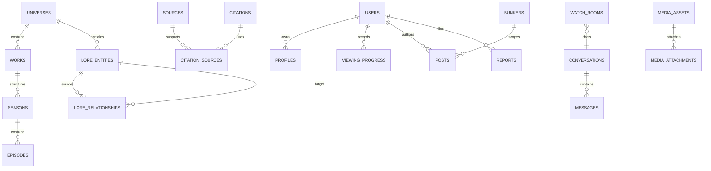
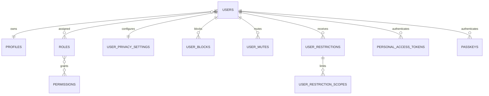

# Database Schema

This is the canonical table inventory. Specialized documents define behavior; if wording differs, this inventory and the ADRs control naming. It proposes **179 domain-owned tables** (including existing foundation/auth product tables, excluding framework cache/queue/password-reset infrastructure).

## Global conventions

- Primary keys: unsigned bigint `id`, preserving Prompt 2. Public APIs expose opaque IDs and slugs; add UUID public identifiers only where enumeration risk or offline creation proves it necessary.
- Foreign keys: singular `{model}_id`; actor fields `created_by`, `updated_by`; `restrictOnDelete` for durable catalog/editorial parents, `nullOnDelete` for actor attribution, cascade only for disposable children/pivots.
- Time: database/application UTC; `timestamp` instants, `date` source publication dates, and explicit IANA `timezone` for local event schedules.
- State: PHP string-backed enums. Workflow tables use indexed `status`; changing native MySQL enums requires an explicit migration, so new high-change workflows should prefer validated strings.
- Slugs: unique within the user-facing parent (`unique(universe_id, slug)`); universe slugs remain globally unique.
- Ordering: integer `position`, unique within parent where stable; viewing order uses decimal/position plus a tie-breaking ID.
- JSON: only flexible provider metadata, immutable event payload fragments, revision patches, or layout/config; never primary relationships, rights decisions, spoiler boundaries, or business rules.
- Soft delete: posts, comments, messages, media, boards, Bunkers, events, and user-authored notes. Catalog/editorial roots use `archived_at` and publication state. Audit, moderation actions, XP ledger, citations, and revisions are append-only/restricted.
- Concurrency: `lock_version` on editorial roots, boards, rooms, and mutable moderation cases; updates compare-and-increment. Message/order allocation uses transactions.
- Morphs: only `citations`, `media_attachments`, `spoiler_constraints`, `reports`, `content_restrictions`, `audit_logs`, `reactions`, `bookmarks`, and `mentions`, with a stable `Relation::enforceMorphMap()` alias and allowlisted target registry.

## Canonical inventory and scale

| Module (count)          | Tables                                                                                                                                                                                                                                                                                                                                                                                                   | Highest-volume/index/deletion notes                                                                                                                                                                                                                        |
| ----------------------- | -------------------------------------------------------------------------------------------------------------------------------------------------------------------------------------------------------------------------------------------------------------------------------------------------------------------------------------------------------------------------------------------------------- | ---------------------------------------------------------------------------------------------------------------------------------------------------------------------------------------------------------------------------------------------------------- |
| Identity (13)           | `users`, `profiles`, `roles`, `permissions`, `role_user`, `permission_role`, `user_privacy_settings`, `user_blocks`, `user_mutes`, `user_restrictions`, `user_restriction_scopes`, `personal_access_tokens`, `passkeys`                                                                                                                                                                                  | Unique normalized email; unique role pivots; `(blocker_user_id, blocked_user_id)` unique; active restrictions indexed by `(user_id, starts_at, ends_at)`; sessions remain framework infrastructure. User deletion pseudonymizes durable authored records.  |
| Catalog (16)            | `universes`, `franchises`, `universe_franchise`, `works`, `work_translations`, `work_relations`, `series_details`, `seasons`, `season_translations`, `episodes`, `episode_translations`, `releases`, `collections`, `collection_work`, `viewing_orders`, `viewing_order_items`                                                                                                                           | Public lookups `(universe_id,status,published_at,id)`; scoped slug/locale uniques; episode unique `(season_id,episode_number)` when numbered and `(work_id,absolute_number)`; parents restrict delete and archive.                                         |
| Lore (18)               | `lore_entities`, `lore_entity_translations`, `lore_aliases`, `character_details`, `performer_details`, `location_details`, `artifact_details`, `organization_details`, `lore_event_details`, `concept_details`, `entity_taxonomies`, `entity_taxonomy_items`, `entity_appearances`, `relationship_types`, `relationship_type_rules`, `lore_relationships`, `timeline_entries`, `timeline_entry_entities` | Root `(universe_id,type,status,slug)`; aliases `(universe_id,normalized_name)`; graph adjacency `(source_entity_id,type_id,status,target_entity_id)` and reverse equivalent; timeline `(universe_id,sort_key,id)`. Archive roots, restrict reviewed edges. |
| Editorial (13)          | `content_licenses`, `sources`, `source_rights_reviews`, `citations`, `citation_sources`, `structured_claims`, `editorial_revisions`, `revision_blocks`, `revision_items`, `review_assignments`, `editorial_actions`, `publication_schedules`, `takedown_records`                                                                                                                                         | Canonical URL hash index; citation target composite; revision unique `(revisable_type,revisable_id,revision_number)`; actions append-only; rights/takedown restrict deletion.                                                                              |
| Spoilers (4)            | `spoiler_constraints`, `spoiler_boundaries`, `spoiler_corrections`, `spoiler_visibility_overrides`                                                                                                                                                                                                                                                                                                       | Constraint target composite plus `(universe_id,severity)`; boundaries indexed by work/season/episode; overrides expire and are audited.                                                                                                                    |
| Media (5)               | `media_assets`, `media_variants`, `external_embeds`, `media_attachments`, `media_processing_jobs`                                                                                                                                                                                                                                                                                                        | Checksum and owner/status; attachment target composite; variants unique `(media_asset_id,purpose,format)`; soft delete assets, retain takedown evidence.                                                                                                   |
| User Journey (12)       | `viewing_sessions`, `viewing_progress`, `watchlists`, `watchlist_items`, `ratings`, `favourites`, `personal_notes`, `saved_theories`, `user_fandom_preferences`, `user_spoiler_preferences`, `activity_events`, `annual_recaps`                                                                                                                                                                          | Progress unique `(user_id,viewing_session_id,work_id,episode_id)` with null-safe application invariant; owner cursors `(user_id,updated_at,id)`; activity partition/prune candidate.                                                                       |
| Community (19)          | `posts`, `comments`, `reactions`, `bookmarks`, `polls`, `poll_options`, `poll_votes`, `tags`, `taggables`, `mentions`, `link_previews`, `bunkers`, `bunker_memberships`, `bunker_join_requests`, `bunker_invitations`, `bunker_bans`, `bunker_rules`, `bunker_categories`, `bunker_category`                                                                                                             | Feed `(visibility,status,published_at,id)` and `(bunker_id,published_at,id)`; comments `(post_id,parent_id,created_at,id)`; unique actor reaction/bookmark/vote; soft delete authored content.                                                             |
| Messaging (8)           | `conversations`, `conversation_participants`, `messages`, `message_versions`, `message_reactions`, `message_receipts`, `message_mentions`, `conversation_mutes`                                                                                                                                                                                                                                          | Message cursor `(conversation_id,id)`; idempotency unique `(sender_user_id,client_message_id)`; participant unique; receipts store latest read message, not one row per read event.                                                                        |
| Watch Rooms (10)        | `watch_rooms`, `watch_room_sessions`, `watch_room_participants`, `watch_room_invitations`, `watch_room_bans`, `watch_room_playback_snapshots`, `watch_room_reactions`, `watch_room_polls`, `watch_room_poll_options`, `watch_room_poll_votes`                                                                                                                                                            | Active room `(status,scheduled_at,id)`; participant unique; periodic snapshots retained briefly; reactions aggregate/prune. Chat is a conversation FK, not duplicate messages.                                                                             |
| Case Boards (8)         | `case_boards`, `case_board_collaborators`, `case_board_nodes`, `case_board_node_layouts`, `case_board_connections`, `case_board_revisions`, `theory_publications`, `case_board_comments`                                                                                                                                                                                                                 | Collaborator unique; nodes by board; connections validate same board; layout separated and versioned; published revision immutable.                                                                                                                        |
| Gamification (14)       | `quiz_categories`, `quizzes`, `quiz_questions`, `quiz_answer_options`, `quiz_attempts`, `quiz_attempt_answers`, `achievements`, `user_achievements`, `experience_ledger`, `ranks`, `challenges`, `challenge_participations`, `user_streaks`, `leaderboard_snapshots`                                                                                                                                     | Attempt owner/date; award idempotency key unique; XP append-only; leaderboard is rebuildable snapshot.                                                                                                                                                     |
| Events (13)             | `event_types`, `events`, `venues`, `event_schedules`, `event_sessions`, `event_guests`, `event_organizers`, `event_attendance`, `personal_itineraries`, `itinerary_items`, `event_announcements`, `event_bunker_links`, `meetups`                                                                                                                                                                        | `(starts_at,status,id)`, geography/provider filters; attendance unique; schedules restrict parent deletion; source/verification required for “official.”                                                                                                   |
| Moderation (11)         | `report_categories`, `reports`, `report_evidence`, `moderation_cases`, `moderation_case_assignments`, `moderation_actions`, `content_restrictions`, `appeals`, `appeal_decisions`, `copyright_notices`, `trust_signals`                                                                                                                                                                                  | Queue `(status,priority,created_at,id)`; subject/report composite; actions/decisions append-only; evidence restricted and retained by policy.                                                                                                              |
| Notifications (5)       | `notifications`, `notification_preferences`, `digest_preferences`, `notification_deliveries`, `push_devices`                                                                                                                                                                                                                                                                                             | Inbox `(user_id,read_at,created_at,id)`; stable `type` and schema version; delivery retry index; revoke/pseudonymize device tokens.                                                                                                                        |
| Search (4)              | `search_documents`, `search_suggestions`, `trending_snapshots`, `search_queries`                                                                                                                                                                                                                                                                                                                         | Unique source target; FULLTEXT title/body where supported plus type/universe/visibility/spoiler filters; analytics minimized and pruned.                                                                                                                   |
| Platform Operations (6) | `feature_flags`, `feature_flag_assignments`, `settings`, `audit_logs`, `analytics_events`, `system_diagnostics`                                                                                                                                                                                                                                                                                          | Setting/flag key unique; audit `(event,created_at,id)` and subject composite; diagnostics short retention; no secrets in values.                                                                                                                           |

## Shared publication fields

Editorially publishable roots use `status`, `owner_user_id` or `created_by`, `current_revision_id`, `submitted_at`, `approved_at`, `approved_by`, `scheduled_at`, `published_at`, `unpublished_at`, `archived_at`, `restricted_at`, `removed_at`, `lock_version`, and timestamps as applicable. User-generated posts use the smaller community lifecycle and moderation state; sources/media/relationships use their specialized review statuses rather than pretending all workflows are identical.

## Simplified platform ER

## Identity and access ER

Detailed readable ER diagrams are kept in each domain document rather than one field-dense diagram.

## Prompt 4 implemented Catalog subset

The first Catalog implementation creates only `franchises`, `works`, `work_translations`, `series_details`, `seasons`, and `episodes`, reusing `universes`. It uses scoped slug/locale/numbering uniques, restricted durable parents, nullable actor attribution, publication/visibility/archive indexes, deterministic position indexes, and `lock_version` on works. The remaining ten Catalog inventory tables are still architectural reservations, not implemented schema.
