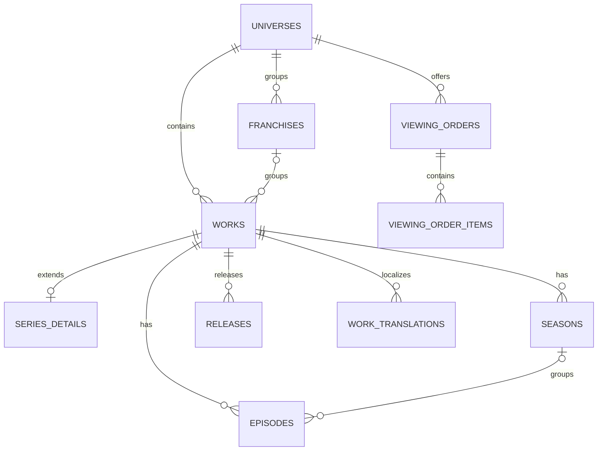

# Fandom Catalog

## Model

`Universe` is the broad continuity/community root. `Franchise` is an optional commercial/editorial grouping. `Work` is a released creative work typed `series`, `film`, `book`, `comic`, `game`, `special`, or `other`. A series uses `series_details`, `seasons`, and `episodes`; films/books/games remain works until real type-specific attributes justify extension tables. `work_relations` handles sequel, prequel, adaptation, crossover, spinoff, and alternate-version links. Collections are curated groupings; viewing orders are ordered editorial paths and never redefine canonical parentage.

## Core columns and rules

| Table                    | Important columns / constraints                                                                                                                                                                                                                                                                         |
| ------------------------ | ------------------------------------------------------------------------------------------------------------------------------------------------------------------------------------------------------------------------------------------------------------------------------------------------------- |
| `works`                  | `universe_id` required, nullable `franchise_id`, `type`, scoped `slug`, original title/language, summary, runtime minutes nullable, release/production status, canon classification, publication fields, lock version; unique `(universe_id,slug)`, indexes on `(universe_id,type,status,published_at)` |
| `series_details`         | unique `work_id`, format (`television`, `streaming`, etc.), start/end years, default episode order; only series works                                                                                                                                                                                   |
| `seasons`                | `work_id`, kind (`season`, `volume`, `arc`), number nullable, display title, position, publication fields; unique numbered season per work                                                                                                                                                              |
| `episodes`               | `work_id`, nullable `season_id`, episode/absolute numbers nullable, production code, runtime, air/release date, special flag, position, publication fields; specials may omit season but always belong to a work                                                                                        |
| `releases`               | work or episode FK (exactly one), region, locale, release type, date/time, platform label, external identifier; no provider playback credentials                                                                                                                                                        |
| translations             | parent, BCP-47 locale, localized title/summary/slug; unique parent+locale and scoped public slug                                                                                                                                                                                                        |
| `viewing_orders` / items | universe, name, purpose, version/status; item references exactly one work or episode, position and optional note                                                                                                                                                                                        |

Validation rejects season/episode children for non-series works, negative runtime/numbering, duplicate production codes within a work when present, cross-universe parentage, and publication without an approved revision and rights/source minimum. Dates may be unknown; unknown is `NULL`, never a fabricated date. Metadata is limited to non-query provider facts with a documented schema.

Policies: public reads require published ancestors; contributors draft; reviewers approve/publish; rights restrictions override publication; administrators manage taxonomy/settings but do not bypass rights silently. Every submit/approve/publish/archive/reorder action is audited.

Common lists use keyset pagination `(published_at,id)` and eager-load bounded translations. Canonical/display/absolute numbering are separate columns; no computation assumes one series or one global chronology.

## Prompt 4 lifecycle clarification

Catalog roots use `draft`, `published`, and `archived` in the bounded first implementation. Archive is a retained business state and remains separate from exceptional hard deletion. Catalog roots do not use `SoftDeletes`: durable parent foreign keys restrict deletion, child-bearing roots must be archived, and public scopes require published non-archived ancestors. The later editorial phase may add submitted/review/approved/unpublished/restricted states through an explicit migration rather than implying them before revisions and rights review exist.
