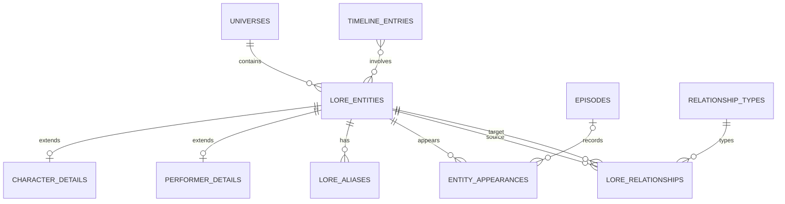

# Lore and Knowledge Graph

## Entity strategy

`lore_entities` is the stable root (`universe_id`, type, slug, canonical name, summary, canon/status/publication fields). Extension tables store type invariants. Aliases and translations are rows, not JSON. Taxonomies represent species/creature classes and other controlled classifications; they do not replace entities that need biographies, appearances, or relationships.

Characters, performers, locations, artifacts (including weapons), organizations, lore events, and concepts have dedicated extension tables. Spells, rituals, symbols, vehicles, creatures, and species begin as typed entities with taxonomy links; add an extension only when validated structured fields emerge. Alternate versions are explicit `work_relations` or lore relationships, not duplicate names hidden in metadata.

## Claims, appearances, and graph

`entity_appearances` explicitly links a lore entity to a work/episode with kind (`appearance`, `mention`, `archive`, `portrayal`) and review/citation/spoiler state. `relationship_types` defines key, forward/inverse labels, direction/symmetry and transitivity policy. `relationship_type_rules` allow source/target type combinations. `lore_relationships` has real `source_entity_id` and `target_entity_id` FKs, type, temporal work/episode bounds, canon status, confidence, editorial state, dispute reason, and spoiler constraint.

Symmetric edges are stored once with canonical lower-ID ordering. Directed inverse text is presentation metadata, not a second row. Multiple sources attach through citations. “Portrayed by” uses lore entities for performer and character; it may also be exposed through a convenience query.

Adjacency indexes support “outgoing by type/status” and “incoming by type/status.” Two-hop queries fetch approved neighbors in two bounded queries or a recursive CTE with depth/row limits. Example: character → `used` → artifact; artifact → `owned_by` → character. Timeline queries order an explicit sortable chronology key within a universe, while retaining uncertain/display dates separately.

No graph assertion is public until approved. Disputed edges remain visible only under an explicit editorial presentation policy. Source/citation, spoiler, media, revision, moderation, and audit hooks attach at the assertion/entity level.
