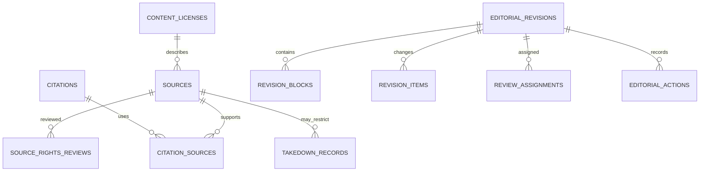

# Editorial, Sources, Rights, and Revisions

## Sources and citations

Existing `sources` remains the external provenance record. Extend types to official canon, official promotional, interview, reference, community, theory, user submission, embedded media, social, and unknown. Store canonical/source URLs, URL hash, title, creator, publisher, publication/access dates, review state, attribution, and provenance; do not copy full third-party works.

`citations` targets an allowlisted record through a morph map and optionally names a field, revision block, structured claim, locator/page/timecode, short quotation, and explanatory note. `citation_sources` supports multiple ordered supporting or contradicting sources. Structured claims and graph assertions receive their own citations. Quotes are minimal, justified, attributed, and rights-reviewed.

## Rights

`content_licenses` remains reusable license/reference data. `source_rights_reviews` records copyright owner, reviewer, evidence, and tri-state (`allowed`, `prohibited`, `unknown`) hosting, embedding, commercial, derivative, and attribution decisions plus expiry. `unknown` always evaluates as denied for hosting/derivatives. Link-only factual citation may remain possible where policy permits. `takedown_records` restrict the affected source/media/content without erasing audit/provenance.

## Workflows

Editorial roots use: `draft → submitted → under_review → changes_requested → approved → scheduled → published → unpublished/archived`; `rejected`, `restricted`, and `removed` are terminal/review states with restoration actions. Community uses draft/scheduled/published/hidden/removed; media uses pending/processing/ready/rejected/restricted; sources use pending/verified/rejected/restricted; graph assertions use draft/review/approved/disputed/rejected/restricted. Do not reuse one enum where transitions or permissions differ.

Contributors own drafts. Reviewers receive `review_assignments`, add private notes, request changes, approve, and schedule. The final approver cannot be inferred from ownership; high-risk rights changes may require a second reviewer. Administrators can operate workflow but every bypass is explicit and audited. User submissions never become canon merely because they are published as community content.

Revisions store metadata and JSON Patch-like changed scalar fields, large `revision_blocks` for text, and `revision_items` for structured child operations. Approval checks optimistic lock version, applies in one transaction, records `editorial_actions`, advances the current revision, and publishes events after commit. Rejected revisions stay attributable and private.

## Prompt 5 implementation

The Catalog slice now implements revision metadata, field-registry scalar items, checksum-backed plain-text blocks, one-active-primary review assignments, immutable `editorial_actions`, normalized citations/source links, and append-only `source_rights_reviews`. Approval revalidates source, rights, and spoiler requirements; application locks the revision and target and increments one Catalog version. Rights remain independent per use type and only an unexpired `allowed` assessment permits the selected use. Private assignment, reviewer, and legal notes are never present in normal API Resources or audit metadata.

## Prompt 6 implementation

Lore entities, translations, aliases, appearances, relationships, timelines, and timeline entries are added to the existing revision and citation allowlists. The field registry exposes only approved Lore content fields and application revalidates Lore/Catalog ownership inside the existing row-locked transaction. Relationship citations use the existing `citations` and `citation_sources`; tri-state rights history remains unchanged and no relationship-evidence source duplicate is created.
