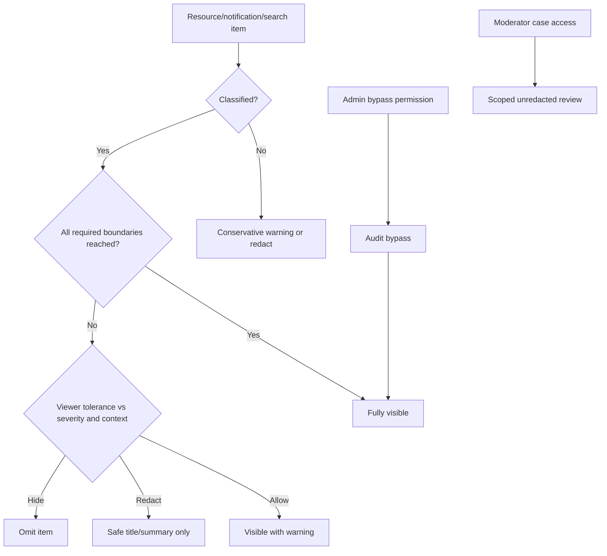
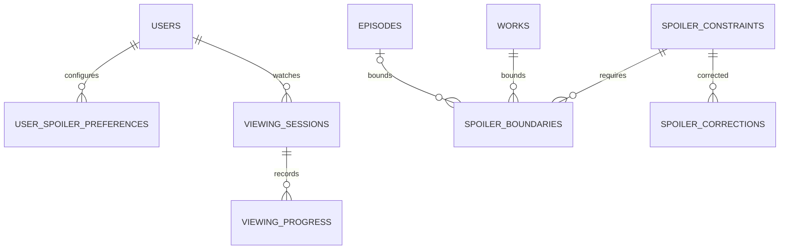

# Spoiler System

## Classification

Severity values become `none`, `minor`, `moderate`, `major`, and `finale`; Prompt 2 `mild/major/critical` data receives an explicit migration map later. A constraint has a universe, allowlisted subject, severity, optional custom warning, classification status/reviewer, and one or more normalized `spoiler_boundaries` referencing the earliest safe work, season, and/or episode under a named viewing order. Missing classification is conservative, not “safe.”

Users hold per-universe tolerance and warning preferences plus viewing sessions/progress. Rewatch sessions are distinct; the active spoiler basis may be “furthest completed across sessions” or a user-selected session. A boundary is satisfied only when the user has reached it in the applicable work/order. Cross-series content may require all listed boundaries (`all`) or any (`any`) as explicitly configured.

## Backend decision

| Context                    | Enforcement                                                                                                                                       |
| -------------------------- | ------------------------------------------------------------------------------------------------------------------------------------------------- |
| Pages/API                  | query candidates, authorize, decide, then Resource returns full/safe/omitted representation                                                       |
| Search                     | classification fields in search document; filter before rank/pagination; safe snippet generated server-side                                       |
| Notification/email/push    | persist safe preview selected for recipient at dispatch; never put spoiler text in push fallback                                                  |
| Community/chat/watch rooms | sender declares boundary; automated/default classification; recipient delivery/resource redacts. Encrypted content is not claimed supported.      |
| Quiz/case board/AI         | question, answer/explanation, node, claim, and generated answer each carry constraints; AI retrieval excludes unsafe source text before prompting |

Frontend blur may improve interaction but never receives protected fields in redacted mode. Moderator corrections create append-only `spoiler_corrections`; temporary overrides expire and are audited. Batch progress/constraint loading avoids per-item queries.

