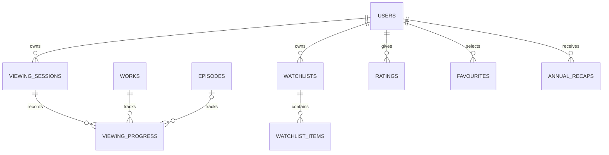

# User Journey and Personalization

`viewing_sessions` identifies first-watch/rewatch/import sessions per user and universe. `viewing_progress` uses one upserted row per user/session/work/episode (episode nullable for work-level media), storing state, position/duration where meaningful, completed timestamp, source (`manual`, `playback`, `import`), and updated time. Season completion is derived/projected, not duplicated per click. Manual correction updates the row and emits an audited progress event; imports retain batch provenance.

Watchlists are named/private collections with ordered unique items. Ratings use integer scale and unique user+target; favourites use an allowlisted morph for work/lore targets; notes are private by default and soft deleted. Saved theories reference published theory/board records rather than copying text. Bookmarks belong to Community but appear in journey queries.

Per-universe fandom and spoiler preferences are normalized rows. Profile/privacy settings control whether progress, favourites, ratings, and recap are private, followers-only (if a following module is later approved), or public. The API defaults to owner-only unless a policy explicitly releases a projection.

`activity_events` contains privacy-minimized stable event types and subject IDs, not arbitrary payload dumps. `annual_recaps` are rebuildable aggregates with schema version, period, visibility, and generated timestamp; deleting underlying private events triggers recomputation or removal under retention policy.

High-frequency progress writes debounce client-side but remain idempotent server-side; the server accepts a monotonic client timestamp/version and rejects stale overwrites. Progress APIs use bulk endpoints with bounded item counts for mobile/offline reconciliation.

## Prompt 8 implementation

Viewing orders remain Catalog-owned and contain allowlisted work, season, or episode targets. User Journey uses `user_viewing_journeys` for the selected order/lifecycle, `rewatch_cycles` for isolated repeats, `viewing_progress_events` for append-only knowledge/correction history, and a null-safe owner/cycle/scope key for current progress. The previously reserved saved-theory/activity/recap rows remain deferred capabilities rather than implemented tables.

Personal APIs are owner-only and force private visibility. Search personalization joins current progress at query time and never enters shared projections. Account deletion removes all current and historical journey rows; a future export can group those same rows into current-state and historical sections without copying protected Catalog text.

## Prompt 14 onboarding integration

Onboarding composes User Journey rather than extending its domain schema. Fandom-preference row presence represents selected universe interest; supported visibility fields remain private; the existing spoiler preference and `RecordViewingProgress` actions own their writes. The workflow row stores only the current sequential step/version. No Journey is automatically created and no public personal projection is introduced.
