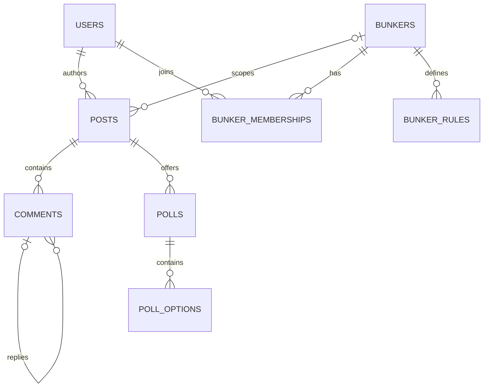

# Community and Bunkers

Posts belong to an author and optionally a Bunker; they carry lifecycle, visibility, spoiler constraint, current revision, publication timestamps, and moderation state. Comments use adjacency-list `parent_id` plus `depth` and `root_id`; enforce a bounded nesting depth and paginate siblings by `(created_at,id)`. Reactions/bookmarks are allowlisted morphs with unique actor+type+target. Poll options and votes are relational and votes are transactionally unique. Tags are curated/sluggable; mentions are resolved user references, never raw notification instructions. Link previews store sanitized fetched metadata with strict SSRF controls and expiry.

Bunkers are fan-created groups with `public`, `private`, or `invite_only` access. Membership roles are owner, administrator, moderator, and member, scoped only to the Bunker. Platform roles grant platform capabilities; Bunker roles grant authority inside one group; authorship controls ordinary edits; platform moderators may intervene only under platform policy and audited cases. A Bunker owner cannot grant platform permissions.

Membership, request, invitation, ban, rules, category, and visibility tables are explicit. Bunker chat references a Messaging conversation; events reference Events records; media uses attachments. Feed queries use cursor pagination and composite visibility/status/published indexes; denormalized counters are cacheable projections, never authorization sources.

All public UGC requires verified identity, rate limits, spoiler declaration/default, reportability, ownership policy, edit history, and moderation readiness. Private group visibility is enforced before query pagination and media URL generation.

## Prompt 10 implementation

The persistent slice uses canonical names except deferred `link_previews`. Bunker and post attachments reuse Media; comments have no attachment target. Feeds are chronological cursor queries. Private Bunkers return 404 to non-members. Local membership roles remain separate from platform roles, and Community events are scalar after-commit facts without Reverb broadcasting.

Prompt 11 adds mutual block enforcement to mentions, targeted replies, reactions, and invitations, plus authenticated feed suppression for active blocks/mutes. Blocks do not remove shared membership or become local bans; join requests remain available through normal authorized reviewers. Mutes never change authorization or member lists.
