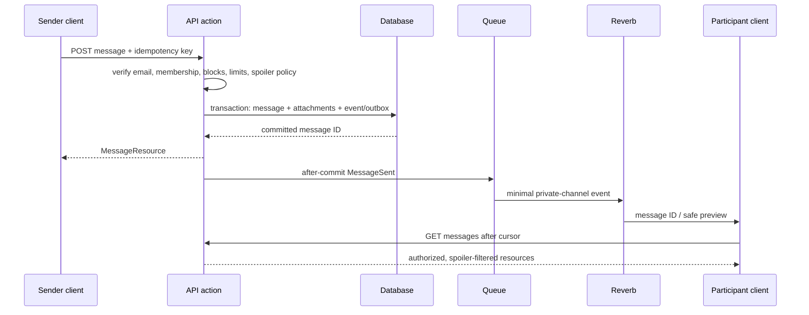
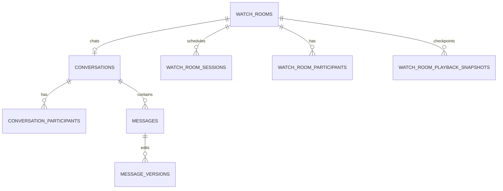

# Messaging, Presence, and Watch Rooms

## Persistent messaging

Conversations are `direct`, `group`, `bunker`, `watch_room`, or `system`. Participants carry role, joined/left state and latest read message. Direct conversation uniqueness is maintained by a normalized participant-pair key. Messages use monotonic bigint IDs, sender, reply ID, body format, status, moderation state, edit/delete timestamps, and client idempotency key. Versions preserve edited bodies; attachments go through Media; receipts store delivered/read positions only where product policy requires them.

Blocks prevent new direct messages and channel authorization; mutes suppress delivery/notifications but do not silently leave membership. “Delete for me” is participant state; “remove for everyone” tombstones under policy; account deletion pseudonymizes authorship where retention/moderation requires it. Typing and presence use short-lived Reverb/client state and are never database history.

Prompt 11 provides the canonical `InteractionSafetyEvaluator`. Prompt 12 must call it before direct conversation creation, message send, participant search, channel authorization, presence, typing, and receipt disclosure. Either-direction blocks deny with a generic error; existing history remains; group membership is not corrupted. Mutes do not authorize or deny sending and affect optional delivery only. Mandatory moderation messages bypass suppression.

## Watch rooms

Rooms reference a legal work/episode and optionally an external provider link; the platform never hosts, retransmits, controls, or bypasses provider playback. Room, scheduled session, participants, invitations, bans, periodic playback snapshots, reactions, and polls are persisted. High-frequency play/pause/seek ticks are authorized ephemeral events; the host periodically commits `(state,position_seconds,occurred_at,sequence)` so reconnecting clients recover. Chat is one persistent conversation.

Channel authorization loads active participant membership on every subscription. Host/moderator actions are rate limited and sequenced; clients discard stale sequence numbers. Room reaction details may be pruned after aggregate summaries. Attachments, reports, and bans follow Media/Moderation policies.

