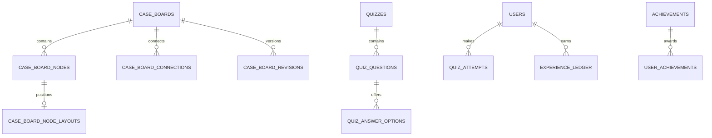

# Case Boards and Gamification

## Case boards and theories

Boards have owner, universe, visibility, status, spoiler policy, lock version, and current published revision. Collaborators have viewer/editor/moderator roles. Nodes are typed text notes, lore/work references, media references, or external links. `case_board_node_layouts` holds x/y/size/color/view data separately from claim content. Connections link nodes in the same board and carry label/evidence status.

Confirmed facts must reference approved lore/structured claims and citations; speculation is explicitly `theory`. A board publication freezes a revision and never upgrades speculative claims into catalog canon. Forking creates a new board with provenance to the source revision; it does not share mutable nodes. Comments and moderation are reportable.

## Quizzes and achievements

Quizzes/categories/questions/options are editorially reviewed. Correctness is stored as structured option/answer configuration; server actions score immutable quiz revisions. Questions, options, answers, and explanations each may have spoiler constraints, with unsafe answers withheld before an attempt and unsafe explanation after scoring according to viewer decision.

Attempts and answers are immutable after submission. Achievements name code-owned criterion handlers or a small versioned structured rule vocabulary; no PHP/SQL/executable expression is stored in the database. Event handlers issue append-only `experience_ledger` rows using an idempotency key. Ranks are threshold reference data, challenges are curated configurations, streak updates use user-local day boundaries but store UTC instants, and leaderboards are rebuildable snapshots with anti-cheat exclusions.

