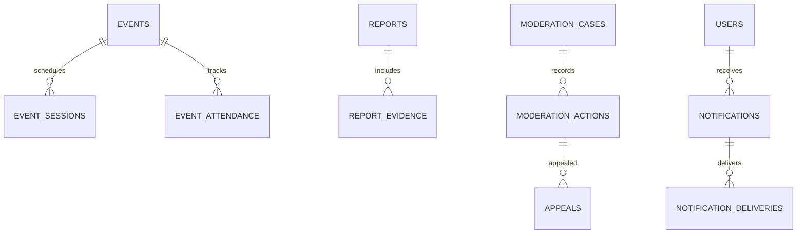

# Events, Moderation, and Notifications

## Events

Events distinguish `official`, `community_submitted`, and `meetup`. Official claims require verified sources and reviewer state; community submissions show provenance; meetups identify their user organizer and safety/reporting controls. Venues hold reusable public location fields, not private home addresses. Schedules/sessions/guests/organizers are relational; external ticket URLs are labeled links only—the platform is not a seller. Attendance and itineraries are private by default. Event Bunkers/chats link to their owning modules.

## Moderation and appeals

Reports use an allowlisted subject morph because the workflow is genuinely cross-domain; report categories are controlled taxonomy. Evidence rows store safe descriptions, media IDs, immutable hashes/snapshots only when policy permits, and access classification. A moderation case groups reports and assignments. Actions are append-only and may create dedicated Identity user restrictions or polymorphic content restrictions. Copyright notices and takedowns retain a dedicated structure because legal fields/visibility differ.

Moderators see case-relevant evidence only. Private messages require a report/case and scoped retrieval; there is no global moderator inbox browser. Severe/permanent restrictions may require administrator or second-reviewer approval. User-visible reasons are separated from internal notes. Appeals reference an action, have deadlines/status, and receive an attributable decision by someone other than the original moderator where feasible.

## Notifications

`notifications` stores recipient, stable type, schema version, actor/subject identifiers, spoiler-safe title/body/route data, read/expiry times—not a serialized PHP notification class. Laravel Notifications remains the delivery adapter. `notification_deliveries` records channel, state, attempts, provider identifier, last error code and retry time. Preferences are type/channel rows; digest preferences carry timezone/frequency; push devices store encrypted/revocable tokens and platform metadata.

Every channel renders from a stable notification data object after authorization, block/mute, preference, and spoiler evaluation. Email/push never contains more sensitive content than in-app. Retries are idempotent and bounded.

Prompt 9 implements the minimum case workflow, Identity capability restrictions, public-content restrictions, appeals, and stable in-app/email records. Report/action/appeal facts and selected Editorial, Media, Journey-completion events feed one queued after-commit notification consumer. Payloads are scalar and allowlisted; rendering is per recipient. Viewing progress, sessions, playback positions, personal notes, and reporter identity never enter notifications or Reverb. Digest and push infrastructure remains deferred.

