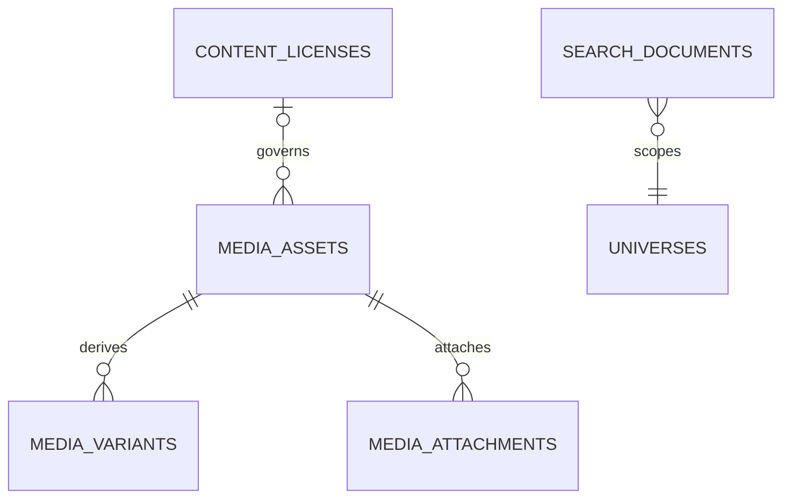

# Search, Discovery, and Media

## Search evolution

`search_documents` is a rebuildable projection keyed by allowlisted source type/ID with universe, title, normalized body, locale, status, visibility, spoiler severity/boundary summary, popularity and timestamps. MySQL FULLTEXT is used where supported; SQLite tests use deterministic fallback matching. Filters cover universe/type/work/canon/locale and source-specific facets. Slug lookup remains direct relational lookup, not search.

Autocomplete begins with prefix-matched approved titles/aliases and cached suggestions. Trending snapshots aggregate privacy-minimized events with abuse resistance. Search query analytics omit raw identity where unnecessary and have short retention. Permission, draft, moderation, and spoiler filters happen before pagination; result snippets are safe projections.

Index jobs consume after-commit publish/update/restrict events and are idempotent. Nightly/manual reconciliation can rebuild a type/universe range. Eventual consistency is acceptable for additions; restrictions/takedowns synchronously mark search documents hidden before asynchronous deletion. Introduce Scout plus a selected engine only at ADR 0010 thresholds.

## Media

Hosted files use `media_assets`: owner, storage disk/key, original name (private), MIME detected server-side, size, dimensions/duration, checksum, processing/moderation/visibility, rights/license/attribution, and deletion/takedown fields. Variants represent thumbnails/optimized outputs. Attachments map assets to allowlisted subjects with purpose, position, alt text and caption.

External video/audio uses `external_embeds` with provider, provider ID, canonical/embed URL, allowlisted embed parameters, rights review and availability status. Never store arbitrary HTML, download remote video, or imply provider authorization. Future 3D assets require explicit MIME/format/security review and are not enabled by a generic upload endpoint.

Uploads are private quarantine first; validate claimed and detected MIME, extension, size, dimensions, decompression limits, checksum, ownership assertion and rights. Queue transformations; publish only ready/moderated assets. Signed URLs are issued after target policy checks. Public repository fixtures must be original generated geometric/placeholder assets or clearly redistributable licensed files with attribution; never copyrighted fandom media.

## Prompt 7 implementation

The five Media and four Search inventory tables are implemented without an external dependency. Uploads enter the private configured disk with server-owned keys and validation; variants/processing remain lifecycle-only. Provider URLs are parsed locally through the YouTube/Vimeo/Spotify/SoundCloud allowlist and never fetched. Media publication requires explicit moderation plus independent effective rights.

Relational projections cover public universe, franchise, work, season, episode, Lore entity, and timeline records with published locale rows and safe aliases. After-commit scalar-ID events refresh/remove projections idempotently. `search:rebuild` provides bounded dry-run/upsert/prune reconciliation. Matching is portable normalized token/title ranking; no typo tolerance or semantic search is claimed. Raw query text and user identity are not stored.

## Prompt 8 implementation

Authenticated Search results may include the viewer's exact current progress status and basis points. Candidate scope keys are joined in one private query after global candidates are selected. Guests receive no personal-state keys. Progress never changes the shared document, suggestion, query-analytics row, or global ranking.

## Prompt 10 implementation

Media attachments now allow `bunker` and `community_post` targets through existing rights, moderation, publication, universe, restriction, ordering, and spoiler gates. Comment media and Community Search projections remain deferred. Search receives no private Bunker, bookmark, reaction, vote, or Journey data.
