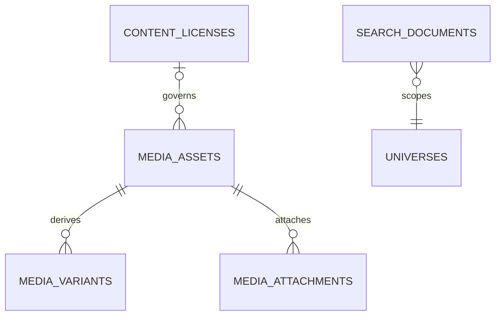

# Search, Discovery, and Media

## Search evolution

`search_documents` is a rebuildable projection keyed by allowlisted source type/ID with universe, title, normalized body, locale, status, visibility, spoiler severity/boundary summary, popularity and timestamps. MySQL FULLTEXT is used where supported; SQLite tests use deterministic fallback matching. Filters cover universe/type/work/canon/locale and source-specific facets. Slug lookup remains direct relational lookup, not search.

Autocomplete begins with prefix-matched approved titles/aliases and cached suggestions. Trending snapshots aggregate privacy-minimized events with abuse resistance. Search query analytics omit raw identity where unnecessary and have short retention. Permission, draft, moderation, and spoiler filters happen before pagination; result snippets are safe projections.

Index jobs consume after-commit publish/update/restrict events and are idempotent. Nightly/manual reconciliation can rebuild a type/universe range. Eventual consistency is acceptable for additions; restrictions/takedowns synchronously mark search documents hidden before asynchronous deletion. Introduce Scout plus a selected engine only at ADR 0010 thresholds.

## Media

Hosted files use `media_assets`: owner, storage disk/key, original name (private), MIME detected server-side, size, dimensions/duration, checksum, processing/moderation/visibility, rights/license/attribution, and deletion/takedown fields. Variants represent thumbnails/optimized outputs. Attachments map assets to allowlisted subjects with purpose, position, alt text and caption.

External video/audio uses `external_embeds` with provider, provider ID, canonical/embed URL, allowlisted embed parameters, rights review and availability status. Never store arbitrary HTML, download remote video, or imply provider authorization. Future 3D assets require explicit MIME/format/security review and are not enabled by a generic upload endpoint.

Uploads are private quarantine first; validate claimed and detected MIME, extension, size, dimensions, decompression limits, checksum, ownership assertion and rights. Queue transformations; publish only ready/moderated assets. Signed URLs are issued after target policy checks. Public repository fixtures must be original generated geometric/placeholder assets or clearly redistributable licensed files with attribution; never copyrighted fandom media.

