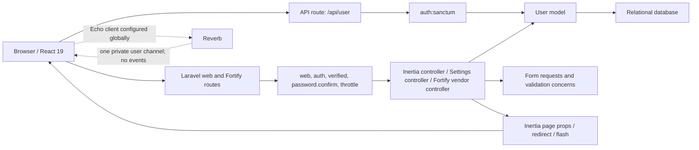
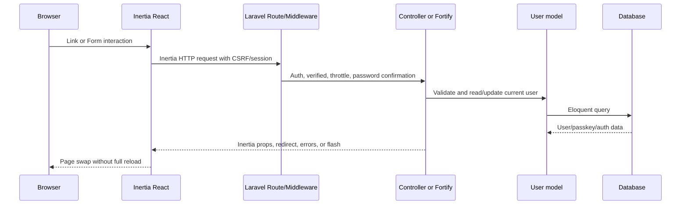
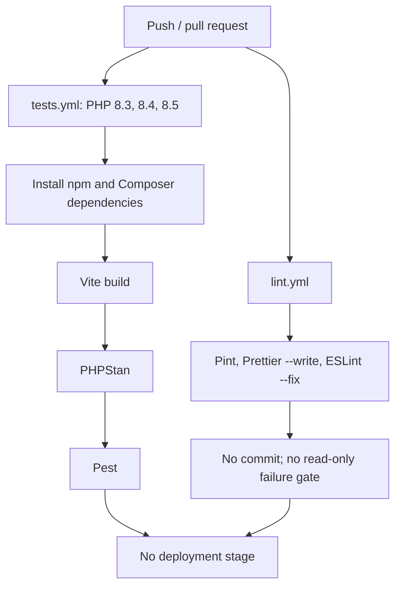

# Repository Audit

## Audit Metadata

- Audit date: 2026-07-12 (Asia/Kolkata)
- Repository root: `/Users/vipertecpro/Herd/supernatural`
- Audit-start branch and commit: `main` at `ec856db74effbec97fe1bcad6a3bf30345237e92`
- Final reconciled branch and commit: `main` at `2f97c64067f0de93e61a68928bfd67e8aac9b23a`
- Scope: the audit-start working tree, including pre-existing modified/untracked files, reconciled against the external commit that landed during the audit
- Method: static repository review, Git metadata inspection, manifest/lock-file inspection, and non-destructive local checks
- Constraint: no product or application code was changed; only the required documentation was created
- Laravel Boost note: Boost is installed, but its repository tools were not exposed to this audit session. Repository files and supported CLI commands were used as evidence.

## Executive Summary

This is the correct website/backend/dashboard repository. It is a fresh Laravel 13 Inertia React starter with a comparatively complete authentication/settings slice, not a NativePHP mobile application. The repository is not yet a fandom platform: it has one domain model (`User`), no reusable fandom content model, no administration or moderation boundary, no community data, and only a raw authenticated `/api/user` endpoint.

The foundation is technically modern and the existing 39 Pest tests pass. A production frontend build also succeeds. It is not yet a reliable architecture baseline because the audit began against extensive pre-existing changes and untracked configuration, repository state changed concurrently during evidence collection, four quality gates fail, email-verification middleware is ineffective while the `User` model omits `MustVerifyEmail`, and public-repository/legal/deployment documentation is absent.

Risk totals: **0 Critical, 4 High, 14 Medium, 5 Low, and 2 Informational**. Architecture work can begin only after Prompt 2 establishes a clean, reproducible, tested platform foundation; feature implementation should not begin directly from this mutable starter state.

## Repository Identity and Git State

- Package identity remains `laravel/react-starter-kit`; the application reports the generic name `Laravel` (`composer.json`, `.env.example`).
- Branch: `main`; no other local branches or remote branches beyond `origin/main` were detected.
- Audit-start commit: `ec856db` (`Configure Boost post-update script`). During the audit, an external process changed `HEAD` to `2f97c64` (`first commit`) and added the previously dirty foundation plus the main audit and inventory files. The auditor did not stage, commit, push, or mutate Git state.
- Final history: five commits: fresh Laravel app, Pest installation, Boost installation, Boost post-update configuration, and `2f97c64`.
- Remote: `origin` points to `git@github.com:vipertecpro/supernatural.git`. GitHub reports `vipertecpro/supernatural` is **public**, with `main` as its default branch.
- Tags/releases: none.
- Audit-start working tree: heavily dirty. It contained deleted skill files, modifications to manifests/bootstrap/frontend primitives, and many untracked skill/config/component files. Important untracked application files included `config/broadcasting.php`, `config/octane.php`, `config/reverb.php`, `config/sanctum.php`, `routes/api.php`, `routes/channels.php`, and the Sanctum migration.
- Final working tree: the external `2f97c64` commit incorporated that foundation. Only the three newly completed deliverables (`01-feature-readiness-matrix.md`, `01-risk-register.md`, and `docs/project/decision-log.md`) remain untracked at final verification; the main audit and inventory are tracked in `2f97c64`.
- Existing product documentation: none. `AGENTS.md` and `CLAUDE.md` are agent instructions, not user/project documentation.
- License: `composer.json` declares MIT, but no `LICENSE` file exists.
- No README, contribution guide, code of conduct, security policy, changelog, issue template, or pull-request template exists.
- `.env`, local SQLite, IDE settings, dependencies, generated Wayfinder helpers, build output, storage views, and the local FrankenPHP binary/worker are ignored (`.gitignore`, `database/.gitignore`).

The repository contains Laravel routes, Inertia pages, authentication, migrations, and dashboard/settings shells. It has no `nativephp` dependency or mobile runtime configuration, confirming that it is not the future mobile repository.

## Current Technology Stack

### Backend

| Area | Current evidence |
| --- | --- |
| Runtime | PHP requirement `^8.3`; audited runtime PHP 8.4.23 |
| Framework | Laravel 13.19.0 (`laravel/framework` locked v13.19.0) |
| Server | Laravel Octane 2.17.5; audited local driver FrankenPHP; config defaults to RoadRunner |
| SPA bridge | Inertia Laravel 3.1.1 |
| Authentication | Fortify 1.37.2, passkeys, TOTP 2FA, password reset, registration |
| API authentication | Sanctum 4.3.2 installed; session guard usable; `User` does not use `HasApiTokens` |
| Real time | Reverb 1.10.2, Echo 2.3.7, Echo React 2.3.7; no application broadcast events |
| Database | Laravel supports SQLite/MySQL/MariaDB/PostgreSQL/SQL Server; audited local environment reports MySQL |
| State drivers | Audited local cache/session/queue: database; broadcast: Reverb |
| Files | Local/public/S3 configuration only; no application media or upload service |
| Mail | Standard Laravel mail configuration; audited local mailer logs mail |
| Testing | Pest 4.7.5, PHPUnit 12 transitively, Mockery, Faker |
| Quality | Larastan 3.10.0/PHPStan level 7, Pint 1.29.3, PAO |
| Development | Boost 2.4.12, Pail, Sail, Tinker |
| Other installed product packages | MCP 0.8.2 and Chisel 0.1.1 are installed but unused by application code |

No search engine, media library, image processor, API documentation, monitoring, error tracking, analytics, repository abstraction, or permissions package is present.

### Frontend

| Area | Current evidence |
| --- | --- |
| Language | Strict TypeScript/TSX (`tsconfig.json`) |
| UI runtime | React 19.2.7, React DOM 19.2.7 |
| SPA framework | `@inertiajs/react` and `@inertiajs/vite` 3.6.1 |
| Styling | Tailwind CSS 4.3.2, CSS variables, light/dark themes, `tw-animate-css` |
| Component system | shadcn configuration plus a mixed Base UI/Radix UI primitive set |
| Forms/navigation | Inertia `Form`, `Link`, and generated Wayfinder route/action helpers |
| Icons/toasts | Lucide React, Sonner |
| Data/table/chart | TanStack Table and Recharts installed; no product usage detected |
| Interaction helpers | date-fns, Embla, Vaul, resizable panels, OTP, day picker |
| Build | Vite 8.1.4, React compiler, Tailwind Vite plugin, Laravel Vite plugin, Bunny font download plugin |
| Quality | ESLint 9, Prettier 3, TypeScript 5.9 |

No frontend test runner, E2E framework, state-management library, 3D/WebGL library, GSAP/Motion package, or accessibility test tool is configured.

### Infrastructure

- GitHub Actions contains test and lint workflows only; there is no deployment workflow.
- `tests.yml` tests PHP 8.3/8.4/8.5, installs npm/Composer dependencies, builds, runs PHPStan, and runs Pest.
- `lint.yml` runs mutating formatter commands (`composer lint`, `npm run format`, `npm run lint`) with `contents: write`, but its commit step is commented out. It does not behave as a read-only quality gate.
- No Docker/Compose file is committed despite Sail being installed.
- No queue worker, scheduler, Reverb, Supervisor/systemd, backup, rollback, release, monitoring, or log-rotation configuration exists.
- `/up` is the only health endpoint.
- `.env.example` documents the base Laravel variables but not Reverb, Octane, Sanctum stateful domains/token prefix, or passkey-specific variables, even though those packages/configurations are active in the current tree.

## Repository Structure

The application follows a small standard Laravel MVC/service-provider layout with page-based Inertia frontend organization:

- `app/Actions/Fortify`: registration and password-reset actions.
- `app/Concerns`: reusable password/profile validation rule traits.
- `app/Http/Controllers/Settings`: profile and security settings controllers.
- `app/Http/Requests/Settings`: settings validation and 2FA state request.
- `app/Http/Middleware`: appearance and shared Inertia props.
- `app/Models/User.php`: the only application model.
- `app/Providers`: application defaults and Fortify configuration/rate limiters.
- `routes`: web/settings/API/broadcast/console routes.
- `database`: six migrations, one factory, one seeder.
- `resources/js/pages`: welcome, dashboard, auth, and settings pages.
- `resources/js/layouts`: public exception, auth, application, and settings layouts.
- `resources/js/components`: application shell/auth components and a large UI primitive catalog.
- `resources/js/actions`, `routes`, `wayfinder`: ignored generated TypeScript route helpers.
- `tests`: Pest feature/auth/settings coverage plus placeholder examples.

There are no domain modules, services, repositories, DTOs, enums, policies, gates, events, listeners, jobs, notifications, mailables, API resources, observers, console command classes, or scheduled tasks.

Apparently dead or premature code includes 34 UI primitives with no imports outside their own folder, installed MCP/Chisel packages with no application references, and Octane/Reverb/Sanctum infrastructure without product workflows. `resources/js/hooks/use-mobile.ts` and `use-mobile.tsx` duplicate the same export with different implementations; module resolution selects the untracked `.ts` first. No TODO/FIXME/HACK/XXX markers were found in application code.

## Existing Product Capabilities

Present capabilities are registration, login/logout, password reset/confirmation/update, passkeys, TOTP 2FA/recovery codes, profile update/deletion, appearance settings, a starter welcome page, an authenticated dashboard shell, one user-private broadcast channel definition, and a session-authenticated user endpoint.

No fandom, catalog, lore, community, chat, admin, moderation, search, media, source attribution, analytics, notification, or mobile-facing product capability exists.

## Current Architecture

The current architecture is conventional Laravel MVC with Fortify actions and a page-based Inertia React client. Business logic is minimal and lives in controllers, Fortify action classes, validation traits, and vendor packages. There is no domain/service layer to assess yet.



### Request and Data Flow

- Validation uses Form Requests for settings and validators inside Fortify actions.
- Authorization is route middleware plus ownership implicit in `$request->user()`. No policies/gates/roles exist.
- API exceptions are rendered as JSON for `api/*` or JSON-expecting requests (`bootstrap/app.php`). There is no custom error envelope.
- API output is the raw authenticated `User` model, relying on model hidden attributes.
- Shared frontend data consists of app name, authenticated user, and sidebar state (`HandleInertiaRequests`).
- Shared types are manually defined in `resources/js/types`; routes/actions are generated by Wayfinder.
- No explicit transactions, domain events, background jobs, or integration abstractions exist.
- Configuration uses standard Laravel `config()`/environment-backed configuration.

### Frontend/Backend Interaction



## Database and Domain Model

### Current schema

- `users`: bigint ID, name, unique email, nullable verification timestamp, hashed password, encrypted 2FA columns, remember token, timestamps.
- `passkeys`: user FK with cascade delete, unique credential ID, JSON credential, optional last-used timestamp, timestamps.
- `personal_access_tokens`: polymorphic token owner, unique 64-character token, abilities, usage/expiry timestamps; no application token issuance and no `HasApiTokens` trait.
- `password_reset_tokens`: email primary key, token, optional creation timestamp; no FK by design.
- `sessions`: string key, nullable indexed user ID without FK, IP/user-agent/payload/activity.
- `cache`, `cache_locks`, `jobs`, `job_batches`, `failed_jobs`: framework infrastructure tables with expected keys/indexes.

```mermaid
erDiagram
    USERS ||--o{ PASSKEYS : owns
    USERS ||--o{ SESSIONS : "may own (no FK)"
    USERS ||--o{ PERSONAL_ACCESS_TOKENS : "tokenable morph"
    USERS {
        bigint id PK
        string email UK
        timestamp email_verified_at nullable
        string password
        text two_factor_secret nullable
        text two_factor_recovery_codes nullable
        timestamp two_factor_confirmed_at nullable
    }
    PASSKEYS {
        bigint id PK
        bigint user_id FK
        string credential_id UK
        json credential
    }
    SESSIONS {
        string id PK
        bigint user_id nullable
        string ip_address nullable
        text user_agent nullable
    }
    PERSONAL_ACCESS_TOKENS {
        bigint id PK
        string tokenable_type
        bigint tokenable_id
        string token UK
        text abilities nullable
    }
    PASSWORD_RESET_TOKENS {
        string email PK
        string token
    }
    CACHE {
        string key PK
    }
    CACHE_LOCKS {
        string key PK
    }
    JOBS {
        bigint id PK
        string queue
    }
    JOB_BATCHES {
        string id PK
    }
    FAILED_JOBS {
        bigint id PK
        string uuid UK
    }
```

The only modeled future area is a partial fan identity (`User`). Every requested fandom/catalog/lore/community/chat/moderation/content area is **Not present**. Notifications have only the `Notifiable` trait, so they are **Partially present** at infrastructure level. API and real-time are likewise **Partially present** as infrastructure, not product architecture. No soft deletes, status enums, audit columns, scopes, observers, polymorphic content relationships, media ownership, source attribution, spoiler metadata, or editorial revision history exists.

There are no current product queries that create N+1 or unbounded-query risks. Future risks cannot be mitigated by the present schema because the relevant entities do not yet exist. The session user reference has no foreign-key integrity. The demo seeder creates `test@example.com` with the factory's predictable `password` password if seeding is run.

## Authentication and Authorization

### Present

- Fortify registration, login/logout, remember-me, password reset, confirmation and update.
- TOTP 2FA with confirmation/recovery codes.
- WebAuthn passkeys with relying-party configuration derived from app URL.
- Login, 2FA, passkey, password-update, and verification notification throttling.
- CSRF/session middleware on web flows and Sanctum guard on `/api/user`.
- Profile update/delete validates current user context and deletion requires current password.

### Findings

- `config/fortify.php` enables email verification and `dashboard`/profile deletion use `verified`, but `app/Models/User.php` has `MustVerifyEmail` commented out and does not implement it. Laravel's verification middleware therefore treats users as not requiring verification. This is a High security/control defect.
- There are no roles, permissions, policies, gates, administrator/moderator models, admin routes, or impersonation controls.
- No social authentication or device/token-management UI exists.
- Sanctum's token table exists, but the user model cannot issue tokens through `HasApiTokens`; mobile token authentication is not implemented.
- Account deletion is an immediate hard delete with no audit record, retention/takedown workflow, or soft-delete recovery.
- No existing application route accepts an arbitrary product resource ID, so no current application IDOR was identified. Future resources require explicit policies and ownership tests.

## API Architecture

The API consists only of `GET /api/user`, protected by `auth:sanctum`, returning the model directly. There is no version prefix, API resource, response envelope, token lifecycle, scopes/abilities, pagination, rate-limit policy beyond the default API stack, OpenAPI documentation, or mobile contract. This is not a reusable public/mobile API foundation.

## Frontend Architecture

- The welcome page is the Laravel starter and bypasses the application layout.
- Auth pages use dedicated card/simple/split layouts; app and settings pages use persistent Inertia layouts.
- Dashboard is placeholder skeleton content; no admin pages exist.
- Reusable auth/settings/sidebar components are present, together with 34 apparently unused UI primitives.
- Tailwind v4 theme tokens support light/dark mode. The current primary palette is red-toned and generic; it is not a deliberate fandom design system.
- Loading is present mainly through buttons/spinners and dashboard skeletons. Error handling uses inline errors and flash toasts. Product empty states are absent because product modules do not exist.
- Semantic headings, labels, `sr-only` text, focus-capable primitives, and theme initialization provide a reasonable starter accessibility base. There is no automated accessibility coverage, skip-link evidence, reduced-motion strategy, or cinematic fallback policy.
- `<Head>` titles exist. Canonical URLs, descriptions, Open Graph, structured data, sitemaps, and content SEO do not.
- The successful build code-splits Inertia pages. Output included 169.17 kB CSS (26.10 kB gzip), 201.40 kB main app JS (59.75 kB gzip), and a 317.86 kB Wayfinder chunk (100.04 kB gzip). These are baseline measurements, not budgets.

The public-page layout separation can support future progressive enhancement. Heavy WebGL/video/3D work should remain isolated to public marketing/content experiences and be dynamically loaded with reduced-motion, low-power, and no-WebGL fallbacks. The fan dashboard should prioritize fast content/community interactions; the admin dashboard should prioritize dense, predictable, accessible CRUD/moderation workflows. No 3D/animation dependency should be selected before those experience boundaries and budgets are defined.

## Real-Time Readiness

Reverb, Echo, and Echo React are installed; broadcasting routes are loaded; a private `App.Models.User.{id}` channel checks ownership; and the React entry point calls `configureEcho`. There are no broadcast events, persisted messages, conversation memberships, read receipts, typing/presence implementations, notifications, attachments, moderation, blocking, muting, anti-spam controls, or real-time tests.

`config/reverb.php` allows `['*']` origins and client events from members, while application-level rate limiting is disabled by default. This is not safe as a production community/chat policy. Echo is also configured for every page, including the public welcome/auth surface, without a product need. Scaling configuration exists but is disabled and requires Redis; queue workers are required for queued broadcasts but no process definition exists.

## Testing and Code Quality

### Existing coverage

- 39 Pest feature/unit tests with 136 assertions pass.
- Coverage focuses on authentication, verification endpoints, password flows, 2FA challenge, dashboard access, profile settings, and security settings.
- Placeholder `ExampleTest` files remain.
- There are no browser, frontend component, E2E, architecture, API contract, real-time, security, accessibility, performance, snapshot, or mobile tests.
- Tests use in-memory SQLite, array cache/session/mail, sync queues, and null broadcasting.

### Check results

| Check | Result | Evidence/impact |
| --- | --- | --- |
| `php artisan test --compact` | Pass | 39 tests, 136 assertions |
| Temporary-output Vite production build | Pass | 2,324 modules transformed |
| TypeScript `tsc --noEmit` | Pass | No type errors |
| `composer validate --strict` | Pass | `composer.json` valid |
| `composer audit` | Pass | No known advisories |
| `npm audit --omit=dev` | Pass | 0 vulnerabilities |
| PHPStan level 7 | Fail | `config/sanctum.php:21`, `explode` receives `bool|string` |
| Pint check | Fail | 12 test files lack the expected final blank line |
| ESLint | Fail | import order in `app.tsx`; hook-effect and spacing errors in shadowing `use-mobile.ts` |
| Prettier check | Fail | `resources/css/app.css`, `resources/js/hooks/use-mobile.ts` |

## Security Findings

- **High:** email verification is configured but not enforced due to the missing model contract.
- **High:** there is no administrator/moderator authorization model or policy baseline.
- **Medium:** Reverb wildcard origins and permissive member client-events policy are unsuitable for production.
- **Medium:** active infrastructure is under-documented in `.env.example`, increasing unsafe environment drift.
- No hardcoded private keys, cloud access keys, tracked `.env`, production credentials, temporary auth bypass, raw SQL, command execution, unsafe upload flow, or application debug endpoint was found.
- `.env` was treated as sensitive and its values were not inspected or reported. Recent Git history contains no tracked `.env`, certificate/key file, SQLite database, or secret-pattern commit found by the safe pattern scan.
- Local `APP_DEBUG` is enabled, as expected for local development. Production configuration cannot be verified because no deployment environment is committed.

## Privacy Findings

- Sessions store IP address, user agent, and payload in the database. No retention, privacy policy, export, audit, consent, or data-classification documentation exists.
- Account deletion is immediate and unaudited. This may conflict with future moderation evidence retention, legal holds, and user-data export/deletion obligations.
- 2FA secrets/recovery codes are handled through Fortify's encrypted traits and hidden model attributes.
- Passkey credential JSON and last-used time are stored, but user-facing privacy/retention documentation is absent.

## Performance Findings

- Current product data access is too small to exhibit N+1 or pagination problems.
- Inertia page code splitting and Vite build output are functioning.
- The baseline includes a relatively large generated Wayfinder chunk and a broad UI/dependency catalog before product features exist.
- No cache policy, search architecture, media pipeline, CDN, image optimization, queue routing, retry policy, or websocket capacity plan exists.
- Octane is active locally under FrankenPHP. No application singleton/static request-state leak was found because there are no custom stateful services, but future services must remain request-scoped.
- The future lore graph, search, chat, notifications, video, 3D, and user-media workloads require explicit data/index/cache/queue/performance budgets in later phases.

## Accessibility Findings

The starter uses accessible primitives, labels, semantic headings, keyboard-oriented component libraries, and `sr-only` text. There is no evidence of automated WCAG testing, manual keyboard/screen-reader review, reduced-motion handling, media captions/transcripts, focus restoration tests, contrast validation, or public cinematic fallback behavior. Accessibility must become a release gate before immersive work.

## DevOps and Deployment



There is no deploy target, environment promotion, migration/rollback strategy, backup, health dependency check, queue/reverb restart, scheduler, release artifact, error monitoring, or log-rotation setup. Actions are pinned to commit SHAs and checkout disables credential persistence, which are positive controls. The lint workflow's write permission and mutating behavior should be corrected before public CI is treated as enforcement.

## Public Repository Readiness

The repository is **already public but is not publication-ready**. It lacks a README, physical license file, contribution guide, code of conduct, security policy, issue/PR templates, changelog/release process, architecture/setup/environment documentation, demo-data policy, ownership, social preview, and funding metadata. Its generic package/app identity also conflicts with the public repository identity.

No committed Supernatural images, logos, video, audio, transcripts, custom fonts, or other franchise media were found. Existing public assets are generic Laravel/favicon assets and are **Safe for public repository** subject to their upstream licenses. Future Supernatural names/marks are **Needs review**; copyrighted media must be **removed/replaced, externally licensed, or represented only by demo placeholders** unless explicit rights exist.

## Copyright and Trademark Risks

- Current repository: no franchise media or copied lore content detected.
- Missing architecture: source attribution, canonical URLs, licenses, creator attribution, embedding/provider metadata, ownership, moderation, approval, revisions, takedown/complaint handling, canon/fan-theory classification, and spoiler metadata.
- No scraper, video downloader, transcript importer, or rehosting code exists.
- The eventual project must distinguish open-source software licensing from content/media rights and avoid implying affiliation or endorsement by rights holders.

## Technical Debt

- Large pre-existing dirty working tree with important foundation files untracked.
- Generic starter identity and placeholder welcome/dashboard content.
- Four failing quality gates.
- Mixed Base UI and Radix UI dependency/component strategy.
- Duplicate `use-mobile` implementations with shadowing behavior.
- 34 apparently unused UI primitives and several unused product packages.
- Email verification contract mismatch.
- API, authorization, real-time, deployment, legal, and documentation foundations absent.

## Blocking Issues

1. Review the concurrent `2f97c64` baseline, confirm it intentionally contains the former dirty working tree, and keep future evidence/feature work on a controlled clean branch without discarding current work.
2. Fix the email-verification contract and prove unverified users cannot reach verified routes.
3. Define tenant/fandom-neutral identity, role/permission, administrator, moderator, and audit boundaries before feature routes are added.
4. Define the reusable universe/source/media/spoiler foundation before creating Supernatural-specific content tables.
5. Make PHPStan, Pint, ESLint, Prettier, TypeScript, build, and Pest consistently pass in read-only CI.
6. Add minimum public-repository, environment, security, licensing, and content-rights documentation.

## Recommended Foundation Decisions

- Keep a Laravel modular monolith with domain-oriented namespaces/modules once the first product domain is added; do not introduce repositories/CQRS without a demonstrated need.
- Treat fandom/universe as first-class data and never hardcode Supernatural identifiers into shared application logic.
- Separate public, fan, and admin route/layout/authorization/performance concerns from the start.
- Use explicit policies and role/permission semantics for every managed or user-owned resource.
- Define source/license/attribution/spoiler/editorial metadata alongside the first content entity, not as a later retrofit.
- Version the API and use resources/contracts before mobile development.
- Persist chat/community state in the database; use Reverb only for delivery/presence, with strict origins/channel authorization/rate limits.
- Keep cinematic dependencies isolated to progressively enhanced public surfaces.

## Recommended Scope for Prompt 2

**Prompt 2 should be: “Stabilize and formalize the reusable platform foundation.”** It should reconcile and commit the intended current dependency/configuration baseline; restore all quality gates; correct email verification; establish fandom-neutral role/permission/admin/moderator and audit boundaries; create the minimum reusable `Universe` plus source/license/spoiler metadata architecture; define a versioned API convention; harden Reverb origins/environment documentation; and add the minimum open-source/security/content-rights documentation. It should explicitly exclude community/chat, immersive design, bulk lore modeling, and Supernatural content ingestion until this baseline passes tests and review.

## Commands Executed

- Git: branch/commit/remotes/status/branches/tags/log/history/file/ignore/object inspection.
- Repository inventory: `rg --files`, `find`, file type/size scans, dependency-use and marker scans.
- Runtime: `php artisan about --only=environment,cache,drivers`, route lists, `channel:list`, `schedule:list`.
- Dependency metadata: `composer show --locked --direct`, `npm ls --depth=0`.
- Quality: `composer validate --strict`, `vendor/bin/pint --test --format agent`, `composer run types:check`, `php artisan test --compact`, `npm run lint:check`, `npm run format:check`, `npm run types:check`.
- Build: `npm run build -- --outDir /tmp/supernatural-audit-build --emptyOutDir`. Vite's Wayfinder plugin regenerated ignored route helpers as part of normal build initialization; no Git-visible application change resulted.
- Advisories: `composer audit --no-interaction`, `npm audit --omit=dev`.
- Safe secret/history scans reported file paths/categories only and never printed secret values.
- Public repository metadata: read-only `gh repo view` for visibility, default branch and canonical URL.

## Commands Not Executed

- No install/update/remove commands, migrations, seeds, database writes, destructive Artisan/Git/filesystem commands, cache rebuilds, queue workers, Reverb server, Octane server, external services, browser tests, load tests, coverage run, or production checks.
- No database schema query was run against the audited local MySQL connection; migrations were treated as schema authority to avoid touching persistent data.
- No live deployment check was possible. Repository visibility was verified read-only through GitHub as public.

## Files Created or Modified

- `docs/audits/01-repository-audit.md`
- `docs/audits/01-repository-inventory.md`
- `docs/audits/01-risk-register.md`
- `docs/audits/01-feature-readiness-matrix.md`
- `docs/project/decision-log.md`

No product, configuration, dependency, migration, test, route, model, controller, or component file was intentionally modified by the auditor. Repository `HEAD` and remote/tracking state changed externally during the audit as documented above.
