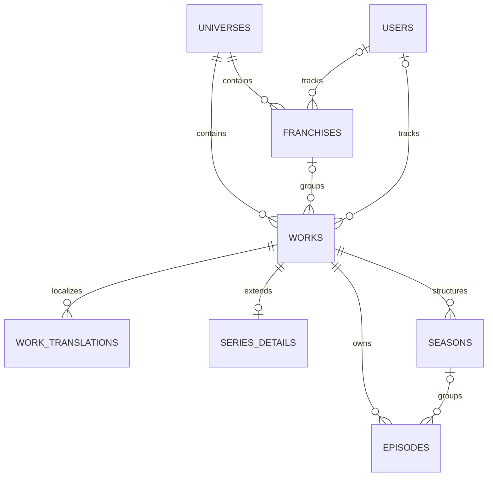
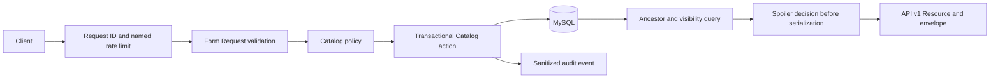

# Catalog Core Implementation

## Implemented scope

Prompt 4 implements only the fandom-neutral Catalog Core: franchises, shared works, localized work text, series details, seasons, and episodes. It adds no lore, community, messaging, media upload, search engine, immersive UI, mobile behavior, seed catalog, external import, or copyrighted franchise content.

## Module layout

- `app/Domain/Catalog/Actions`: aggregate creation, updates, localization upsert, and lifecycle transitions.
- `app/Domain/Catalog/Exceptions`: stable invalid-operation exception.
- `app/Domain/Catalog/Services`: conservative spoiler visibility decision.
- `app/Models`, `app/Enums`, `app/Policies`: persistence, stable values, and record authorization.
- `app/Http/Requests/Api/V1`, `Controllers/Api/V1`, `Resources/Api/V1`: validated API boundary.
- `database/migrations`, `database/factories`: additive schema and synthetic factories.
- `tests/Feature/Catalog`: model/integrity, policy, API, and lifecycle coverage.

## Data model

| Table | Primary invariants and indexes |
| --- | --- |
| `franchises` | FK universe restrict; unique `(universe_id,slug)`; universe/status/publication and ordering indexes; nullable actor FKs set null. |
| `works` | FK universe/franchise restrict; unique `(universe_id,slug)`; universe/type/status/publication, franchise/publication, and visibility indexes; optimistic `lock_version`. |
| `work_translations` | FK work restrict; unique `(work_id,locale)`; locale/status/publication index. |
| `series_details` | Unique restricted `work_id`; status/premiere index; application invariant requires a series work. |
| `seasons` | FK work restrict; unique work slug and nullable work number; work ordering/publication and visibility indexes. |
| `episodes` | Restricted work and nullable season FKs; unique season number, work absolute number, work production code, and work slug; work/season ordering and publication indexes. |

Catalog parents use explicit archival rather than `SoftDeletes`. Restricted foreign keys prevent unsafe cascade deletion. Actor deletion retains records and nulls attribution. Nullable unique numbering permits multiple unnumbered specials while rejecting duplicate known numbers.

## Enums

- Existing `PublicationStatus`: `draft`, `published`, `archived`.
- `WorkType`: `series`, `film`, `book`, `comic`, `game`, `special`, `other`.
- `CanonStatus`: `canon`, `non_canon`, `alternate`, `unknown`.
- `WorkReleaseStatus`: `announced`, `in_production`, `released`, `cancelled`, `unknown`.
- `SeriesStatus`: `announced`, `ongoing`, `completed`, `cancelled`, `hiatus`, `unknown`.
- `SeriesFormat`: `television`, `streaming`, `web`, `audio`, `other`.
- `EpisodeOrder`: `aired`, `production`, `absolute`.
- `SeasonType`: `season`, `volume`, `arc`, `specials`.
- `EpisodeType`: `standard`, `special`, `pilot`, `webisode`, `short`, `other`.
- `DatePrecision`: `day`, `month`, `year`; an unknown date remains `NULL`.

## API v1

Public reads use the existing envelope, request ID, and public limiter:

- `GET /api/v1/universes/{universe}/franchises`, `GET /api/v1/franchises/{franchise}`
- `GET /api/v1/universes/{universe}/works`, `GET /api/v1/works/{work}`
- `GET /api/v1/works/{work}/seasons`, `GET /api/v1/seasons/{season}`
- `GET /api/v1/seasons/{season}/episodes`, `GET /api/v1/episodes/{episode}`

Verified Sanctum writes add create/update, translation upsert, publish, archive, and protected delete endpoints for the same roots. Lists use bounded cursor pagination (`page[size]`, maximum 50), deterministic ordering, and allowlisted filters, sorting, and includes. Unknown filters and sorts return the stable validation envelope. Controllers authorize, invoke actions, and serialize Resources; they do not expose audit metadata or actor IDs.

## Permissions and policies

The added permissions are `catalog.view-drafts`, `catalog.create`, `catalog.update`, `catalog.publish`, `catalog.archive`, and `catalog.delete`. Fans have public read only. Contributors may create and update only their own drafts. Moderators receive no automatic Catalog authority. Administrators receive all Catalog permissions. Policies cover view, create, update, publish, archive, delete, and explicit non-support for restore/force-delete.

## Publication transition matrix

| From | To | Permission | Preconditions |
| --- | --- | --- | --- |
| `draft` | `published` | `catalog.publish` | Universe is public/published; optional franchise and all applicable work/season parents are public/published; validated `is_public` selects public or restricted visibility. |
| `published` | `archived` | `catalog.archive` | Explicit action; record remains stored and becomes non-public. |
| `draft` | `archived` | `catalog.archive` | Explicit action; useful for abandoned drafts. |
| `published` | `published` | denied | Stable `invalid_catalog_transition` conflict. |
| any | hard delete | `catalog.delete` | Only childless roots; durable child relationships require archival instead. |

Publishing a parent never silently publishes children. Archiving a parent does not mutate children, but ancestor-aware public scopes immediately hide them. Full submitted/review/revision workflow remains Prompt 5 work.

## Localization

Locales are normalized to lowercase BCP-47-style hyphen form (`fr_CA` becomes `fr-ca`) and unique per work. Public selection uses the `locale` query parameter, then the first `Accept-Language` value. Only a published exact-locale translation may replace the display title/summary; otherwise the original canonical title, language, and summary are returned. `canonical_title` never changes. Draft translations are never nested in public resources.

## Spoiler behavior

Works, seasons, and episodes opt into the existing polymorphic spoiler concern through an enforced stable morph map. Resources eager-load constraints and decide before serialization. Until viewer progress and normalized boundaries arrive, missing classification or any non-`none` constraint conservatively removes summaries and synopses while retaining safe identity/title fields. Protected text is never sent for frontend-only hiding.

## Audit events

Lifecycle actions record `catalog.{record}_published` and `catalog.{record}_archived`. Additional events cover `catalog.work_type_changed` and protected root deletion. Metadata contains only state, type changes, or a slug for deletion; descriptions, summaries, synopses, credentials, headers, and complete request payloads are excluded and still pass through `AuditLogger` sanitization.

## Migration and rollback

`2026_07_11_215033_create_catalog_core_tables.php` creates the six tables in dependency order and drops them in reverse order. It was applied to the verified local database only after the three Prompt 2 migrations. Rollback validation uses an isolated SQLite database; local MySQL data is never reset or refreshed.

## Deferred catalog functionality

Work relations, season/episode translations, releases, collections, viewing orders, full editorial revisions/approval, normalized spoiler boundaries, rights/citation minimum enforcement, source attachment, search projections, external metadata import, and all frontend CRUD are deliberately deferred.

## Architecture compatibility decision

Prompt 4's checklist mentioned soft deletion for Catalog records, while the canonical Prompt 3 schema and ADRs explicitly select archive-first Catalog roots with restricted parents. The implementation follows Prompt 3: archive is a business state, hard deletion is exceptional and child-protected, and restore is unsupported. The canonical Catalog document and ADR 0003 are clarified accordingly; no new architecture direction was introduced.
