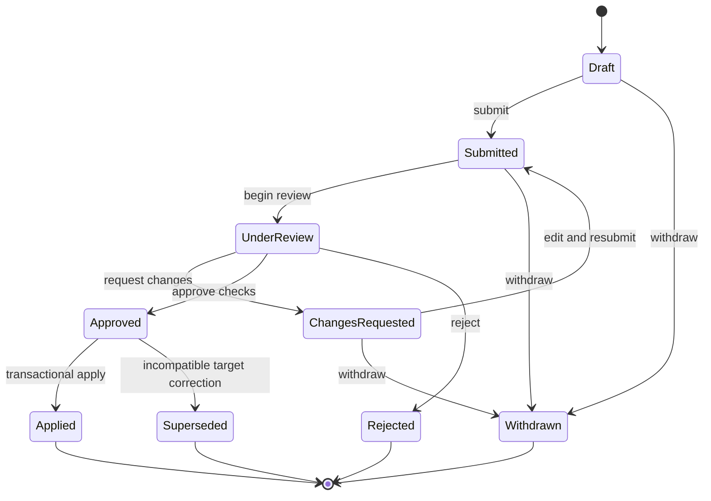
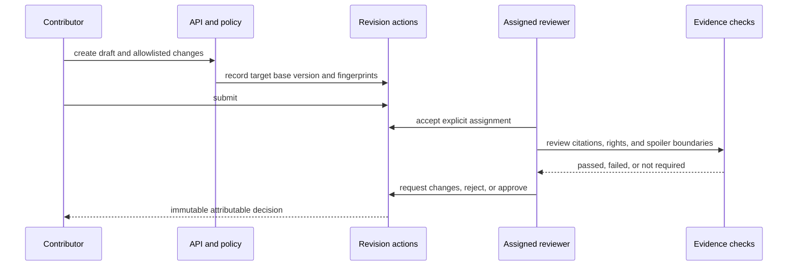
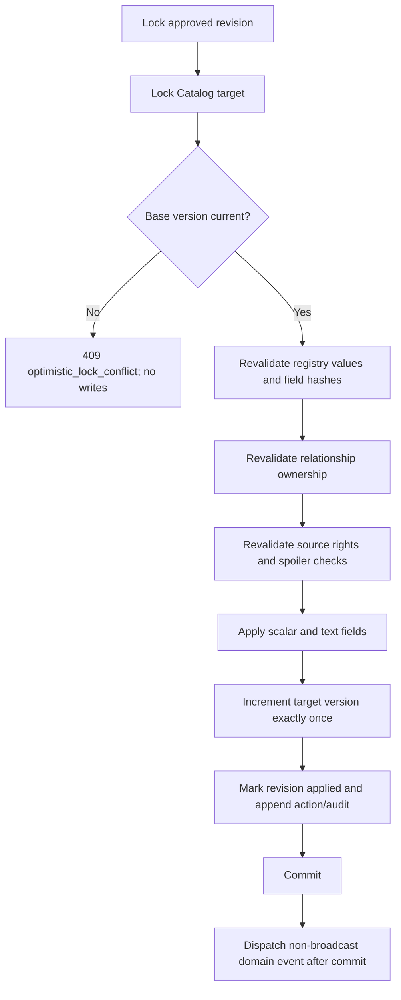
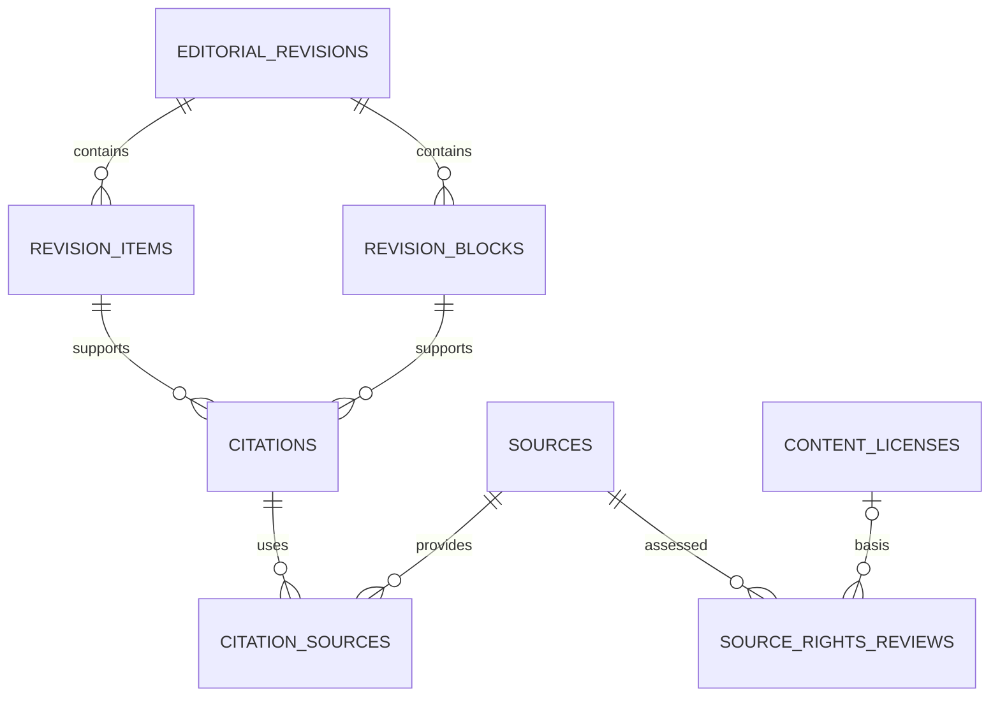
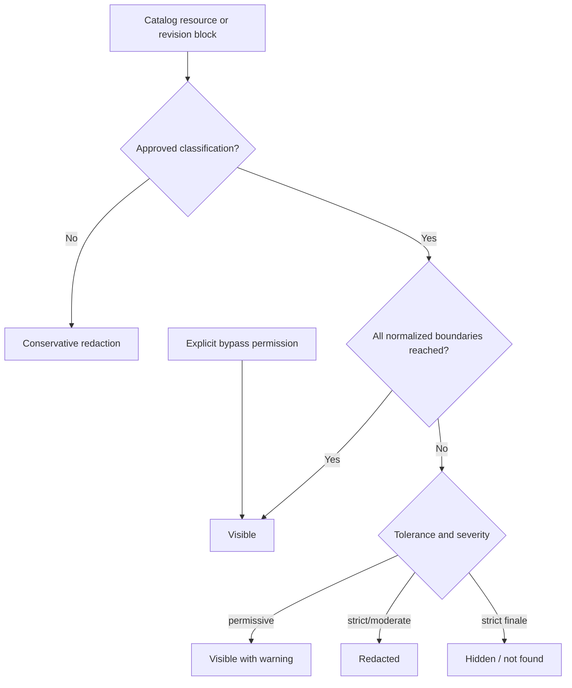
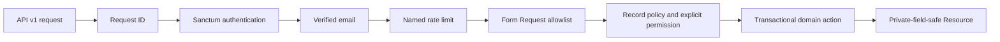

# Catalog Editorial Governance Implementation

## Implemented scope

Prompt 5 adds Catalog-scoped editorial proposals, structured scalar items, plain-text revision blocks, reviewer assignments, immutable decisions, transactional application, normalized citations, append-only tri-state source-rights reviews, normalized spoiler boundaries, minimal viewer spoiler context, backend visibility decisions, optimistic locking, authenticated API v1 actions, audit records, after-commit domain events, factories, and Pest coverage.

It does not add lore, community, messaging, media ingestion, search, notifications, administration UI, mobile behavior, external imports, or a generalized workflow engine.

## Module structure

- `App\Domain\Editorial`: revision, evidence, citation, rights, assignment, decision, and application actions.
- `App\Domain\Spoilers`: normalized boundary validation and classification actions.
- `App\Domain\Catalog`: existing Catalog actions plus optimistic locking and backend visibility evaluation.
- `App\Models`, `App\Enums`, `App\Policies`: persistence, stable workflow values, and explicit permissions.
- `App\Http\Controllers\Api\V1`, requests, and resources: authenticated and verified API boundary.

## Tables and ownership

| Table | Owner | Purpose / key and relationships | Integrity, deletion, volume, retention |
| --- | --- | --- | --- |
| `editorial_revisions` | Editorial | bigint PK; allowlisted `revisable` morph; author; optional parent; target revision number and base version | Unique target/revision number; queue and author indexes; restricted attribution; durable history retained. |
| `revision_items` | Editorial | Field-registry scalar operation and server-generated previous-value fingerprint | Unique revision/field; ordered index; restricted parent; retained with revision. |
| `revision_blocks` | Editorial | Normalized plain text, locale, checksum, source/rights flags | Unique revision/field/locale; 20,000-character ceiling; no HTML/Markdown contract; retained. |
| `review_assignments` | Editorial | Reviewer, assigner, lifecycle timestamps, private assignment note | Composite unique `(revision_id, active_primary_key)` permits one active primary; cancellation retains history. |
| `editorial_actions` | Editorial | Immutable submit/review/decision/apply fact with check results | Append-only ordered decision history; private notes never serialized or audited. |
| `citations` | Editorial | Allowlisted target, field/claim key, locator, short excerpt, evidence and review state | Target/field and queue indexes; 500-character excerpt limit; durable provenance. |
| `citation_sources` | Editorial | Ordered supporting/contradicting Source association | Unique citation/source; source index; restricted deletion prevents orphaned evidence. |
| `source_rights_reviews` | Editorial | Source use type, tri-state decision, basis, actors, expiry, superseded review | Source/use/date index; append-only chain; private legal notes excluded from resources/audits. |
| `spoiler_boundaries` | Spoilers | Constraint plus required work and optional season/episode FKs | Normalized path unique/index; restricted deletion; cross-parent integrity revalidated in action. |
| `spoiler_corrections` | Spoilers | Previous classification and attributable correction reason | Ordered append-only history; sensitive content is not copied. |
| `user_spoiler_preferences` | User Journey | Minimal per-user/per-universe tolerance and warning choice | Unique owner/universe; user/universe cascade; user-controlled state. |
| `viewing_progress` | User Journey | Minimal per-user/per-work highest completed season/episode | Unique owner/work and owner/universe index; normalized Catalog FKs; no ratings, notes, lists, or feeds. |

The migration also adds `lock_version` to franchises, work translations, seasons, and episodes; works already had it. Existing rows receive version `0`. `spoiler_constraints` gains classification/reviewer attribution and maps legacy `mild` to `minor` and `critical` to `finale` without discarding data.

Expected revision/evidence volume is moderate and retained for attribution. Assignments and actions grow with review activity. Viewer preferences/progress are higher-volume owner-keyed rows. No automatic pruning is selected until a legal retention policy is approved.

## Revision lifecycle

| From | Allowed transition | Actor / requirements |
| --- | --- | --- |
| Draft | submit, withdraw | Owner; submit requires at least one item or block. |
| Submitted | assign, begin review, withdraw | Explicit assign permission; reviewer must differ from author. |
| Under review | changes requested, approve, reject | Active assigned reviewer; approval requires all mandatory checks. |
| Changes requested | edit, resubmit, withdraw | Owner; earlier decisions remain immutable. |
| Approved | apply | Explicit apply permission; target and field fingerprints must remain current. |
| Rejected / applied / withdrawn / superseded | none | Immutable terminal record. |

## Review and approval sequence

Community moderators receive no editorial permissions. Reviewers cannot approve their own revisions. Reassignment cancels the active row but preserves it. Approval does not publish; application and Catalog publication remain distinct actions.

## Field registry and text handling

`CatalogEditorialFieldRegistry` is the only source of editable fields. It defines type, validation/normalization, public status, and source/rights/spoiler requirements for franchise, work, work translation, season, and episode targets. Actor IDs, primary keys, lifecycle timestamps, archive/publication state, internal notes, and arbitrary metadata paths are not registered.

Scalar values use `revision_items`. Summary, description, and synopsis values use `revision_blocks`, newline normalization, plain-text format, a server checksum, and 5,000/20,000-character limits. Clients never provide database column names outside the registry and cannot provide executable operations.

## Transactional application

Any exception rolls back target changes, revision state, actions, and audit records. No Reverb broadcast is emitted.

## Source requirement matrix and citations

| Change | Source | Rights | Spoiler |
| --- | --- | --- | --- |
| Canonical/original title, work type/language/status/canon/date/runtime | verified citation | not normally required | no |
| Season/episode title, type, release date, runtime, production code | verified citation | not normally required | no |
| Original editorial summary/description | optional | not required | approved normalized boundary required |
| Long synopsis | verified citation | explicit effective quotation permission | approved normalized boundary required |
| Ordering/display metadata | optional | not required | no |

Contributors cannot mark citations verified. A user with review permission may record a verified citation. Quotes remain short and the application stores no transcript/article body.

## Tri-state rights

Every source/use assessment is `allowed`, `prohibited`, or `unknown`. Only an unexpired `allowed` decision permits the assessed use. Linking, embedding, hosting, attribution, commercial, derivative, redistribution, quotation, thumbnail, and metadata reuse remain independent; no permission implies another. New assessments point to the prior assessment rather than overwriting it.

## Spoiler boundaries and visibility

Boundaries require a work; season must belong to that work; episode must belong to the selected season and work; the work must share the target universe. Draft classifications do not become public. Missing classification redacts. Resources decide before serialization and never return protected summary/synopsis text in redacted mode. Hidden detail endpoints return not found and hidden collection items are filtered before resource serialization.

The early User Journey subset intentionally omits viewing sessions, ratings, favourites, notes, watchlists, recaps, feeds, and rewatch UX. The current projection stores only the highest known path per user/work; richer ordering/session semantics remain deferred.

## API authorization flow

There are 28 editorial routes for revision lists/details/items/blocks/transitions, assignment/review/apply actions, citations, rights assessments, and spoiler boundaries. Lists are cursor paginated and bounded to 50.

## Permissions, audit, and events

Permissions add revision create/view-own/view-all/review/assign/approve/apply, citation management, rights assess/review, and spoiler classify/review/bypass. Contributors receive only create, own-view, and citation capabilities. Administrators receive all. Moderators receive none automatically.

Audit events cover revision creation/submission/resubmission/withdrawal, assignment/reassignment/cancellation, review start/decision/application, optimistic-lock conflict, citation creation, rights assessment/change, and spoiler classification/correction. Metadata contains identifiers, states, versions, and check results only.

`EditorialRevisionSubmitted`, `EditorialRevisionApproved`, and `EditorialRevisionApplied` implement `ShouldDispatchAfterCommit`. They carry scalar IDs, have no listeners yet, and are never broadcast. Notification/search consumers are deferred.

## Migration, rollback, security, and deferred work

The additive migration was inspected, previewed, applied to the verified loopback MySQL development database, and independently rolled forward/back on temporary SQLite. Existing Catalog rows receive version zero. The local database had no Catalog/spoiler rows, so no live backfill was necessary. Legacy severity mappings remain part of the migration.

| Threat | Control |
| --- | --- |
| Arbitrary field patch / mass assignment | Server registry, Form Requests, explicit actions, protected-field omission. |
| Arbitrary morph / IDOR | Enforced morph map, request type allowlists, policy checks, cross-revision checks. |
| Self approval / privilege escalation | Separate author/reviewer invariant and explicit permission seeding. |
| Stale overwrite / race | Integer versions, row locks, field fingerprints, transactions, HTTP 409. |
| Missing or fabricated provenance | Code-owned source matrix and verified citation requirement. |
| Unknown rights treated as approval | Tri-state enum; only current unexpired allowed evaluates true. |
| Private-note leakage | Dedicated private columns omitted from Resources and audit metadata. |
| Spoiler leakage | Backend visibility decision before serialization; hidden filtering and conservative unknown fallback. |
| Oversized copied text / XSS | Plain text only, conservative limits, no HTML/Markdown execution. |

Deferred work includes full User Journey sessions/orders, schedule/publication automation, double-review rules for selected legal risks, takedown integration, notification consumers, reconstruction tooling, UI, and non-Catalog modules. No dependency was added.

## Test coverage

Focused coverage verifies lifecycle, ownership, self-review rejection, reassignment history, immutable decisions, transactional application, exactly-once version increment, stale conflicts, field protection, tri-state rights history, sensitive audit omission, API auth/verification/private-note behavior, seeder idempotency, normalized boundary integrity, missing/draft fallback, tolerance/progress decisions, bypass, redaction, and hidden not-found behavior.
