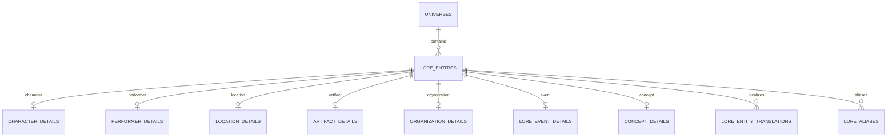
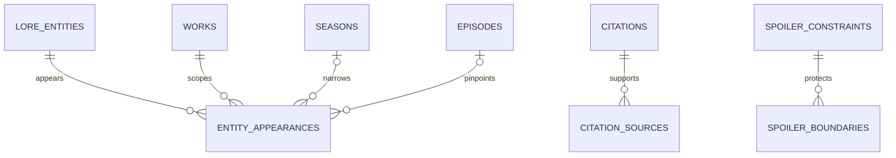
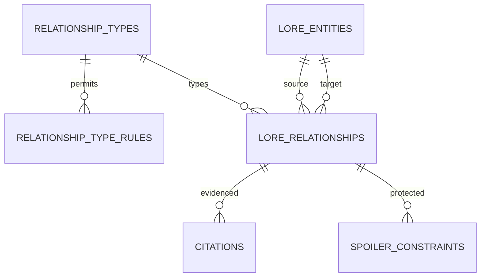
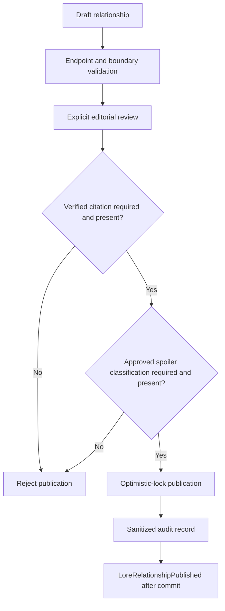
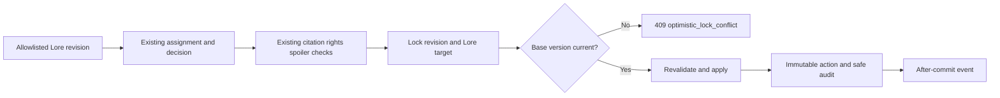
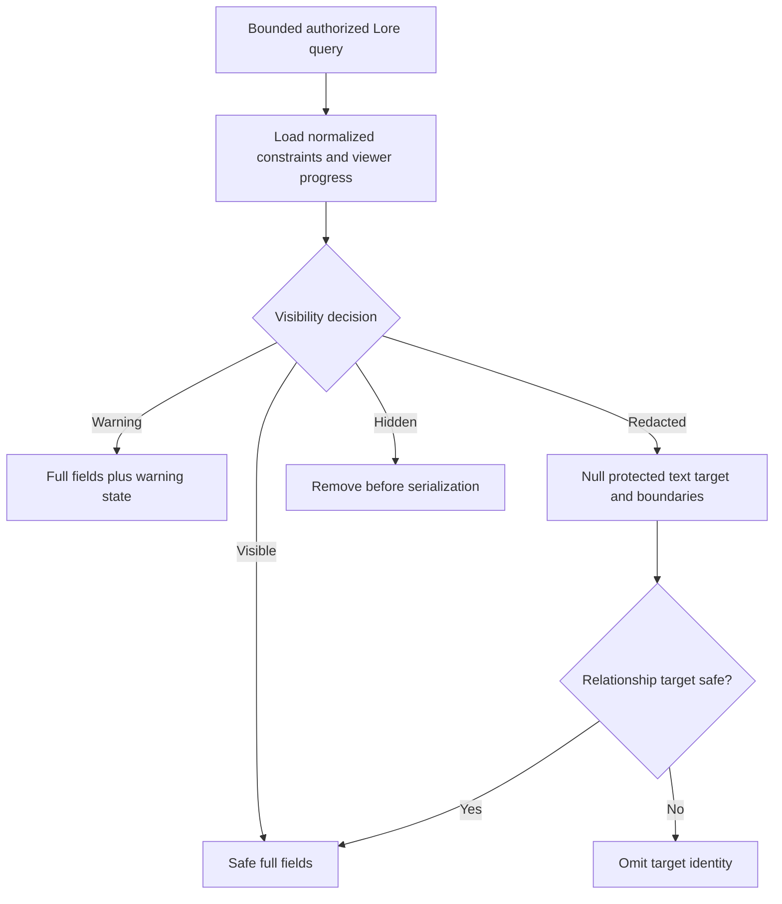
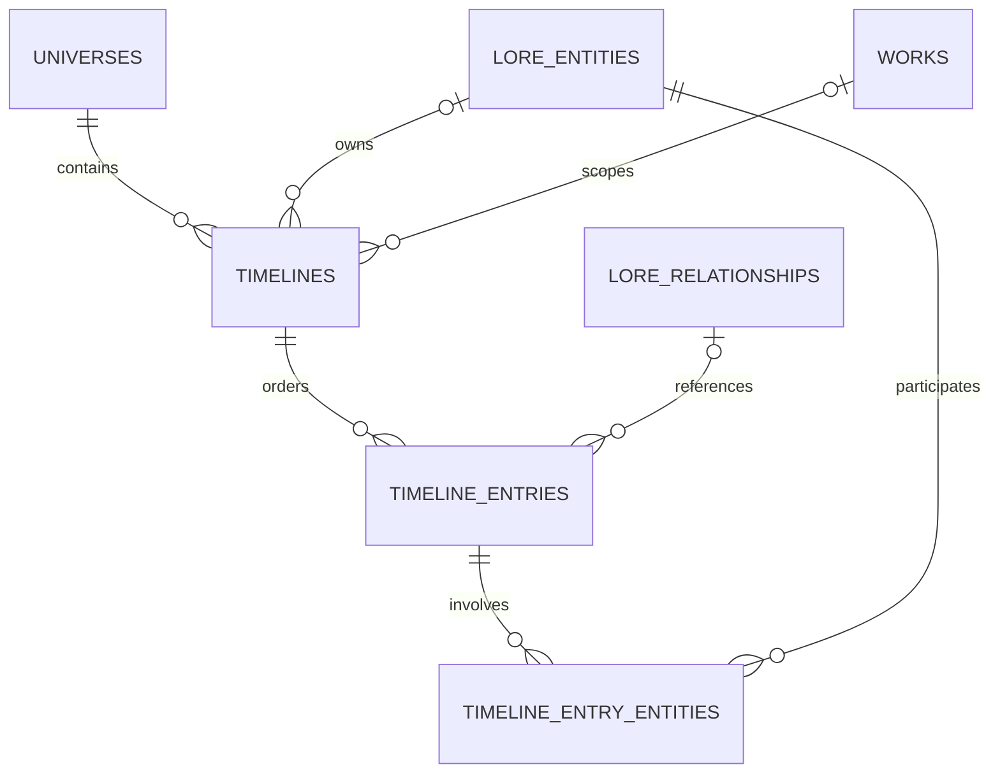
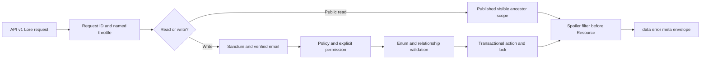

# Lore and Knowledge Graph Implementation

## Implemented scope

Prompt 6 implements a fandom-neutral relational Lore domain: shared typed entities, seven approved extensions, localized text, aliases, controlled taxonomies, Catalog appearances, governed directed and symmetric relationships, named timelines, ordered entries, editorial revisions, citations, spoiler classification, optimistic locking, policies, API v1 resources, audit records, after-commit domain events, factories, seed definitions, and focused Pest coverage.

It adds no graph database, search projection, media, community, messaging, notification, UI, mobile, external import, scraping, AI, copyrighted content, or fandom-specific production data.

## Module structure

- `App\Domain\Lore`: invariant services and transactional entity, alias, translation, appearance, relationship, timeline, entry, and lifecycle actions.
- `App\Models` and `App\Enums`: relational persistence and stable machine values.
- `App\Policies`, API Form Requests, controllers, and Resources: explicit authorization, validation, bounded reads, and spoiler-safe serialization.
- Existing Editorial, Citations, Rights, Spoilers, Catalog, Audit, permissions, and API envelope infrastructure is reused.

## Schema selection and ownership

Prompt 3's Lore inventory omitted a parent for its approved `timeline_entries`. Prompt 6 adds the smallest compatible correction, `timelines`, producing 19 Lore-owned tables. No `relationship_evidence` table is added because existing polymorphic citations are the authoritative evidence association.

All tables use unsigned bigint primary keys. Durable parents use restricted foreign keys; nullable actor foreign keys use `nullOnDelete`. Roots archive explicitly and keep reviewed history. Expected root/edge/appearance/entry volume is medium-to-high and adjacency/order indexes support bounded reads; extension, taxonomy-definition, and relationship-rule volume is low.

| Table | Purpose, keys, integrity and lifecycle |
| --- | --- |
| `lore_entities` | Universe-owned typed root; unique `(universe_id,type,slug)`; public adjacency lookup index; draft/published/archived plus visibility; lock version; editorial/citation/spoiler/audit target; restrict referenced deletion. |
| `lore_entity_translations` | Published exact-locale text with canonical fallback; unique entity/locale; normalized locale; lock version; editorial/citation/spoiler target; restricted parent. |
| `lore_aliases` | Typed, normalized alternate names; application null-safe uniqueness plus DB composite; draft/public/archive and lock version; citation/spoiler target. |
| `character_details` | One-to-one character fields and optional species entity FK; entity-type action invariant; restricted deletion. |
| `performer_details` | One-to-one minimal production-domain performer fields; no unnecessary sensitive data. |
| `location_details` | One-to-one location classification and optional parent-location entity FK; no user geolocation. |
| `artifact_details` | One-to-one artifact/weapon category, fictional function, and safe usage constraints. |
| `organization_details` | One-to-one organization classification and fictional founding description. |
| `lore_event_details` | One-to-one event fields with optional validated Catalog path and date precision. |
| `concept_details` | One-to-one abstract concept category/classification. |
| `entity_taxonomies` | Universe-scoped controlled taxonomy definition; unique universe/scope/key; active state. |
| `entity_taxonomy_items` | Restricted entity/taxonomy association; unique pair and entity-position index. |
| `entity_appearances` | Explicit entity-to-work/season/episode appearance or mention; null-safe duplicate action check, Catalog ordering index, lock version, publication/editorial/citation/spoiler hooks. |
| `relationship_types` | Code-owned key, labels, direction/symmetry, evidence/spoiler/editorial requirements, temporal flags, activation, and safe metadata. |
| `relationship_type_rules` | Allowlisted source/target entity-type combinations; unique type/source/target. |
| `lore_relationships` | Real source/target/type FKs; directed or canonicalized symmetric edge; Catalog/date bounds, canon/confidence/review state, dispute note, lock version; forward and reverse adjacency indexes. |
| `timelines` | Universe-owned named chronology with optional entity/work owner; unique universe/slug; publication/visibility/archive and lock version; editorial/citation/spoiler target. |
| `timeline_entries` | Deterministically ordered allowlisted structured target; unique timeline/sort key, stable ID tie-breaker, relative/imprecise time support, lock version, publication/editorial/citation/spoiler target. |
| `timeline_entry_entities` | Ordered entity participants with controlled role; unique entry/entity/role and reverse entity index. |

## Entity types, extensions, aliases and localization

Approved root types are character, performer, creature, species, location, artifact, weapon, spell, ritual, symbol, organization, vehicle, event, and concept. Creature, species, spell, ritual, symbol, and vehicle remain typed roots with controlled taxonomy links until new structured invariants justify an ADR-backed extension.

Character, performer, location, artifact/weapon, organization, event, and concept use dedicated one-to-one extensions. Actions reject details for types without an approved extension and block type changes while any extension exists.

Locales normalize lowercase with hyphens. Public output selects a published exact locale and otherwise returns stable canonical text. Alias normalization lowercases and collapses whitespace; duplicate, draft, archived, and spoiler-hidden aliases do not enter public output. Aliases remain names, not keyword storage.

## Appearances

Appearances require a work and may narrow to a season and episode. Actions enforce entity/work universe equality, season/work ownership, episode/season/work ownership, and null-safe duplicate prevention. Public queries require published entities and Catalog ancestors and filter spoiler-hidden rows before serialization.

## Relationship definitions and edges

Relationship types own stable forward/inverse labels, direction, symmetry, allowed endpoint rules, self/duplicate flags, temporal/Catalog flags, citation/spoiler/editorial requirements, and activation. The idempotent seeder adds only reusable `related_to`, `portrayed_by`, and `located_in` definitions.

Directed edges retain source/target order. Symmetric edges are stored once with lower entity ID first; inverse labels remain presentation metadata and no inverse row is written. Actions reject inactive semantics, disallowed types, forbidden self edges, cross-universe endpoints, duplicate active edges, mismatched Catalog paths, and start-after-end boundaries. Public traversal is one bounded adjacency collection with cursor size at most 50; no recursive client depth or raw ordering is exposed.

## Editorial, citations, rights and optimistic locking

Lore entity, translation, alias, appearance, relationship, timeline, and entry morph aliases are added to the existing enforced map. The existing revision actions accept these targets. The server field registry exposes only approved public fields; IDs, endpoint semantics, entity type, actors, lock versions, lifecycle timestamps, reviewer/legal fields, and audit fields remain protected. Revision application row-locks revision and target, rechecks base version and fingerprints, revalidates Lore relationships, increments once, and rolls back atomically.

Existing citations directly target Lore records, fields, revision items, or blocks. Relationship publication enforces verified citations where its controlled type requires them. Existing tri-state source-rights history remains authoritative; no rights flag is inferred from a citation or URL, excerpts retain existing limits, and unknown/prohibited rights never authorize copied hosting or derivation.

## Spoiler-safe serialization

All public Lore roots and mutable child assertions reuse `SpoilerVisibilityService` and normalized boundaries. Guests use conservative defaults. Missing classification redacts protected text; a strict finale classification hides the record. Relationship serialization separately evaluates its target so a visible edge cannot reveal a redacted/hidden identity. Hidden edges, appearances, aliases, and timeline entries are removed before Resource output; cursor responses expose no totals.

## Timelines

Named timelines support universe, work, entity, organization, location, thematic, alternate, and reference-order contexts. Entries use a unique decimal sort key plus stable ID ordering, optional sequence/relative description, optional imprecise date, an allowlisted structured Catalog/event/relationship target, and an ordered entity association. Actions enforce universe and Catalog ownership. Alternate timelines remain distinct roots. Publishing a timeline never publishes its entries; archive is explicit and durable parents restrict deletion.

## API, permissions and policies

Public endpoints cover universe Lore lists, Lore detail/aliases/appearances/relationships/timeline entries, universe timelines, timeline detail, and entries. Verified protected endpoints create/update/publish/archive the same roots and children, plus translations. They preserve the v1 envelope/request ID, named limits, cursor pagination, page-size 50 maximum, filter/sort allowlists, explicit policies, and stable 409 domain codes.

Permissions are `lore.view-drafts`, create/update/publish/archive/delete; relationship create/review/publish; and timeline create/update/publish. Contributors create and update their own eligible drafts and revisions. Fans read public filtered output. Moderators receive no automatic Lore authority. Administrators receive explicit permissions through the existing idempotent seeder.

## Audit, events, deletion and threat review

Audits cover relationship creation and all Lore publication/archive transitions, carrying only IDs, state, type key, and versions. `LoreEntityPublished`, `LoreRelationshipPublished`, and `TimelinePublished` dispatch scalar IDs after commit and do not broadcast through Reverb. Entities with graph, appearance, timeline, citation, or revision history cannot be hard deleted.

| Threat | Control |
| --- | --- |
| Arbitrary entity/relationship/morph type | Backed enums, code-owned types/rules, enforced morph map, allowlisted actions. |
| Cross-universe IDOR | Policy plus action-level universe and Catalog ownership checks. |
| Draft/restricted leakage | Public scopes, ancestor checks, detail visibility guard. |
| Symmetric duplicate race | Canonical ID order, transaction check, composite DB unique. |
| Hidden node/count leakage | Visibility filtering before Resource output; cursor contract has no total. |
| Recursive graph exhaustion | One-hop endpoint, page maximum 50, no recursive parameter/CTE. |
| Stale overwrite | Row locks, expected integer version, one increment, stable HTTP 409. |
| Arbitrary editorial fields | Existing code-owned field registry and fingerprinted transaction. |
| Private note or copied text exposure | Resources omit editorial notes; existing plain-text and excerpt limits. |
| Unsafe cascade deletion | Restricted durable FKs and archive-first roots. |

## Migration, rollback and deferred work

`2026_07_12_054029_create_lore_knowledge_graph_tables.php` is additive and creates the 19 tables in dependency order. It changes no existing row, performs no backfill, adds no dependency, and drops only its own empty/new tables in reverse order. Isolated SQLite forward and full rollback validation passed before local MySQL execution; local execution ran as batch 6.

Deferred capabilities include recursive/multi-hop traversal, graph analytics/database, search indexing, media, external cast/metadata ingestion, public/admin UI, interactive timeline visualization, richer viewing orders/sessions, disputed-edge public presentation, notification consumers, and Prompt 7.

## Test coverage

Focused Pest coverage verifies entity scopes/casts/slugs, extension compatibility, type-change protection, locale and alias normalization, appearance paths/duplicates, directed/symmetric semantics, endpoint rules, cross-universe rejection, timeline ordering/ownership, idempotent seeds, public/draft authorization, stale conflicts, editorial application, protected fields, citation/spoiler publication gates, target redaction, hidden child omission, audit metadata, and after-commit events.
