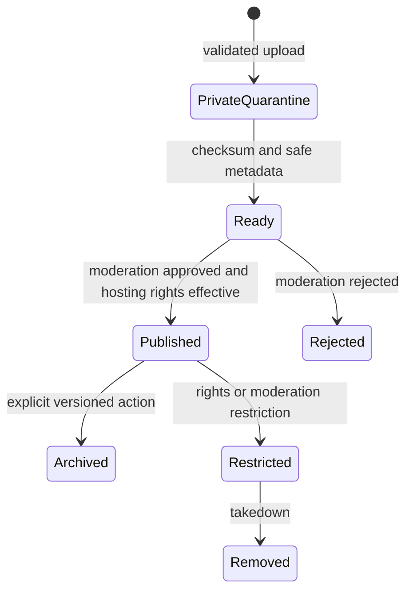
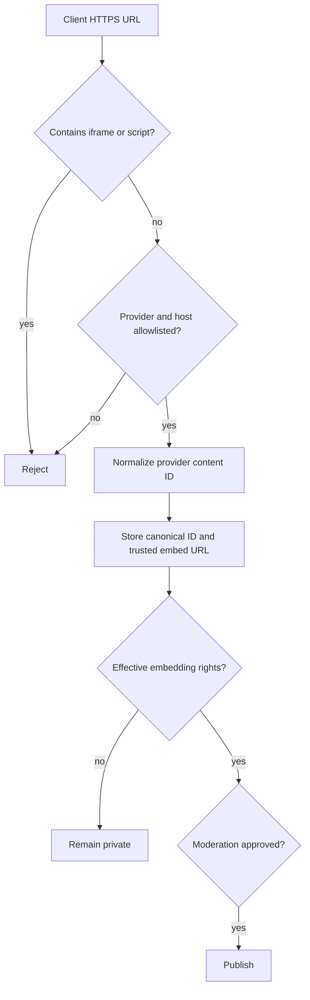
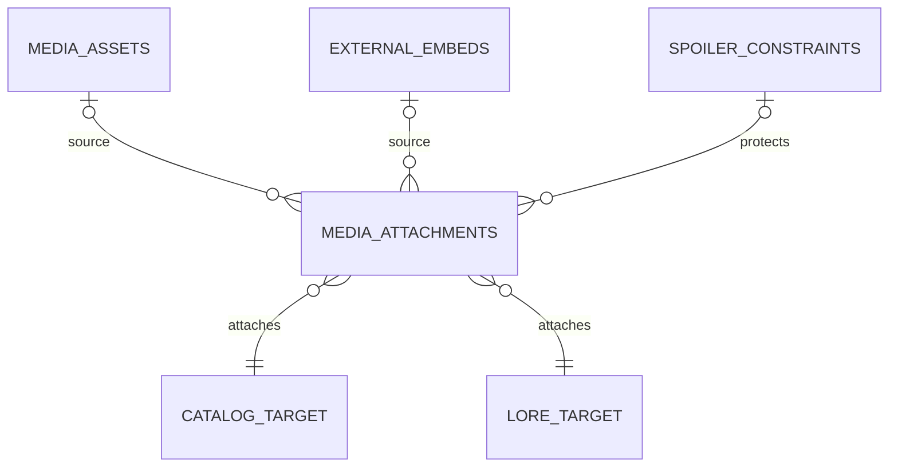
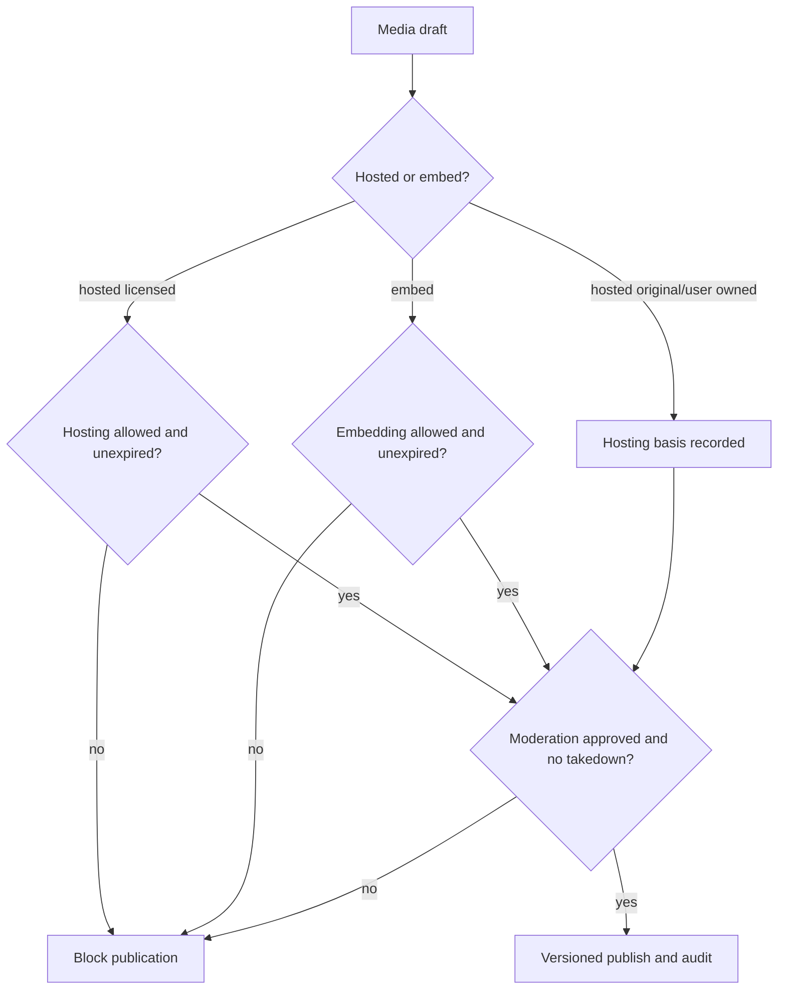
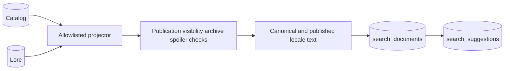
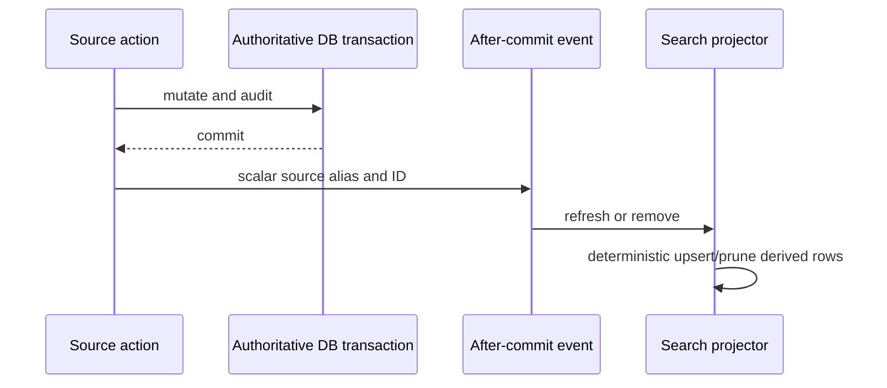
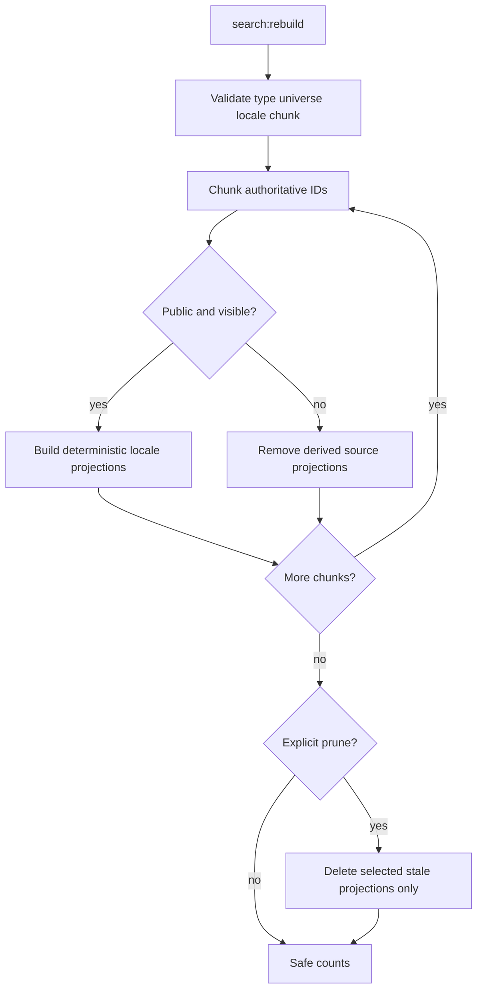
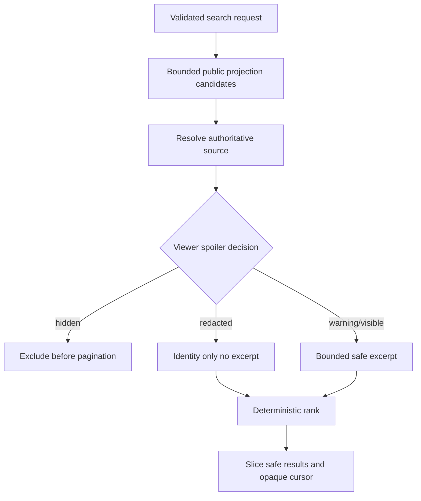
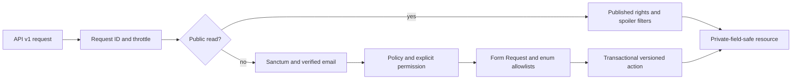

# Media and Relational Search/Discovery Implementation

## Implemented scope and module layout

Prompt 7 implements the approved nine-table Media/Search slice with `App\Domain\Media` actions/services, `App\Domain\Search` projection/query services, models/enums/policies, API v1 requests/resources/controllers, after-commit events/listeners, a rebuild command, factories, tests, and operational documentation. Catalog and Lore remain authoritative; projections never write source records.

It adds no community, messaging, watch rooms, boards, gamification, notifications, UI, NativePHP/mobile, AI, embeddings, vector/graph/external search, scraping, remote downloads, copyrighted fixtures, or fandom-specific data. No dependency was added.

## Schema selection

All tables use unsigned bigint keys. Durable cross-module parents restrict deletion; actors null on deletion; disposable variants/suggestions cascade only from their owning Media/Search row.

| Table | Owner and purpose | Integrity, lifecycle, volume, retention, rebuild |
| --- | --- | --- |
| `media_assets` | Media authoritative hosted-file metadata; owner/universe/source/license FKs | Unique server storage key; checksum/size and public-state indexes; private pending quarantine, optimistic lock, soft delete; rights/history references prevent unsafe hard deletion. Medium/high volume; binary is storage-owned, not DB-owned. |
| `media_variants` | Media derived representations of one asset | Unique asset/purpose/format and storage key; ready-state exposure only; deleting a variant never deletes original. Rebuildable when a processor is approved. |
| `external_embeds` | Media authoritative provider-authorized reference | Required Source; unique provider/content ID; provider/public/moderation indexes; soft delete/archive/takedown and optimistic lock. No raw HTML or remote bytes. |
| `media_attachments` | Media authoritative allowlisted association to Catalog/Lore | Exactly-one-source action invariant; enforced morph map, target/order indexes, one-primary nullable unique key, locale normalization, soft history, lock version. |
| `media_processing_jobs` | Media derived processing lifecycle record | Asset/operation/status indexes; contains safe status metadata only. No worker or transformation pipeline starts in this phase. |
| `search_documents` | Search derived public projection | Unique source/type/locale; universe/type/locale/status indexes; source version and projection version; hard-rebuildable and explicitly prunable. High volume. |
| `search_suggestions` | Search derived title/slug/safe-alias prefixes | Unique document/type/normalized value; universe/locale/prefix index; cascades with document and is rebuilt from sources. |
| `trending_snapshots` | Search derived privacy-thresholded aggregate reservation | Window/score and universe/type indexes; bounded retention required before production scheduling. No public trending endpoint yet. |
| `search_queries` | Search privacy-minimized interaction aggregate input | HMAC query hash, length, locale, optional public filters and result bucket; no raw query, identity, IP, session, result text, or token. Short retention is an operations requirement. |

Stable Media states are backed enums: kind, origin, lifecycle, moderation, processing, visibility, provider, attachment role, and variant purpose. Search uses document, projection, and suggestion enums. Existing publication, canon, rights, and spoiler enums remain authoritative.

## Hosted media boundary

Actual upload admission is implemented because Phase 4 approves quarantine. The API accepts only configured MIME/extension pairs and a configurable size ceiling, rejects active/unapproved types including SVG/HTML/archives, checks image structure, computes SHA-256, derives dimensions, sanitizes the display filename, and generates a random storage key. Disk/path, checksum, dimensions, duration, status, moderation, processing, and visibility are server-owned. Files begin private and pending; no public filesystem URL or private path is serialized.

Variants and processing rows are lifecycle foundations only. No image package, transformation, transcoding, extraction, remote processor, scheduler, or long-running worker was added. Signed binary delivery remains deferred.

## External embeds and provider allowlist

`youtube`, `vimeo`, `spotify`, and `soundcloud` are code/config allowlisted with HTTPS host validation. Input is a URL, never iframe/script HTML. The normalizer parses a trusted provider identifier and generates a canonical/embed URL without HTTP requests. A public URL alone does not grant embedding permission; an effective unexpired `source_rights_reviews` `embedding=allowed` decision is mandatory.

## Attachments

Targets are limited to universe, franchise, work, work translation, season, episode, Lore entity/translation/alias/appearance/relationship, timeline, and timeline entry aliases from the enforced morph map. The action enforces exactly one asset/embed, target existence, same-universe ownership, duplicate prevention, deterministic position, normalized locale, and one primary per target/role. Public lists require published media and attachment plus conservative spoiler approval.

## Rights, moderation, editorial, locking, and audit

Hosted `project_original` and `user_owned` origins may publish after moderation/processing without pretending third-party permission. `licensed` assets require effective `hosting=allowed`; embeds require effective `embedding=allowed`. Permissions are independent, expired/unknown/prohibited deny, takedown blocks republication, and private rights notes never enter resources or audit metadata. This is an enforcement mechanism, not legal advice.

Mutable Media uses expected `lock_version`, row locks, one increment, and stable HTTP 409 conflicts. Controllers cannot directly set lifecycle/visibility/takedown. Metadata updates may set moderation only with `media.moderate`. Media editorial changes reuse the existing revision framework conceptually; direct public metadata is already allowlisted, while extending the revision field registry is deferred until Media reviewer workflow requirements are approved. Storage keys, checksums, uploader identity, provider internals, and takedown evidence are never revision fields.

Audits include asset/embed creation, update, attachment/detachment/publication, media publication/archive, and rebuild completion. Payloads contain only identifiers, safe states, sizes, types, versions, and counts.

## Search projections and event flow

The projector supports universe, franchise, work, season, episode, Lore entity, and timeline sources. It verifies ancestor publication/visibility/archive state, emits one locale row for canonical text plus published Work/Lore translations, bounds searchable text, omits spoiler-unsafe summaries, includes only non-sensitive published aliases, records source lock version, and upserts deterministically. Unpublic sources remove projections.

`SearchProjectionRequested`, `SearchProjectionRemovalRequested`, existing Lore publication events, and `EditorialRevisionApplied` are consumed synchronously only after authoritative transactions commit. Handlers carry scalar IDs, are idempotent/retry-safe, delete stale rows when sources disappear, never broadcast, and cannot roll back the already committed source transaction.

## Rebuild command

`php artisan search:rebuild` supports allowlisted `--type`, numeric existing `--universe`, normalized `--locale`, bounded `--chunk`, `--dry-run`, and explicit `--prune`. Default behavior is non-destructive upsert. Prune is limited to selected derived source types. Output contains only created/updated/unchanged/skipped/removed counts and never source text.

## Search matching, locale, suggestions, and discovery

Search normalizes ASCII tokens and requires every token in bounded projected text. At most 250 candidates are ranked deterministically: exact canonical title, exact localized title, canonical prefix, localized prefix, token/title match, controlled ranking weight, then stable ID. No typo tolerance, semantic search, client SQL, dynamic column, or raw ranking expression is claimed. Locale filters exact normalized locale; each published locale is an independent projection.

The backend resolves the source and applies the existing viewer spoiler decision before pagination. Hidden rows and counts disappear; redacted rows carry safe identity with no excerpt; warning/visible rows receive bounded safe excerpts. Guest behavior is conservative. Suggestions use the same source/spoiler check, prefix match, minimum two characters, maximum ten rows, and exclude sensitive aliases. Related discovery is live and bounded: same franchise for Works and shared existing taxonomy for Lore, with self/publication/spoiler filtering and allowlisted explanation keys.

Search interactions store only HMAC hash, query length, locale, allowlisted public filters, result bucket, and timestamp. Trending snapshots are schema-approved but production aggregation/publication is deferred until retention, abuse filtering, and minimum sample thresholds are operationally approved.

## API and authorization

Public routes: `GET /api/v1/search`, `/search/suggestions`, `/discovery/related/{type}/{id}`, `/media/assets/{asset}`, `/media/embeds/{embed}`, and `/media/attachments/{targetType}/{targetId}`. A non-blocking Sanctum resolver supplies authenticated spoiler context when a valid session/token is present while preserving guest access. Protected routes create/update/publish/archive assets/embeds and create/publish/delete attachments. All preserve the v1 envelope/request ID and named limits.

Permissions add Media view/create/update-own/attach/review/publish/archive/rights/moderate and Search rebuild/inspect/manage. Contributors receive only draft Media capabilities. Moderators receive no automatic rights authority. Administrators receive all through the existing idempotent seeder. Operational Search permissions are not exposed as HTTP rebuild endpoints.

## Threat review

| Threat | Control |
| --- | --- |
| Path traversal/private path leakage | Server-generated storage keys; disk/path absent from input/resources/audits. |
| MIME confusion/SVG/XSS/executable upload | MIME-extension allowlist, image structure validation, no SVG/HTML/archive/executable support. |
| SSRF/remote rehosting | No HTTP client call or remote download path; allowlisted URL parsing only. |
| Iframe/script/provider injection | HTML rejected; provider enum and exact host list; trusted embed URL generation. |
| Rights/takedown bypass | Independent effective rights checks, moderation gate, versioned action, takedown terminal block. |
| Arbitrary morph/cross-universe IDOR | Enforced morph map, target allowlist, target existence and universe action checks. |
| Draft/path/note leakage | Public scopes; safe Resources omit storage/provider/legal/internal metadata. |
| Spoiler alias/snippet/count leakage | Unsafe summaries/aliases absent from projection; source decision before pagination; no totals. |
| Search SQL/ranking injection | Fixed columns/operators and in-memory controlled rank; filter/sort enums. |
| Unbounded search/enumeration | Length/page/candidate/suggestion/related bounds and public limiter. |
| Raw query/privacy retention | HMAC only, result bucket, no identity/IP/session/token/text. |
| Duplicate projection/attachment races | Projection unique source/locale; attachment duplicate and primary unique checks. |
| Stale writes | Row lock, expected version, one increment, stable 409. |
| Unsafe deletion | Archive/soft-delete roots; restricted attachments/rights/source links; derived rows alone are prunable. |

## Operational and deferred guidance

Run `search:rebuild --dry-run` before normal reconciliation; use `--prune` only intentionally. Queueing remains deferred because current bounded synchronous after-commit projection work is small; move to a unique queued listener when event volume or p95 source mutations justify it. No scheduler is installed. Establish query retention/pruning, trending k-anonymity, malware scanning, decompression limits, image transformation, signed delivery, cloud storage, takedown records, dual rights review, and full Media editorial revisions before production Media launch.

Rollback drops only these nine new tables in dependency order. It does not delete storage objects, so an operational storage reconciliation is required before any authorized production rollback. No backfill is performed; projections are populated explicitly by `search:rebuild` or later source events.
