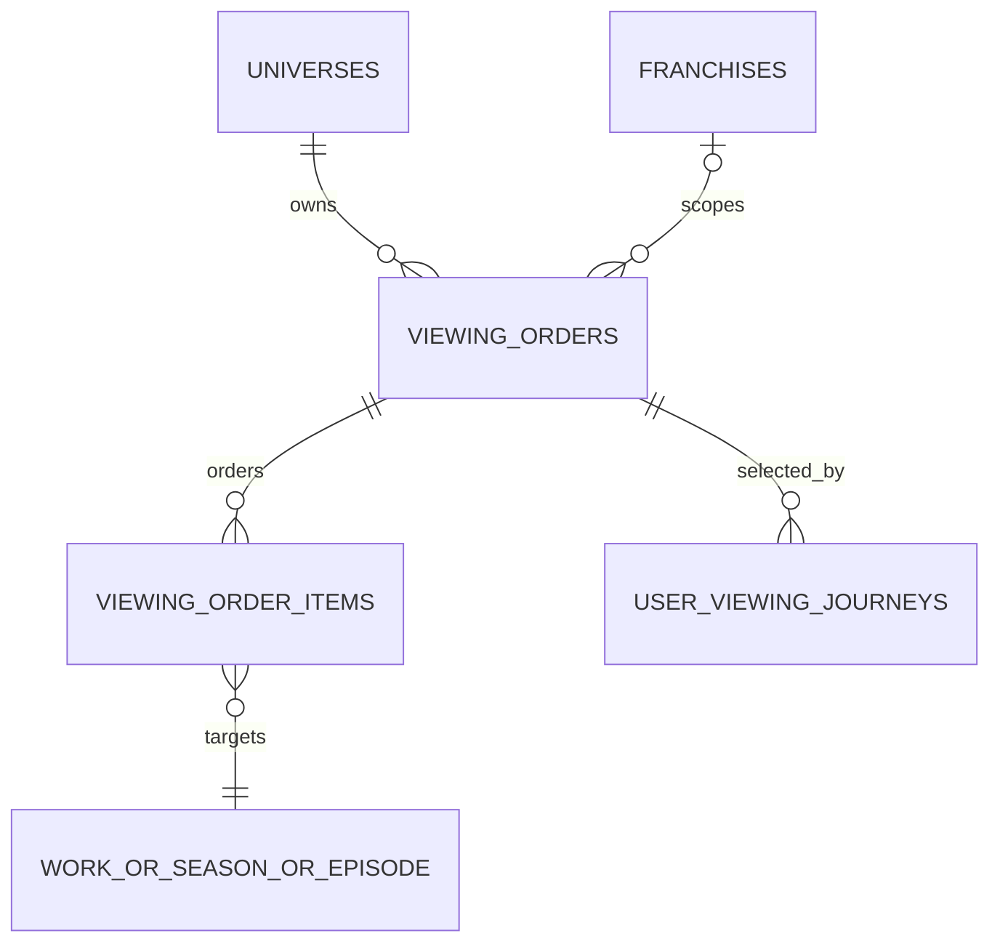
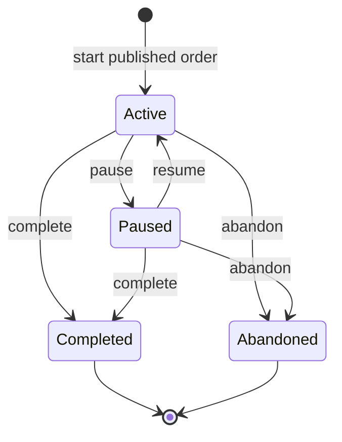
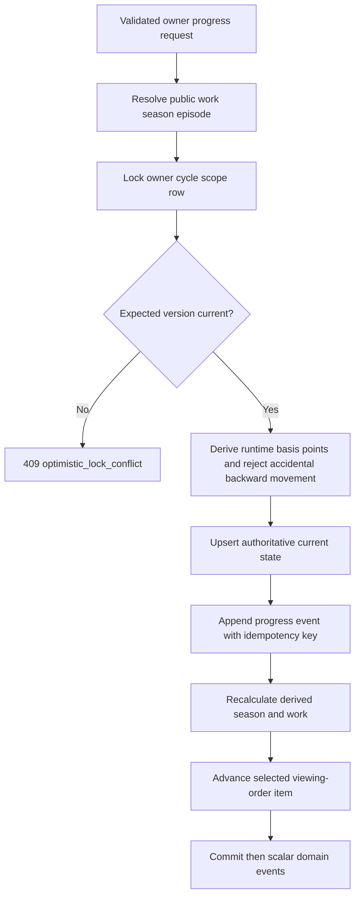
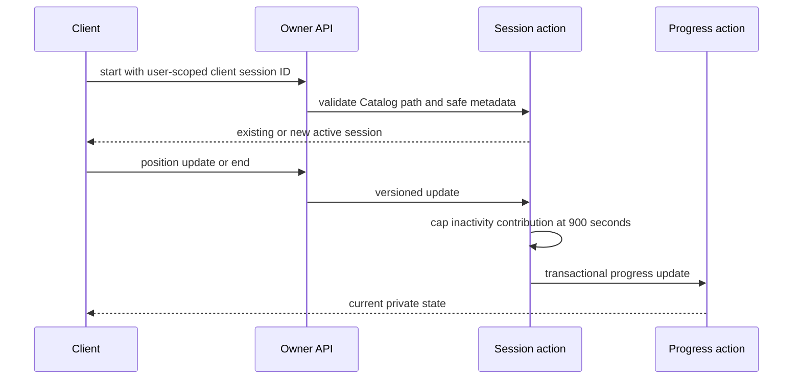
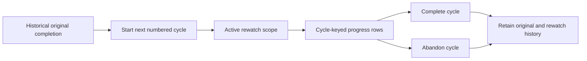
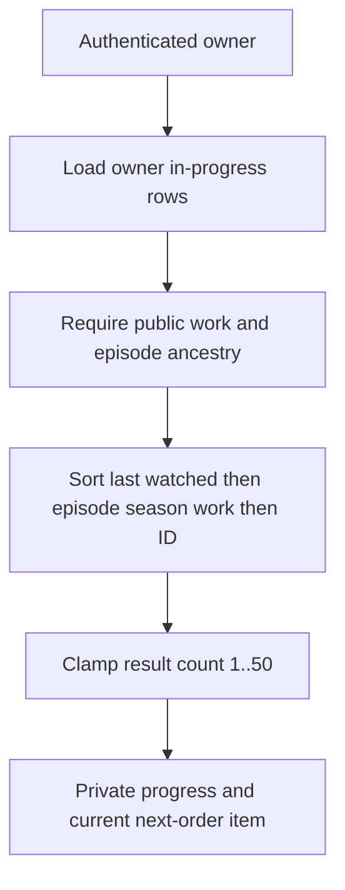
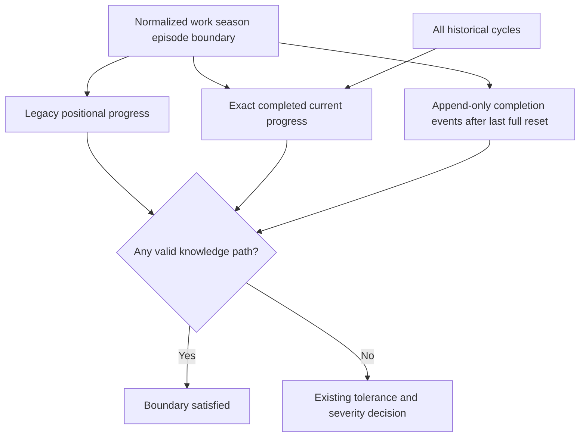
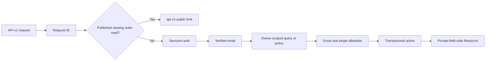
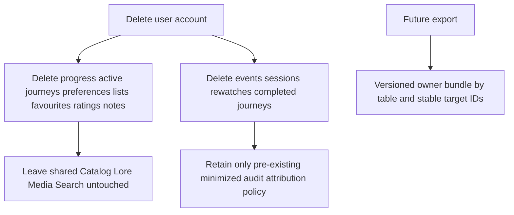

# User Viewing Journey Implementation

## Implemented scope and architecture decision

Prompt 8 implements the fandom-neutral User Journey foundation: Catalog-owned viewing orders/items; owner-private journeys, progress and append-only events; bounded sessions; rewatches; deterministic continue watching; watchlists; favourites; ratings; private notes; fandom/spoiler preferences; spoiler and Search integration; API v1; policies; account-deletion behavior; factories; tests; and documentation.

The Prompt 3 inventory assigned 12 tables to User Journey but reserved `saved_theories`, `activity_events`, and `annual_recaps` before the approved journey lifecycle was detailed. Prompt 8 makes the smallest compatible correction: those three deferred reservations become `user_viewing_journeys`, `viewing_progress_events`, and `rewatch_cycles`. The User Journey count remains 12. `viewing_orders` and `viewing_order_items` remain Catalog-owned. No unrelated module is redesigned.

Deferred: custom personal viewing orders, public journey/profile projections, reviews, aggregates, exports endpoint/UI, recap generation, social sharing, feeds, notification listeners, achievements, mobile/offline batch UI, provider synchronization, and recommendations.

## Module structure

- `App\Domain\UserJourney\Actions`: viewing-order integrity, journey lifecycle, progress, sessions, rewatches, and private library commands.
- `App\Domain\UserJourney\Queries`: deterministic continue-watching query.
- `App\Domain\UserJourney\Services`: allowlisted target resolution, publication and universe checks.
- Models/enums/policies/factories: persistence, stable values, owner authorization, and valid synthetic records.
- API v1 requests/controllers/resources: verified owner-only boundaries and public published viewing-order reads.
- Existing Spoiler, Search, Catalog, Audit, optimistic-lock, request-ID, and API-envelope infrastructure is reused.

## Tables and ownership

| Table | Owner | Role and authority | Integrity, deletion, retention, volume |
| --- | --- | --- | --- |
| `viewing_orders` | Catalog | Authoritative named order per universe | Scoped slug/default unique, publication/archive/version indexes, Catalog restrict deletion; retained while journeys reference it. |
| `viewing_order_items` | Catalog | Authoritative ordered allowlisted work/season/episode path | Unique position and target per order, stable morph alias, cross-universe action validation; restrict deletion. |
| `user_viewing_journeys` | User Journey | Current/historical selected order | One active/paused row per user/universe, private default, optimistic lock; deleted with account. |
| `viewing_progress` | User Journey | Authoritative current state | Expanded in place; unique owner/cycle/scope, continue/spoiler indexes, legacy marker; deleted with account. High volume. |
| `viewing_progress_events` | User Journey | Append-only correction/knowledge history | Owner idempotency key unique, progress/time cursor; deleted with account. High volume, future retention review. |
| `viewing_sessions` | User Journey | Bounded claimed viewing activity | User/client ID unique, status/activity indexes, safe metadata only; deleted with account. High volume, future retention review. |
| `rewatch_cycles` | User Journey | Historical first-class rewatch scope | Cycle number and one-active constraints; deleted with account. |
| `watchlists` | User Journey | Named private owner collections | Owner slug/default/order/version constraints; cascade account deletion. |
| `watchlist_items` | User Journey | Ordered private saved targets | Unique target and position per list; disposable child cascade. |
| `favourites` | User Journey | Private preference, not reaction | One user/allowlisted target; account cascade; no public count. |
| `ratings` | User Journey | Private integer 1–5 current rating | One user/allowlisted target; account cascade; no public aggregate/ranking. |
| `personal_notes` | User Journey | Private plain-text note | Owner/target indexes, soft delete, optimistic lock; account cascade permanently removes notes. |
| `user_fandom_preferences` | User Journey | Typed per-user/per-universe preferences | Unique owner/universe, private visibility enforced, optimistic lock; account cascade. |
| `user_spoiler_preferences` | Spoiler Safety | Existing typed spoiler choices consumed by User Journey | Preserved in place; rewatch behavior/version added; account cascade. |

Current state comprises progress, active journey, preferences, watchlists, favourites, ratings, and notes. Historical state comprises progress events, sessions, rewatches, and completed/abandoned journeys. No personal journey table has a public read endpoint.

## Stable enums and numeric values

- Viewing orders: release, chronological, editorial, franchise, rewatch.
- Journeys: active, paused, completed, abandoned.
- Progress: not started, in progress, completed; source manual, playback, session, import, legacy.
- Events: started, position updated, complete/incomplete, manually corrected, reset, imported, rewatch started/completed.
- Sessions: active, paused, ended. Rewatches: active, completed, abandoned.
- Visibility: private, followers, public is represented for future compatibility, but personal APIs force private in this phase.
- Progress is integer basis points `0..10000`; runtime positions are non-negative integer seconds. Ratings are integers `1..5`. No float comparison is used.

## Viewing-order structure

Public orders must be published, public, non-archived, and under a public universe. Items support only work, season, and episode aliases, must share the order universe, and must be public before order publication. Default changes and complete-set reorder run transactionally. Reordering uses a temporary offset so unique positions cannot collide. Archived orders cannot start a new journey; existing references remain valid.

## Journey lifecycle

One active/paused journey is allowed per user/universe. Starting never erases history. Current order item and Catalog IDs advance after completion. Transitions row-lock and compare `lock_version`; stale writes return `optimistic_lock_conflict` with HTTP 409. Journey output always reports private visibility.

## Hierarchical progress update

Episode paths revalidate season/work ownership. Runtime-derived progress wins when runtime is known; a 120-second tolerance permits end-credit variance. Completion sets 10000 basis points and timestamp. Backward movement needs correction intent. Explicit manual parent progress is not overwritten by derived progress. Client request IDs return the original effect. Current rows remain authoritative; events preserve knowledge/correction history.

Legacy progress rows are backfilled to deterministic scope keys and marked `is_legacy_projection=true`. The spoiler resolver retains their previous positional semantics. Resetting current progress normally preserves historical completion knowledge. An explicit spoiler-knowledge reset appends a reset event; history remains append-only while later evaluation disregards earlier completion for that scope.

## Viewing-session flow

Sessions claim activity only; they do not verify streaming playback. Watched seconds are non-negative, capped, and inactivity cannot inflate by more than 15 minutes per update. Metadata allowlists only client platform and app version. IP, user agent, authentication material, and fingerprints are not stored or returned.

## Rewatch-cycle flow

Only one active cycle exists per user/universe/work. Progress uses cycle ID as a null-safe `cycle_key`, so original and rewatch state never overwrite each other. Spoiler knowledge evaluates all historical cycles and never decreases merely because a rewatch starts or is abandoned.

## Continue-watching query

Completed state is excluded. Active rewatch rows remain eligible because they are independently in progress. Archived/unpublished targets are excluded, missing journey items are nullable, eager loading avoids resource N+1 queries, and sorting is deterministic.

## Watchlists, favourites, ratings, notes, and preferences

- Watchlists are named, ordered, and private. One optional default per user is enforced with a nullable key. Items support public work/season/episode targets, prevent duplicates, validate universe, and never mutate progress.
- Favourites support universe, franchise, work, season, episode, Lore entity, and timeline. They are private preferences with no public counts.
- Ratings support public work, season, and episode, one integer 1–5 row per user/target. They do not modify Catalog or Search ranking.
- Notes support work, season, episode, Lore entity, timeline entry, and owned journey. Input is bounded and converted to plain text. List resources omit bodies; detail resources include the owner’s body. Audit metadata contains version/ID only.
- Fandom preferences are typed. Unknown keys fail validation. Preferred orders must share a universe. Personal visibility remains private. Existing spoiler tolerance is updated through the existing spoiler table rather than duplicated.

## Spoiler-context resolution

Partial progress never satisfies a completion boundary. Episode/season/work completion does. Search, Catalog, Lore, Media attachment, and related discovery continue using the one canonical spoiler service. Guests remain conservative; verified state grants no bypass. Administrative bypass remains explicit permission behavior.

## Search integration

Search projections remain global and content-derived. For an authenticated query, at most 250 candidate scope keys are joined to the viewer’s original-cycle progress in one query. Only authenticated results receive `viewing_status` and `progress_basis_points`; guest keys are absent. Personal state never changes ranking, projection rows, query analytics, suggestions, or global discovery.

## API authorization

Protected routes use `auth:sanctum`, `verified`, and `throttle:api-v1`. No route accepts a user ID. Cross-user route records return 404. Page sizes are bounded to 50. Progress and session internals, raw device data, event history, and note bodies in lists are not exposed.

Route groups: published viewing orders/items; `/me/journeys`; `/me/progress`; `/me/viewing-sessions`; `/me/rewatches`; `/me/continue-watching`; `/me/watchlists`; `/me/favourites`; `/me/ratings`; `/me/notes`; and `/me/journey-preferences`.

## Policies and permissions

Personal policies are ownership-only for journey, progress, session, rewatch, watchlist, favourite, rating, note, and fandom preference. Contributor, moderator, and administrator roles gain no access to another user’s records. Viewing-order editorial permissions are administrator-only: create, update, publish, archive. Fan/contributor/moderator do not inherit them.

## Audit and domain events

Audit is intentionally sparse: viewing-order default/publication/archive, manual progress correction/reset, spoiler preference changes, and version-only personal-note update. Full note bodies, watchlists, histories, request bodies, authentication data, device data, and spoiler text are excluded.

After-commit scalar events: `ViewingProgressUpdated`, `EpisodeCompleted`, `WorkCompleted`, `ViewingJourneyStarted`, `ViewingJourneyCompleted`, `RewatchCycleStarted`, `RewatchCycleCompleted`, and `WatchlistItemAdded`. They do not broadcast and have no notification/achievement listener in this phase.

## Account deletion and export compatibility

User-owned tables cascade with account deletion; notes are physically removed even when previously soft deleted. Ratings do not remain identifiable, and no aggregate requires retention. Shared Catalog targets are restricted, not cascaded from personal records. A future export can serialize current and historical sections using stable IDs/timestamps without exposing protected Catalog text. No export endpoint or privacy dashboard is introduced.

## Migration and rollback

`2026_07_12_064234_implement_user_journey_foundation.php` creates the new tables, expands both existing tables in place, drops the old one-row-per-user/work unique only after adding the richer scope, backfills every old progress row deterministically, and adds new indexes after backfill. No existing progress or preference row is deleted.

Rollback restores the legacy columns and unique key only when at most one row exists per user/work. If richer data cannot fit the legacy constraint, rollback stops with an explicit exception rather than deleting/consolidating data silently. New Prompt 8 tables would be dropped by an authorized rollback and therefore require export/backup once populated.

Isolated SQLite results: empty full forward/full rollback passed; a non-empty legacy fixture retained one progress and one preference row after forward migration, retained legacy tolerance/warning values, received `episode:1` scope plus legacy marker, and retained both original rows after Prompt 8 rollback.

## Threat review

| Threat | Control |
| --- | --- |
| Cross-user IDOR / user ID mass assignment | No user ID input; owner queries/policies; cross-owner route records return 404. |
| Arbitrary morph target | Enforced morph map plus operation-specific target allowlists. |
| Cross-universe or invalid episode path | Registry universe checks and Catalog relationship validation. |
| Progress spoofing/runtime overflow | Server runtime derivation, basis-point/range limits, runtime tolerance, manual correction flag. |
| Replay/idempotency collision | User-scoped unique request/session IDs return original state. |
| Stale/racing progress or journey updates | Row locks, expected versions, null-safe unique scope keys, transaction retry. |
| Duplicate active journey/rewatch/default/rating/favourite | Null-safe active/default keys and database unique constraints plus action checks. |
| Note XSS/private content leak | Plain text conversion, length bounds, list body omission, owner-only resources, body-free audits. |
| Private progress in Search | Query-time owner join only; projections/ranking/analytics stay user-neutral. |
| Device fingerprint collection | Only two safe metadata keys; no IP, user agent, token, or fingerprint column. |
| Unsafe shared-record cascade | Catalog/Lore parents restrict deletion; personal records cascade only from owner/list/progress roots. |
| Spoiler knowledge regression | Historical completion events and all rewatch cycles; explicit full reset event required. |

## Test coverage

Focused Pest coverage verifies viewing-order targets/default/reorder/publication/archive/versioning; journey lifecycle/history/privacy/ownership; progress hierarchy, bounds, corrections, reset, idempotency and stale conflicts; sessions; rewatches; continue watching; watchlists; favourites; ratings; notes/XSS/audit omission; preferences; Search personalization; API auth/verification/request IDs; role boundaries; account deletion; and existing spoiler behavior.

No production User Journey seed data, copyrighted content, fandom-specific fixture, dependency, Community, messaging, watch-room, notification, achievement, UI, mobile, provider synchronization, or recommendation feature was added.
