# Moderation and Stable Notifications Implementation

## Implemented scope and architecture selection

Prompt 9 implements the Phase 6 minimum moderation and notification foundation: controlled report categories, private reports and evidence, case workflow and assignments, append-only actions, Identity-owned capability restrictions, polymorphic public-content restrictions, appeals and immutable decisions, central enforcement, stable application notifications, preferences, in-app/email delivery attempts, recipient-aware spoiler-safe rendering, queued after-commit event consumers, API v1, policies, permissions, audit records, factories, and Pest coverage.

The canonical inventory controls table names. The implementation adds the two Identity tables `user_restrictions` and `user_restriction_scopes`; nine immediately approved Moderation tables; and the canonical Notification tables `notifications`, `notification_preferences`, and `notification_deliveries`. `copyright_notices` and `trust_signals` remain reserved because no public legal intake or automated trust system is approved. `digest_preferences` and `push_devices` remain deferred by scope. Stable notification definitions are code-controlled in `NotificationTypeRegistry`; no unapproved `notification_types` table is introduced.

No Community, messaging, watch rooms, public profiles, UI, push delivery, digests, AI moderation, external moderation provider, file-evidence upload, remote URL fetch, or Reverb activity broadcast is implemented.

## Module layout

- `App\Domain\Moderation`: report target registry, report/case/action/appeal commands, restriction evaluator, and stable domain errors.
- `App\Domain\Notifications`: type registry, payload validation, recipient renderer, idempotent record creation, and delivery lifecycle.
- `App\Models`, enums, policies, factories, and seeders: relational authority and stable machine values.
- API v1 requests/controllers/resources: verified, rate-limited, owner/case-scoped boundaries.
- `CreateDomainNotification` and `StableNotificationMail`: queued after-commit event consumption and Laravel mail transport.
- Existing Catalog, Lore, Editorial, Media, Search, Spoiler, Audit, Identity, and User Journey interfaces remain authoritative.

## Tables, ownership, and lifecycle

| Table | Owner | Authority and integrity | Retention and volume |
| --- | --- | --- | --- |
| `report_categories` | Moderation | Code-owned stable key, target allowlist, priority and review flags; idempotent seed | Low volume; definitions retained when disabled. |
| `reports` | Moderation | Reporter, category, allowlisted morph target, duplicate link, private status and bounded plain text | Moderate/high; durable case evidence; reporter FK nulls on deletion. |
| `report_evidence` | Moderation | Report-owned typed text/media/source/citation/HTTPS reference with access classification | Moderate; restricted deletion; no remote fetch or arbitrary upload. |
| `moderation_cases` | Moderation | ULID public identifier, target/subject, lifecycle, resolution, private summary, optimistic lock | Moderate; authoritative and never hard-deleted by workflow. |
| `moderation_case_assignments` | Moderation | Historical assignee/assigner/status; nullable key enforces one active primary | Moderate; cancellation/reassignment retain history. |
| `moderation_actions` | Moderation | Append-only decision fact; actor, user/content target, public reason, private note, expiry | Durable authoritative history; update/delete guarded. |
| `user_restrictions` | Identity | Active/lifted/expired capability or platform restriction sourced from one action | Active lookup by user/state/time; removed with deleted account after appeal detachment. |
| `user_restriction_scopes` | Identity | Normalized approved capability scopes | Low per restriction; cascades only with owning restriction. |
| `content_restrictions` | Moderation | Active/lifted/expired allowlisted morph restriction sourced from one action | Durable enforcement history; indexed by target/state/time. |
| `appeals` | Moderation | Affected user, action, optional restriction, state, text, window, optimistic lock | Durable; appellant identity nulls on account deletion. |
| `appeal_decisions` | Moderation | One immutable attributable decision per appeal | Append-only durable decision history. |
| `notifications` | Notifications | Recipient, stable key/version, allowlisted subject, idempotency/correlation, scalar payload, read/archive/expiry | High-volume inbox; deleted with recipient. |
| `notification_preferences` | Notifications | One user/type/channel state with optimistic lock | Deleted with recipient; deterministic defaults need no row. |
| `notification_deliveries` | Notifications | Per-channel attempt number, safe status/timestamps/codes, bounded retry | Cascades with notification; no address or provider payload. |

All IDs are unsigned big integers except the case ULID. Morph columns contain enforced aliases, never PHP class names. Mutable cases, appeals, and preferences use integer lock versions. Actions and appeal decisions are immutable. Notifications are authoritative for the client inbox; Search documents remain derived.

## Stable enums and definitions

String-backed enums cover report status/priority/evidence, case and assignment states, action types, restriction types/scopes/states, content effects, appeal state/decision, notification channel/priority/lifecycle/preference, and delivery state. Persisted values are lowercase machine keys and API serialization uses the same values.

Seeded categories are fandom-neutral: spam, harassment, hate/abuse, sexual/exploitative, illegal/dangerous, impersonation, privacy, copyright/ownership, spoiler, misleading factual content, rights/attribution, and other. A category never applies enforcement automatically.

## Report lifecycle

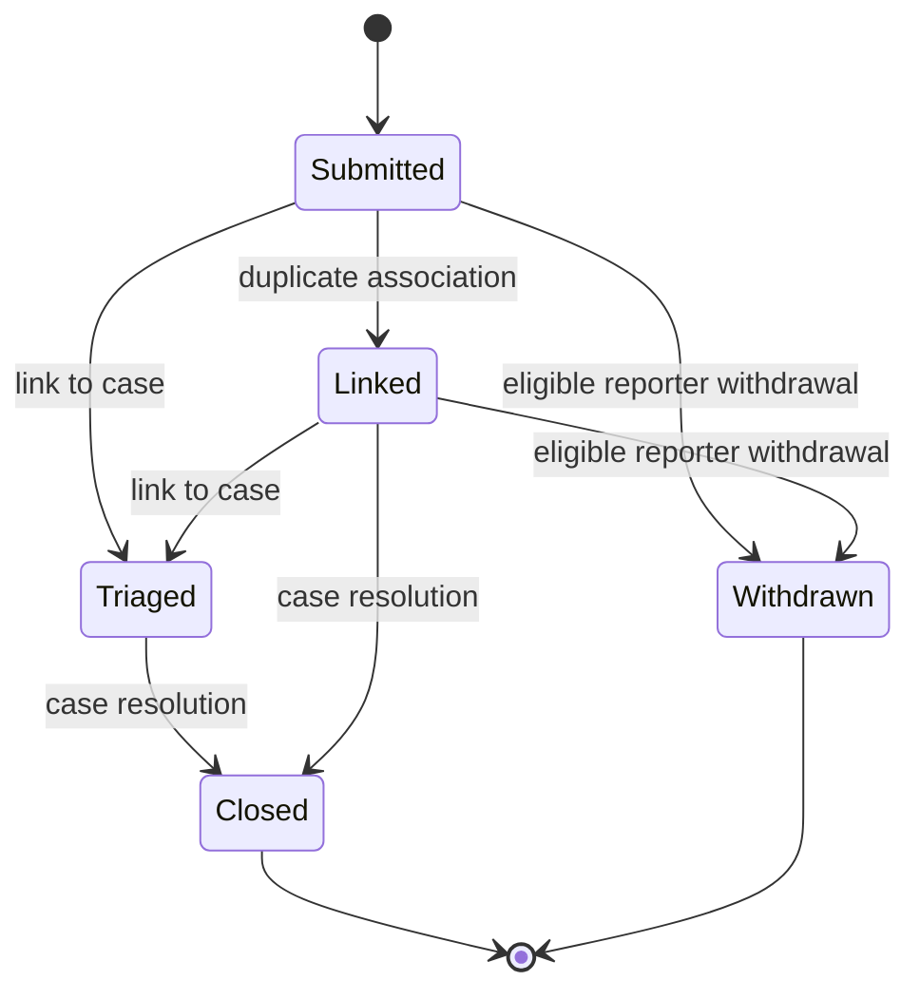

Reports require Sanctum, verified email, the strict `reports` limiter, an active controlled category, and an accessible allowlisted target. Unsupported/private Journey targets are rejected. Duplicate submissions remain separate rows linked to the earlier report. HTML is stripped; text is bounded. Evidence supports bounded text, existing Media/Source/Citation identifiers, safe metadata checksums, and HTTPS URLs only. URLs are never downloaded.

Reporter resources expose only the reporter's rows. Moderator access requires explicit permission. Subjects have no report/case route. Reporter identity is present only in authorized moderator report serialization and never in subject-facing actions, appeals, notifications, or public resources.

## Moderation case lifecycle

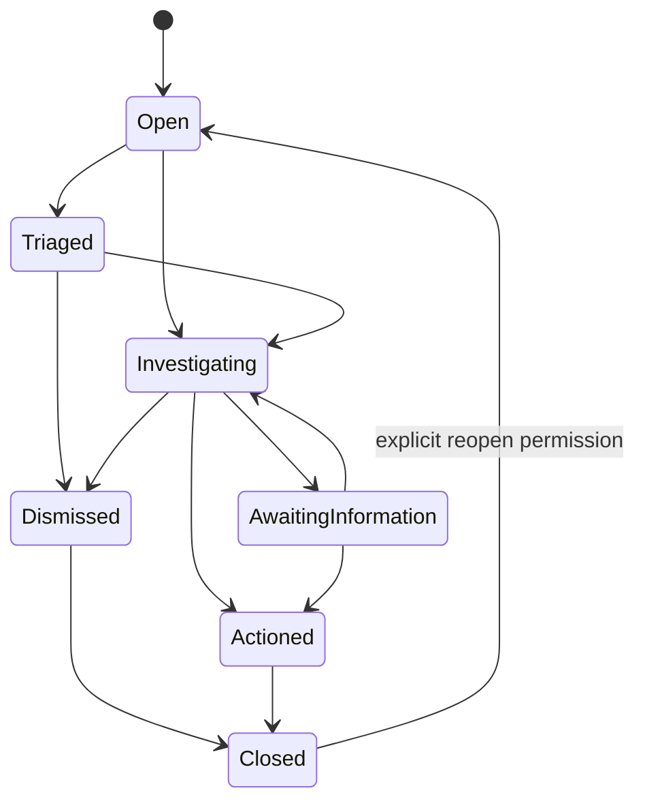

Invalid transitions and stale versions return stable HTTP 409 responses. Dismissal/closure requires a resolution. Closing updates eligible linked reports and emits one scalar `ReportClosed` event per identifiable reporter. Closed records are retained.

## Assignment and decision sequence

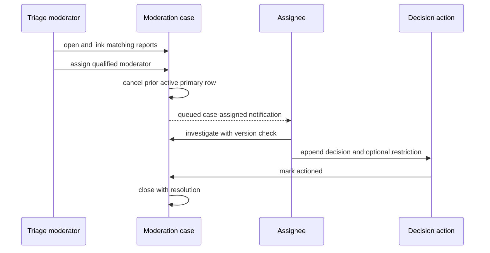

Subjects and reporters cannot be assigned. Rights-flagged reports require the separate existing rights-review permission. Reassignment preserves the cancelled row. Private assignment notes never enter Resources or audit metadata.

## Actions and restrictions

Actions are append-only. Corrections and extensions create new attributable actions. User-visible explanations are plain bounded text and exclude reporter identity. Permanent user restrictions require `moderation.restrictions.permanent`; ordinary moderators receive temporary authority only. Takedown/rights-review content effects require the separate rights permission.

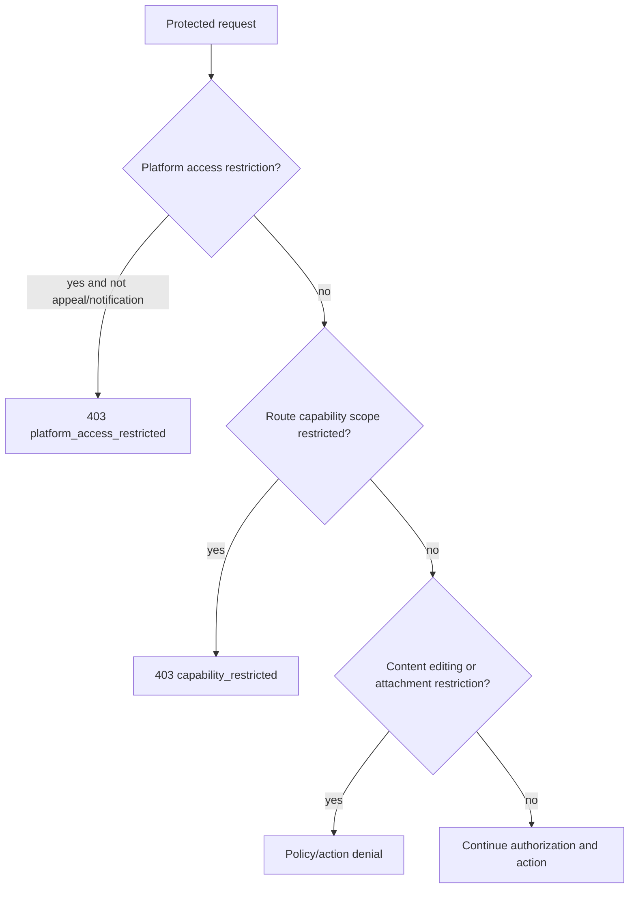

Approved user scopes are platform access, Catalog contribution, Lore contribution, Editorial submission, Media submission, Media attachment, and report submission. Private Journey use remains available for capability restrictions. Platform suspension preserves notification, notification-preference, and eligible appeal API access. Administrators are not implicitly exempt.

## Content restrictions and existing modules

Active public-hide and takedown restrictions are appended to Catalog, Lore root/child, Timeline, Media, Media Attachment, and viewing-order public queries. Editing freeze is enforced in core policies and editorial revision creation. Attachment restrictions are enforced inside the existing Media attachment action. Publication, archival, rights, Media moderation, takedown state, and spoilers remain separate authoritative systems.

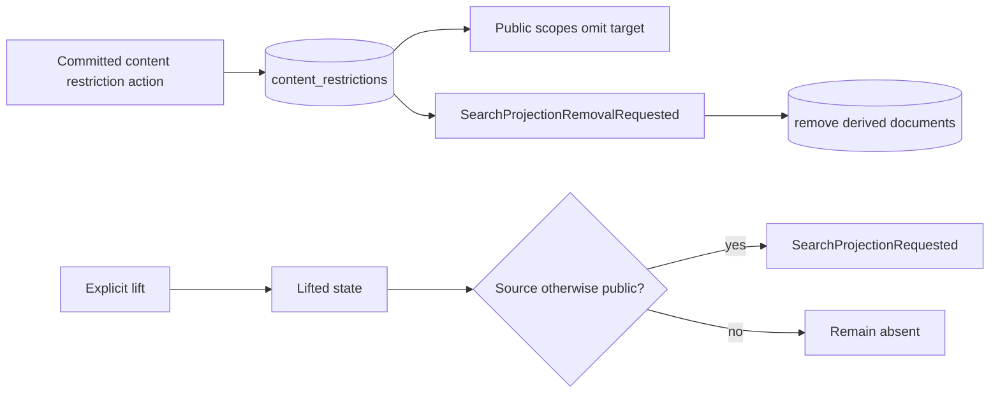

Suggestions and related discovery resolve only active Search sources; removal prevents restricted content and counts from entering results. Lifting requests reprojection, and the existing projector rechecks publication/visibility/spoilers before writing. No historical editorial or rights record is destroyed.

## Appeal lifecycle and conflict rules

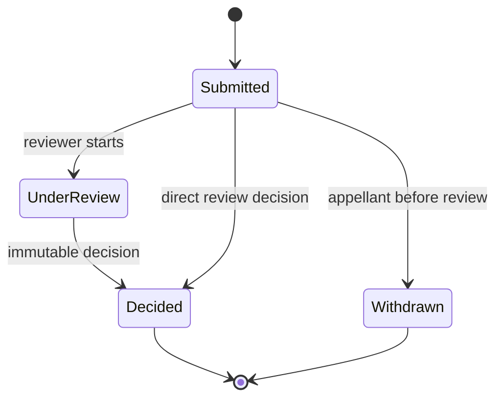

Only the affected user may appeal an eligible action within the configurable 30-day default window. One active appeal exists per appellant/action. Appeals do not pause restrictions. The appellant, original actor, and subject cannot review the appeal. Upheld/dismissed retain enforcement; modified/overturned lift linked active restrictions transactionally while preserving the original action. Replacement actions are separately attributable.

## Notification registry, payloads, and versioning

The code registry defines stable key, schema version, category, priority, supported channels, mandatory flags, opt-out rules, expiry, spoiler sensitivity, payload allowlist, and active state. Initial consumed types cover report receipt/closure, action application, restriction lift, appeal receipt/decision, case assignment, editorial approval/application, Media approval, Journey completion, and rewatch completion.

Payloads contain allowlisted scalar IDs and state/reason codes only. Unknown or nested values and keys matching tokens, secrets, authorization, passwords, notes, histories, positions, or sessions are rejected. Model serialization, class names, private notes, reporter identity, viewing history, playback positions, and arbitrary URLs cannot enter payloads. Schema version `1` is stored per record; a breaking payload requires a new version/renderer branch.

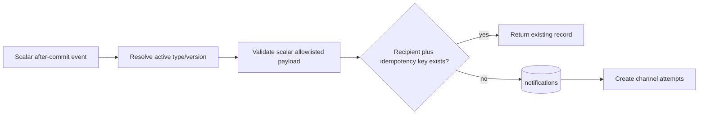

## Spoiler-safe notification rendering

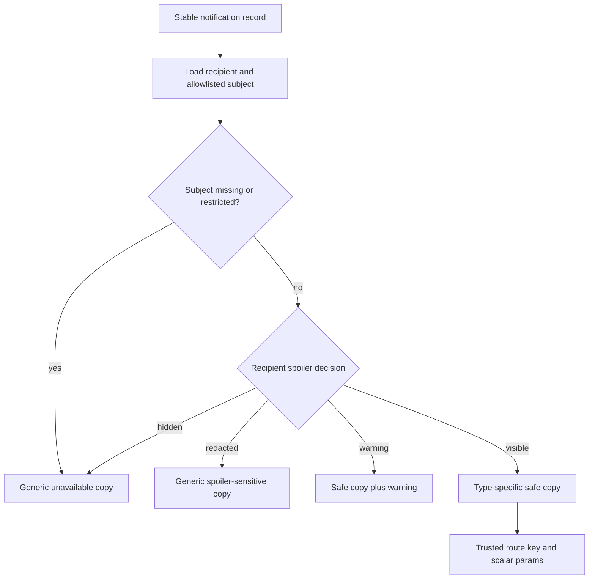

Rendering happens per recipient for API and email. Stored payloads are safe before rendering. Deleted/restricted subjects fall back safely. Journey/rewatch notifications are addressed only to the owner and contain only the owner record ID. Routes are selected by code and never accepted from payload input.

## Preferences and delivery

Deterministic defaults are enabled without creating rows. A preference row is written only for an explicit user change. Mandatory in-app moderation delivery cannot be disabled; rejected attempts are minimally audited. Unknown types/channels are rejected and stale versions return 409. Push and marketing preferences do not exist.

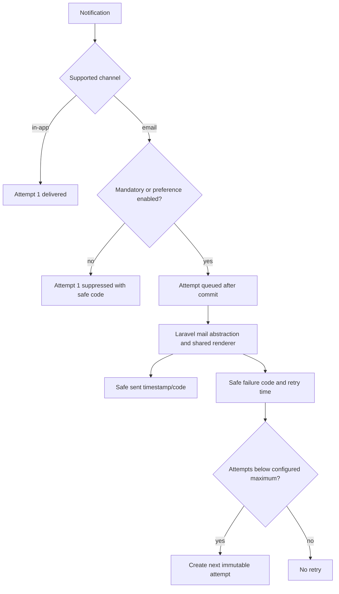

Delivery attempts do not copy email addresses or provider bodies. Retry defaults to three attempts. Tests fake Laravel Notifications; no real mail is sent. Delivery failure occurs after the authoritative source transaction and cannot roll it back.

## Domain-event consumers

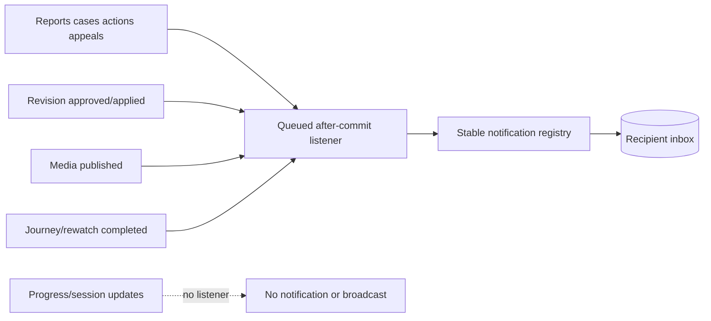

Added scalar events: `ReportSubmitted`, `ReportClosed`, `ModerationCaseAssigned`, `ModerationActionApplied`, `UserRestrictionApplied`, `UserRestrictionLifted`, `ContentRestrictionApplied`, `ContentRestrictionLifted`, `AppealSubmitted`, and `AppealDecided`. Consumed existing events: `EditorialRevisionApproved`, `EditorialRevisionApplied`, `MediaPublished`, `ViewingJourneyCompleted`, and `RewatchCycleCompleted`. Missing/deleted recipients are skipped. `ViewingProgressUpdated`, session activity, playback positions, personal notes, watchlists, and private histories are not consumed. No Prompt 9 event implements broadcasting.

## API authorization

```mermaid
flowchart LR
    Request --> ID[Request ID]
    ID --> Sanctum[Sanctum]
    Sanctum --> Verified[Verified email]
    Verified --> Limit[API plus report/appeal limit]
    Limit --> Suspension[Central restriction middleware]
    Suspension --> Owner[Owner or case-scoped binding]
    Owner --> Policy[Explicit permission/policy]
    Policy --> RequestRules[Form Request allowlists]
    RequestRules --> Action[Transactional domain action]
    Action --> Resource[Private-field-safe Resource]
```

Added routes cover report categories; own report list/create/detail/withdraw/evidence; case list/create/detail/update/assign/action and restriction lifts; own appeal list/create/detail/withdraw plus moderation review/decision; own notification list/detail/read/unread/archive/read-all; and notification preferences. Lists are cursor-bounded to 50 and read-all is bounded to 500. No route accepts a user ID to select another user's inbox/report/appeal.

## Permissions, policies, and audit

Permissions add report view/triage, case create/view/assign/investigate/reopen, action application, user/content/permanent restriction authority, appeal review, and notification-delivery/type operational reservations. Moderators receive the minimum ordinary temporary workflow permissions. Administrators receive all explicitly through the existing seeder. Rights authority remains separate.

Audits record safe identifiers, state transitions, type/scope keys, versions, and counts for report, case, assignment, action, restriction, appeal, rejected mandatory preference, and future manual delivery intervention. Full report/appeal text, internal notes, reporter identity in subject surfaces, personal Journey data, rendered bodies, email bodies, provider payloads, addresses, headers, tokens, and secrets are excluded.

## Account deletion and retention

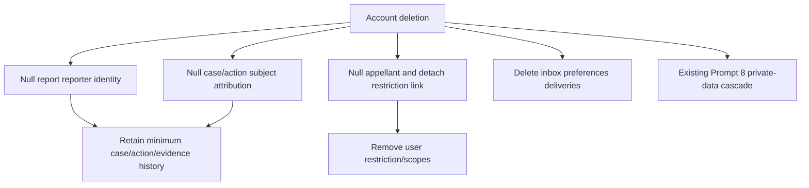

Reports/evidence/cases/actions/appeal decisions remain when moderation integrity requires them; actor/reporter/subject FKs null where appropriate. Identifiable private Journey data is never copied to a case and continues to follow Prompt 8 deletion. Notifications/preferences/deliveries are deleted with the recipient. No legal hold or scheduled pruning conclusion is invented. Report, evidence, case, action, appeal, takedown, failed-delivery, and audit retention windows remain an owner/legal/operations decision; destructive pruning is deferred.

## Threat review

| Threat | Control |
| --- | --- |
| Arbitrary morph/target IDOR | Enforced morph map, operation registry, existence/access checks, owner/case policies. |
| Reporter deanonymization | No subject route; subject actions/notices omit reporter; moderator-only report field. |
| Moderator self-dealing | Subject/reporter assignment checks; appeal reviewer cannot be appellant, actor, or subject. |
| Rights bypass | Rights categories and takedown/rights effects require separate rights permission. |
| Restriction bypass/expiry error | Central route middleware, policies/actions, time-aware evaluator, direct API tests. |
| Duplicate restriction/notification races | Source-action uniqueness, active-primary/active-appeal keys, recipient/idempotency unique. |
| Hidden-content/search/count leak | Public scopes omit active restrictions; after-commit projection removal; no totals. |
| Private note/history exposure | Dedicated private columns omitted from user Resources/audits/payload registry. |
| Notification injection/XSS/URL abuse | Scalar field allowlists, plain copy, code-selected routes, no rendered HTML storage. |
| Email/header/provider leakage | Laravel Mail abstraction; no recipient address/provider body in delivery rows. |
| Retry storm | Immutable attempt numbers, configured maximum, expiry check. |
| Report spam | Verified authentication and strict user-keyed limiter. |
| Stale writes | Case/appeal/preference lock versions and stable 409. |
| Unsafe deletion | Restricted durable parents, nullable attribution, explicit account-deletion detachment. |

## Migration, rollback, and deferred work

`2026_07_12_130000_implement_moderation_notifications.php` is additive and sorted after Media because report evidence may reference existing Media rows. Empty SQLite full forward/full rollback passed. It performs no backfill and changes no existing row. Local loopback MariaDB applied it as batch 9. Repeated permission/category seeding is idempotent.

Rollback drops only Prompt 9 tables in dependency order. Once moderation history exists, rollback requires explicit backup/authorization because it intentionally removes new Phase 6 records. No existing Catalog, Lore, Editorial, Media, Search, User Journey, rights, spoiler, or audit row is deleted.

Deferred Moderation: public legal/copyright intake, arbitrary file evidence, legal hold automation, severe dual-control workflow, workload balancing, automatic assignment, AI classification, external services, Community/message moderation, and UI. Deferred Notifications: digest tables/jobs, push devices/providers, mobile delivery, marketing preferences, frontend UI, scheduler-driven expiry reminders, provider delivery receipts, and operational retry endpoints.

## Test coverage

Focused Pest coverage verifies idempotent definitions, valid/invalid/private reports, duplicates, withdrawal/evidence, auth/verification/ownership/rate limits, case transitions/conflicts/resolution, assignment history/conflicts/rights separation, action immutability, scoped/platform/content restrictions, expiry/lift/Search/public/editing enforcement, appeals/conflicts/overturn, payload/version/idempotency, rendering fallbacks/spoilers/routes, preferences, delivery suppression/retry, queued event mapping, absence of progress notifications/broadcasting, recipient API isolation, account deletion/anonymization, request IDs, cursor bounds, and private-note omission.
