# Community Core and Bunker Groups Implementation

## Implemented scope

Prompt 10 adds the fandom-neutral persistent Community domain: controlled Bunker categories; public, private, and invite-only Bunkers; local memberships and roles; join requests; invitations; local bans; ordered rules; posts; adjacency-list comments; reactions; private bookmarks; normalized tags; mentions; polls and votes; global, universe, and Bunker feeds; spoiler, Media, report, restriction, notification, audit, account-deletion, policy, and API v1 integration.

No frontend, direct/group/Bunker chat, Reverb broadcast, presence, watch/voice/video room, follower graph, public activity feed, mobile feature, AI, scraper, copyrighted asset, or fandom-specific production content is included.

## Canonical schema selection

Prompt 3 owns 19 Community inventory names. This phase creates 18 tables: the canonical 19 minus `link_previews`. The prompt explicitly defers external fetching and link previews unless an approved safe service already exists; none exists. Separate post/comment version tables are not canonical and were not invented. `edited_at`, checksums, audit events, soft deletion, and existing immutable moderation actions preserve the approved edit/moderation evidence boundary.

| Table | Ownership and lifecycle |
| --- | --- |
| `bunker_categories` | Code-controlled active taxonomy; stable key; disabling does not invalidate links. |
| `bunkers` | Authoritative soft-deletable group root; scoped slug; versioned draft/published/suspended/archived lifecycle. |
| `bunker_category` | Disposable category assignment with composite primary key. |
| `bunker_memberships` | Attributable local-role history; nullable active key enforces one current membership. |
| `bunker_join_requests` | Immutable decisions with one active request key. |
| `bunker_invitations` | Hashed single-use token, expiry, and one active invitation key. |
| `bunker_bans` | Local enforcement history with private note excluded from resources. |
| `bunker_rules` | Ordered, versioned, plain-text rules. |
| `posts` | Soft-deletable UGC with universe/Bunker/reference, feed indexes, checksum, lifecycle, and lock version. |
| `comments` | Soft-deletable adjacency/thread-root UGC with bounded depth and stable sibling cursor. |
| `reactions` | Disposable allowlisted post/comment morph with actor-target-type uniqueness. |
| `bookmarks` | Owner-private disposable post morph with no public counter. |
| `tags` | Universe-normalized controlled UGC vocabulary. |
| `taggables` | Unique post/tag morph assignment. |
| `mentions` | Resolved accessible-user source morph with notification idempotency key. |
| `polls` | One versioned poll per post. |
| `poll_options` | Immutable-after-vote ordered options. |
| `poll_votes` | Private identity, unique option choice, transactional choice-limit enforcement. |

All use unsigned bigint IDs except the composite pivot. Durable parents restrict deletion; user attribution nulls where public/moderation integrity survives; reactions/bookmarks cascade with account deletion. High-volume indexes cover feeds, comment siblings, reactions, bookmarks, mentions, and votes. Authoritative rows are Bunkers/content/membership/polls; counters are derived at query time and are never authorization inputs.

## Stable values

String-backed enums define Bunker visibility/status, membership role/status, request/invitation/ban/rule states, post/comment state and visibility, five generic reaction types, mention type, poll type/status/results visibility. Existing spoiler, publication, restriction, and Media enums remain authoritative.

## Bunker lifecycle and visibility

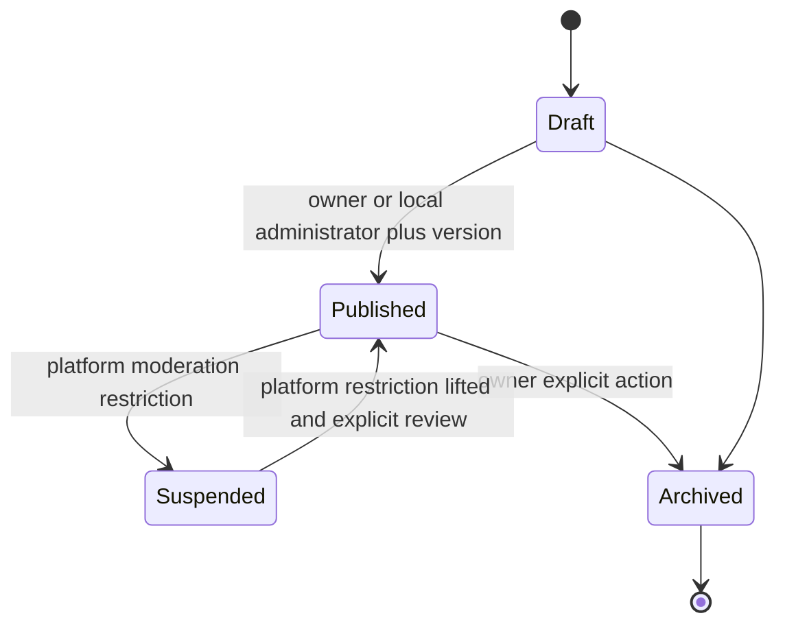

Public Bunkers are discoverable after publication. Private Bunkers return 404 to non-members and never enter discovery. Invite-only Bunkers reject join requests and require a valid hashed invitation. Content and membership authorization is enforced before pagination. Counts are not exposed as authorization facts.

## Membership and local roles

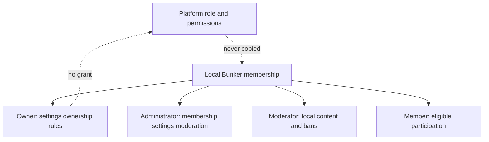

Creation transactionally creates one owner membership. Ownership transfer locks the Bunker, validates an active destination member, demotes the prior owner, promotes the destination, updates the unique owner key, increments the version, and audits safe IDs. Owners cannot leave or be removed/banned before transfer or archival. Role edits use lock versions; administrators cannot appoint other administrators.

## Join requests and invitations

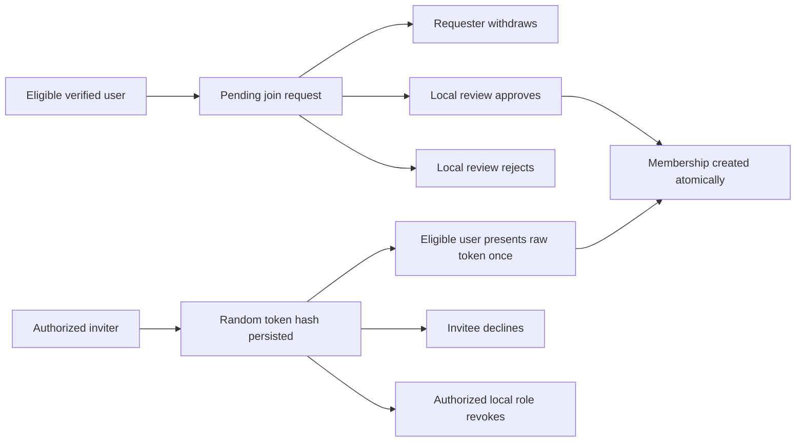

Messages are bounded plain text and not included in notification/audit payloads. Invitations target verified existing users, expire after seven days, store only SHA-256 hashes, and reveal the raw token only in the creation response. Bans and active memberships block both paths.

## Local bans and rules

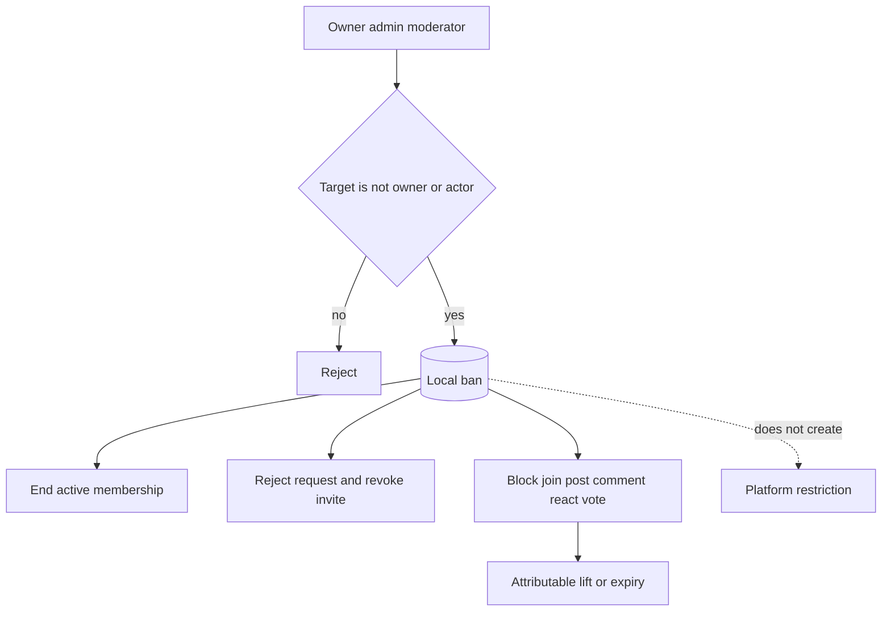

Rules are bounded plain text, deterministically ordered, versioned, attributable, and deactivated rather than losing history. Reordering is transactional with a temporary position range to preserve uniqueness.

## Posts, comments, edits, tags, mentions, and media

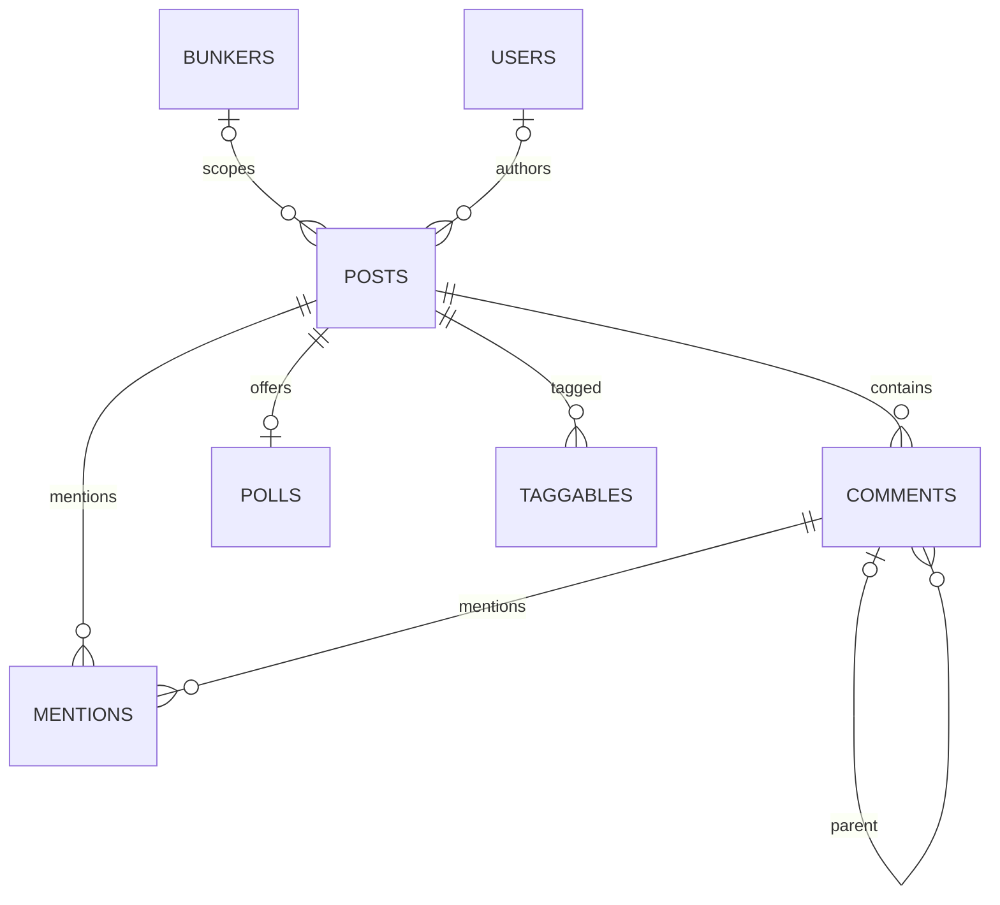

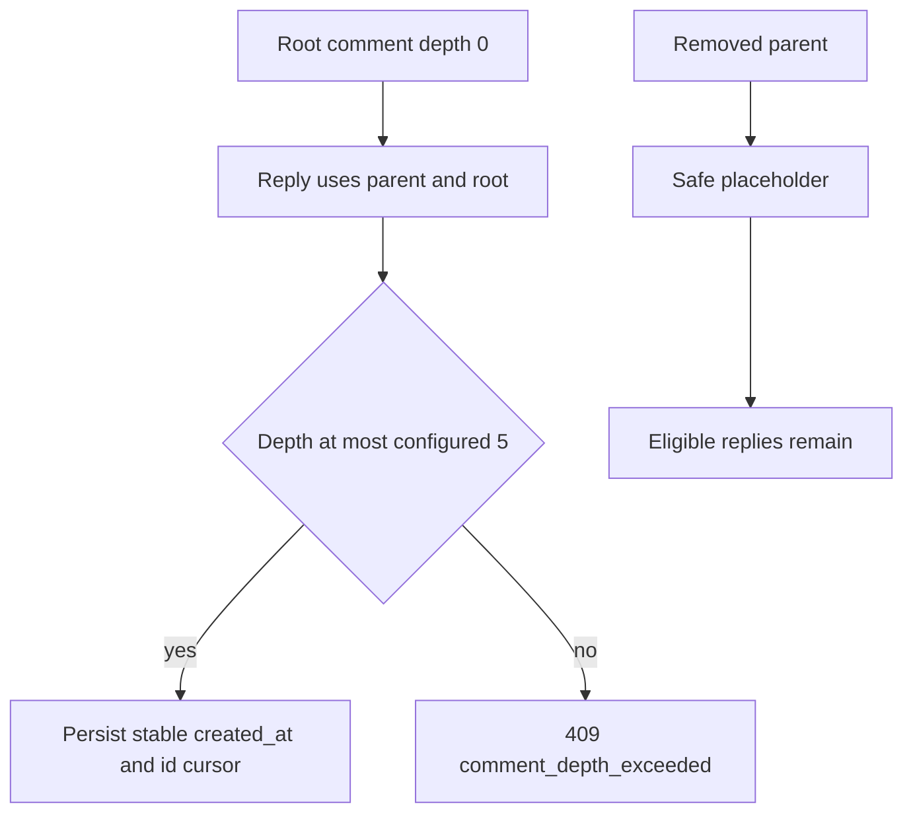

HTML is stripped and plain text is stored. Cross-universe Bunker, Catalog, Lore, and spoiler references are rejected. Posts/comments carry checksums, edit timestamps, and optimistic lock versions; author deletion and moderator removal use distinct states. Edit bodies are not copied into audit records. Reactions use five code-controlled values. Bookmarks remain owner-only with no totals. Tags normalize lowercase/squished within a universe and are bounded to eight per post. Server-owned `@<user-id>` parsing reconciles at most ten accessible mentions transactionally.

Media reuses `media_attachments`; approved targets now include `bunker` and `community_post`. Existing quarantine, rights, moderation, publication, universe, attachment restriction, and spoiler rules continue to control exposure. Comments do not receive Media attachments in this phase.

## Polls and votes

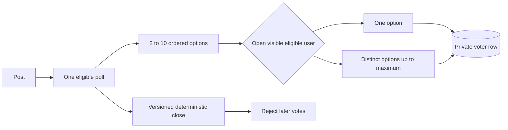

Options cannot be changed by the API after creation. Vote replacement is transactional; DB uniqueness prevents duplicate option choices. Results respect always/after-vote/after-close settings. Voter identities have no public resource.

## Spoiler-safe feeds

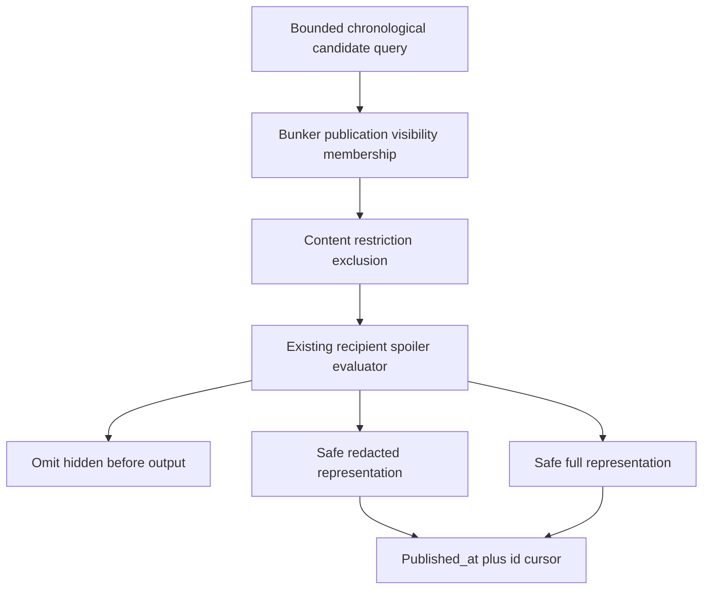

Global, universe, and Bunker feeds use `(published_at,id)` descending cursor order and a maximum page size of 50. Private Bunker filtering occurs inside the query. Posts/comments reuse normalized `spoiler_constraints` and `spoiler_boundaries`; Community targets were added to the existing evaluator and author classifications begin draft/conservative. Notifications render per recipient. Poll text and attached Media inherit the post boundary.

## Notifications and moderation

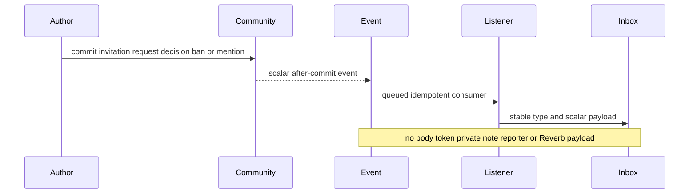

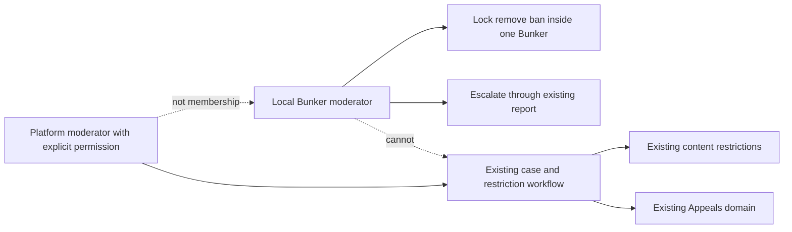

Report targets now include Bunker, post, comment, and poll aliases with reporter access checks. Restriction scopes add Bunker creation/membership and Community create/comment/react/mention/vote capabilities. Content restrictions add comment blocking while existing public hide, search hide, editing freeze, attachment block, and takedown remain authoritative.

Stable Community notification definitions cover invitation, join request/approval, local ban, and mention. Payloads contain IDs only. The existing queued after-commit listener creates idempotent inbox/delivery rows; failures occur after source commit. No Community event implements `ShouldBroadcast` or uses Reverb.

## API authorization

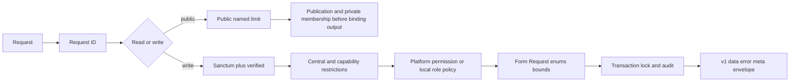

Routes cover category/discovery/detail/rules/members; Bunker create/update/publish/archive/transfer; membership list/role/removal; request withdraw/approve/reject; invitation accept/decline/revoke; ban/lift; rule CRUD/reorder; three feeds; post/comment CRUD and locks; reactions; private bookmarks; poll create/vote/remove/close. Writes require Sanctum, verification, named limits, central restrictions, Form Requests, policies/local role checks, and stable 409 errors.

Platform permissions add Bunker creation, safety-only private access reservation, platform Community moderation, restore reservation, and tag management. Ordinary management is local-role based. Contributors gain no Community authority from editorial permissions; platform moderators gain no membership; local roles gain no platform, editorial, Lore, rights, or administrator permission.

## Audit, events, privacy, and deletion

Audits cover Bunker create/publish/archive/transfer, local role changes, membership removal, ban/lift, and integrity-sensitive rule/post state. Metadata contains IDs, states, reason codes, and versions—not bodies, request messages, raw tokens, notes, bookmark contents, votes, or notification copy.

After-commit scalar events: `BunkerCreated`, `BunkerMembershipRequested`, `BunkerMembershipApproved`, `BunkerInvitationCreated`, `BunkerMemberBanned`, `CommunityPostPublished`, `CommunityPostUpdated`, `CommunityPostRemoved`, `CommunityCommentCreated`, `CommunityCommentRemoved`, `CommunityMentionCreated`, and `CommunityPollClosed`.

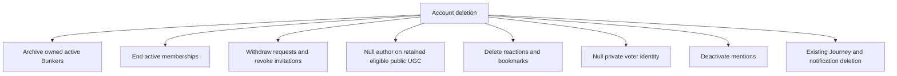

Public eligible authored content may remain anonymized; drafts and destructive retention remain an owner/legal decision. Private bookmarks delete. Reaction rows delete. Vote identity nulls to preserve aggregate integrity. Ban/moderation history retains nullable attribution. Private User Journey data is never copied or exposed.

## Threat review

| Threat | Control |
| --- | --- |
| Cross-Bunker IDOR/private enumeration | Private resources return 404; membership is checked before feed/resource output. |
| Local/platform escalation | Separate enum/table/policy paths; local roles never mutate platform role pivots. |
| Owner removal | Transactional owner key and explicit transfer/archive guard. |
| Token/note leakage | Invitation hash only at rest; private notes omitted from resources/audits/payloads. |
| Stored XSS/unsafe Markdown | Plain text, HTML stripping, bounded fields, no Markdown renderer or remote preview. |
| Arbitrary morph/cross-universe reference | Enforced morph map, allowlists, action-level universe checks. |
| Comment/mention/reaction spam | Depth/count limits and named write limiters. |
| Vote race/identity leak | Poll row lock, DB unique choices, no voter resource. |
| Hidden count/spoiler/Media leak | Filtering before output; no private totals; existing rights/spoiler checks. |
| Stale overwrite | Row locks, expected versions, stable `optimistic_lock_conflict`. |
| Unsafe cascade | Durable parents restrict; disposable pivots/private interactions cascade only where approved. |

## Migration and deferred work

`2026_07_12_140000_implement_community_bunkers.php` is additive, performs no backfill, and changes no pre-existing row. Empty SQLite full forward/full rollback passed before local MySQL execution; local execution is batch 10. Repeated permission/category seeders are idempotent.

Deferred from Prompt 10: link previews, richer post/comment revision bodies, Community Search projection/ranking, aggregated reaction notifications, joined-Bunker personalized feed, public member privacy controls beyond the current visibility rule, frontend/admin/moderator UI, Messaging/Bunker chat, all Reverb delivery, rooms, followers, mobile, and push. Prompt 11 subsequently implemented the canonical `user_blocks` and `user_mutes` prerequisite without beginning Messaging.

## Test coverage

Focused Pest tests cover stable morphs/non-broadcast events, owner creation, local-role separation, join approval/duplicates, hashed single-use invitations, local bans without platform restriction, membership-gated UGC, XSS stripping, cross-post threading, reaction/bookmark/vote uniqueness, stale versions, public/private discovery, authentication/verification, request IDs, and owner-only bookmarks. Full validation evidence is recorded in the implementation audit.
