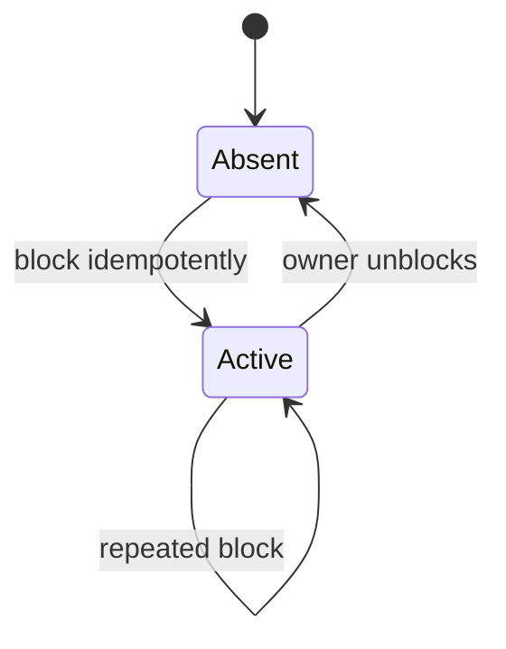
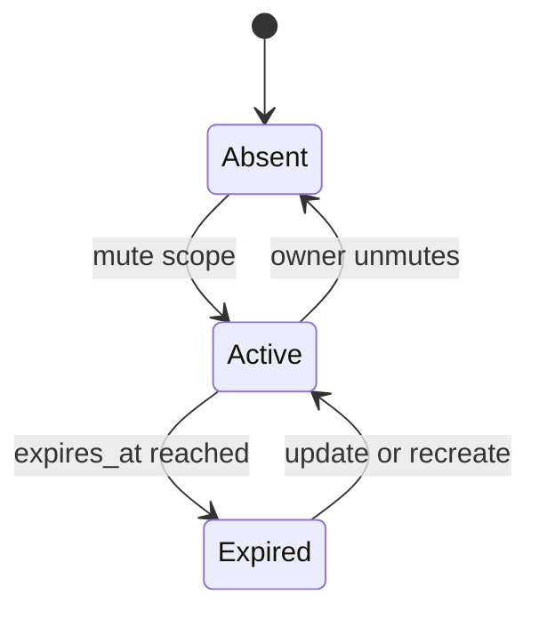
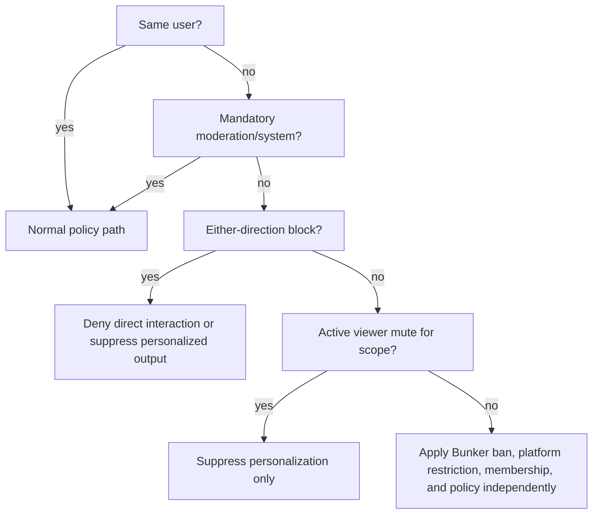
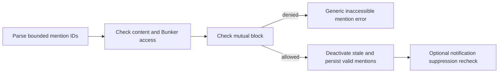
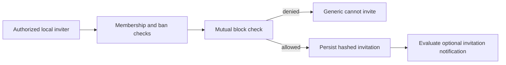
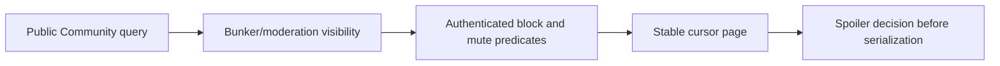
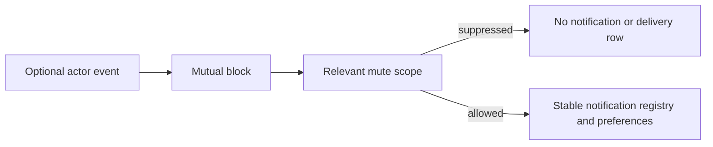
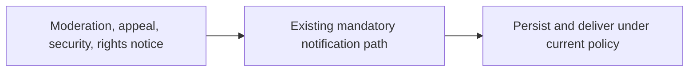
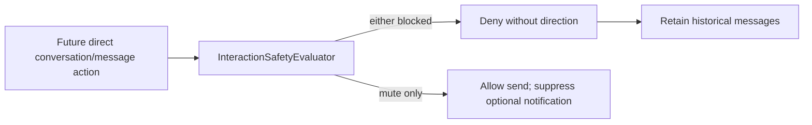
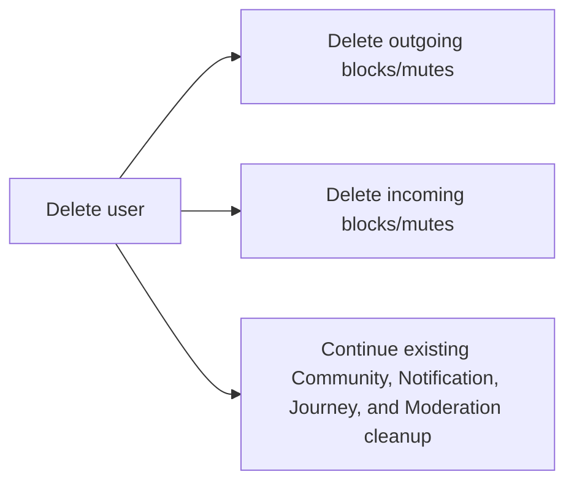

# Prompt 11 Interaction Safety

## Scope and decisions

Identity owns `user_blocks` and `user_mutes`. Both are private, mutable preference records with integer primary keys, real cascading user foreign keys, timestamps, pair/scope uniqueness, and reverse-lookup indexes. They are removed on either account's deletion. Blocks are permanent until removed; temporary blocking was not approved. Mutes support `all`, `community_content`, `mentions`, and `bunker_invitations`, with optional `expires_at`. Expired rows are inert. `all` matches every narrower scope; narrower records may coexist and remain deterministic.

Blocking is unilateral persistence with mutual direct-interaction enforcement. It prevents mentions, targeted replies, reactions to the other user's content, Bunker invitations, and future direct-message creation/sending. It suppresses either-direction authored content for the authenticated blocker/blockee and optional actor-caused notifications. It does not remove public content, shared memberships, reports, cases, appeals, platform restrictions, Bunker bans, or mandatory safety notices. Public content remains available to guests: blocking is not secrecy.

Muting is viewer-only personalization, never authorization. It hides selected authored content and optional notifications, does not stop direct interaction, does not alter membership/roles, and is invisible to the target. Search projections remain shared; Community Search is deferred and must apply the evaluator at query time.

## Components and API

- `InteractionSafetyEvaluator` is stateless and side-effect-free. It answers directional/either-direction block, scoped mute, direct interaction, mention, invitation, feed, and optional notification decisions.
- `ManageInteractionSafety` provides idempotent create and owner-only delete actions, safe audit metadata, and scalar after-commit events.
- `UserBlockPolicy` and `UserMutePolicy` grant only owner access; platform roles add no bypass.
- `GET/POST/DELETE /api/v1/me/blocks[/{block}]` and equivalent mute routes require Sanctum, verified email, platform-restriction middleware, stable v1 envelopes/request IDs, bounded cursors, and named write throttling.
- `UserBlocked`, `UserUnblocked`, `UserMuted`, and `UserUnmuted` contain scalar IDs only, dispatch after commit, and never broadcast or notify the target.

Audit records contain actor, target ID, and mute scope only. Block reasons are bounded private codes returned only to the blocker and are omitted from audit metadata. No free text, content body, notification body, request body, Journey data, network fingerprint, or token is logged.

## Integration behavior

Mentions recheck mutual blocks and return the existing generic inaccessible-mention error. Edits deactivate stale mentions before creating valid replacements. Replies are rejected only when directly targeting the other user's post/comment; unrelated participation in a shared public thread remains possible. Reactions enforce the authored target relationship. Bunker invitations enforce blocks in both directions. Join requests remain workflow-based and are not globally rejected merely because an owner/reviewer relationship is blocked; Bunker bans remain the membership prohibition. Blocks never remove shared members, and mutes never alter member lists.

Authenticated feed queries exclude block relationships in both directions and active `all`/`community_content` mutes before cursor serialization. Guest feeds are unchanged; existing Bunker, moderation, rights, and spoiler filters remain. Community Search is not indexed, so only the future query-time contract is recorded.

Optional mention and invitation notifications are suppressed before record/delivery creation. Moderation actions, restrictions, appeal decisions, security/account, rights/takedown, and system-integrity notices do not call optional suppression and remain deliverable. No Reverb path was added.

Account deletion explicitly removes all incoming/outgoing personal safety rows before existing Community/Moderation cleanup. Durable moderation evidence remains independent.

## Decision flows

## Migration, testing, and threat review

The additive migration creates two empty tables and performs no backfill. MySQL index names are explicit and bounded. SQLite forward/rollback and local MySQL application are validated separately. Factories produce synthetic distinct relationships; `expired()` supports evaluator coverage. No production seed rows exist.

| Threat | Control | Residual risk |
| --- | --- | --- |
| Self relation / duplicate race | request and action validation plus unique indexes | simultaneous create returns a database conflict if both miss `firstOrCreate`; retry remains safe |
| Direction disclosure | generic Community/Bunker errors and no target endpoint | public content can still be observed anonymously |
| Enumeration / role bypass | `/me` routes, owner checks, no broad permissions/counts | compromised owner account can read its own list |
| Notification bypass | creation-time evaluator recheck | new optional notification types must declare actor/scope integration |
| Feed leakage | query-time exclusion before serialization | future Community Search must reuse the same contract |
| Mandatory notice suppression | mandatory event paths bypass personal suppression | type classification requires review when new types are added |
| Audit/privacy leakage | scalar allowlist; reason omitted | central audit retention policy still applies |
| Stale cache | evaluator reads MySQL directly | future caching requires user/version invalidation |

Deferred: Community Search indexing, frontend settings, administration UI, maintenance pruning for expired mute rows, Messaging, conversations, chat, presence, typing, receipts, Reverb, followers, mobile, and public block/mute counts.
