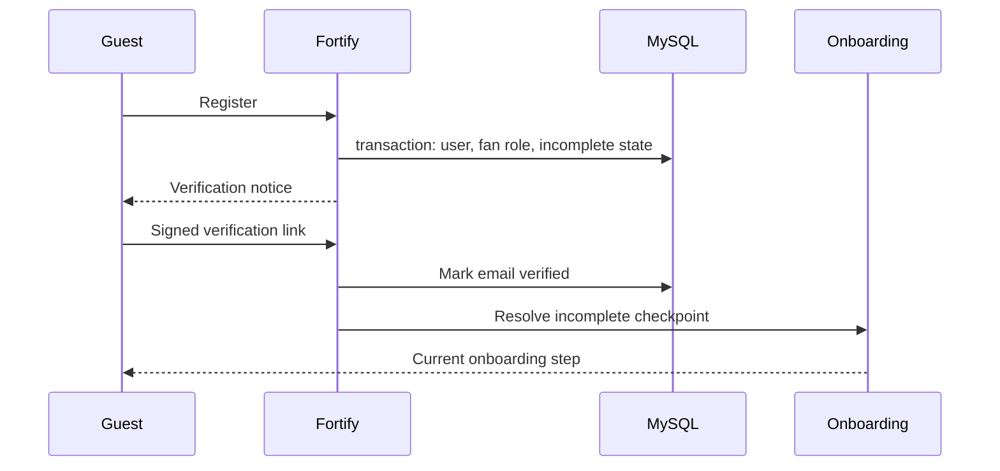
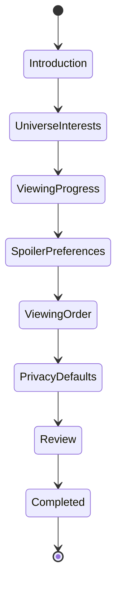
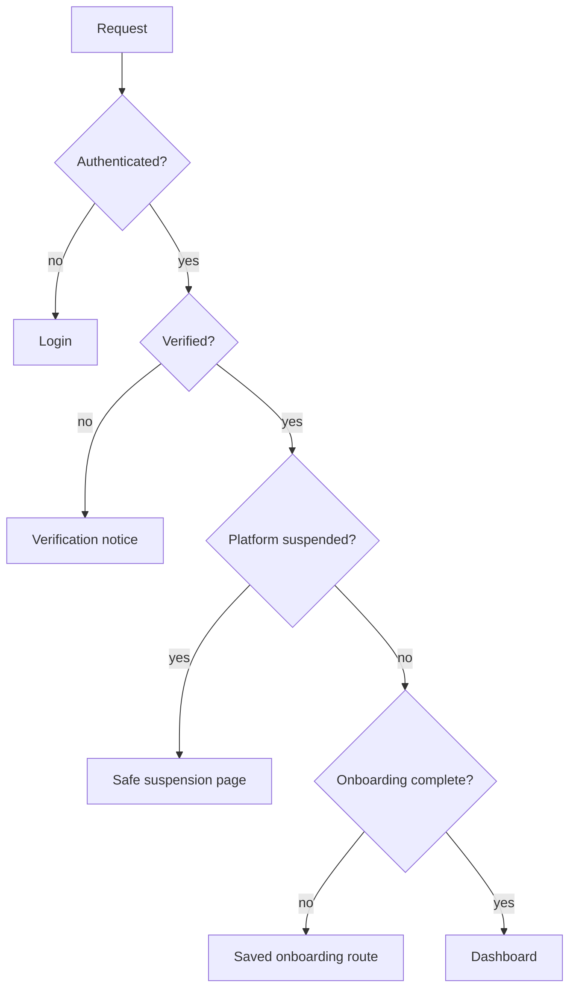
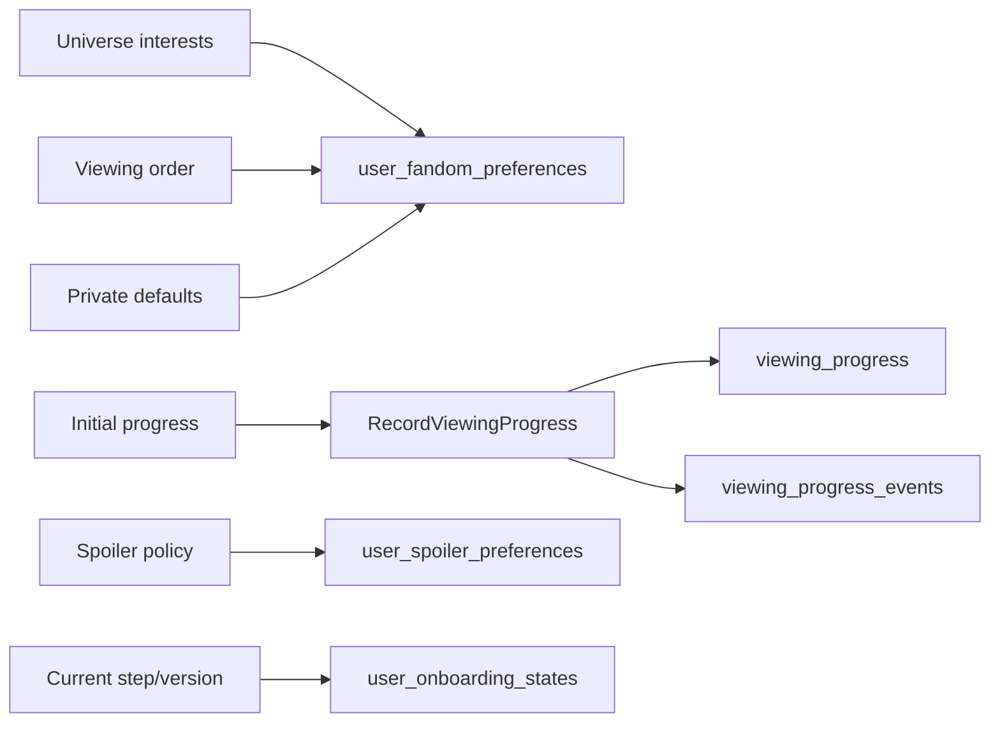
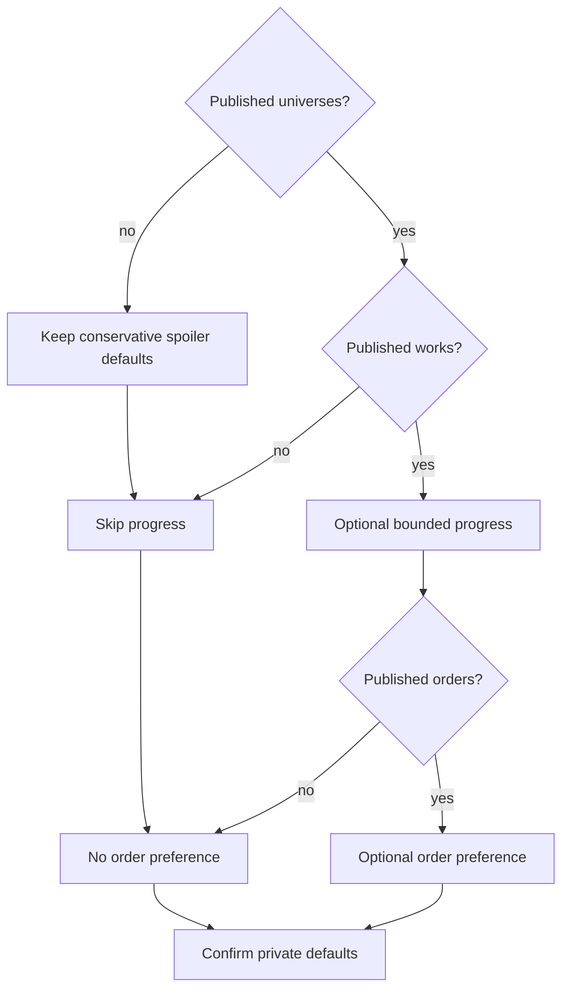
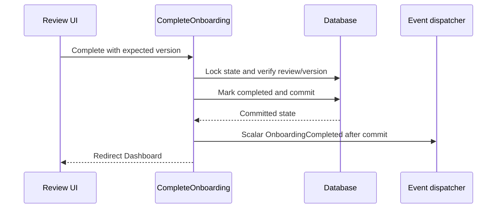
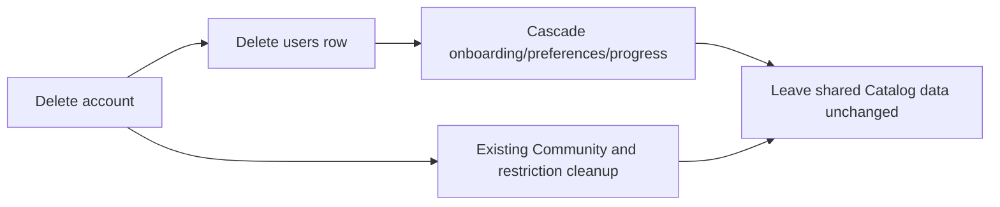

# Prompt 14 Authentication and Persisted Onboarding

## Implemented scope

Prompt 14 completes the branded Fortify page contract and adds a resumable, server-persisted fan onboarding workflow. It introduces one workflow-only record, seven sequential Inertia steps, verification-aware resume, dashboard enforcement, platform-suspension handling, optimistic conflicts, account-deletion cleanup, responsive/accessibility behavior, and focused Pest coverage. It does not implement public Catalog/Lore pages, Fan dashboard widgets, Community, workspaces, Messaging, realtime delivery, mobile, WebGL, or copyrighted content.

## Persistence decision

`user_onboarding_states` stores only `user_id`, `current_step`, `started_at`, `last_activity_at`, `completed_at`, `lock_version`, and timestamps. The unique user foreign key cascades on account deletion. Interests and viewing-order/privacy preferences remain in `user_fandom_preferences`; spoiler choices remain in `user_spoiler_preferences`; initial progress remains in `viewing_progress` and `viewing_progress_events`. There is no JSON settings bag, completed-step array, client completion flag, or duplicate domain table.

The stable enum is: `introduction`, `universe_interests`, `viewing_progress`, `spoiler_preferences`, `viewing_order`, `privacy_defaults`, `review`, and `completed`. A successful current-step submission advances once. A fresh submission of an earlier completed step updates the typed domain record without rewinding the workflow. Future submissions and stale versions return the branded HTTP 409 conflict page.

## Existing and new users

The additive migration backfills every existing user as completed, including verified and unverified accounts. The migration does not alter user or domain rows. The resolver also treats a missing state as completed as a defensive compatibility path for non-registration user creation. Fortify registration creates an incomplete `introduction` state inside the existing user/role transaction, so user creation cannot commit without required onboarding state creation.

## Step progression and redirect behavior

Authenticated unverified users are limited to verification/resend/logout as before. Verified incomplete users are redirected from Dashboard to the saved step. Settings Profile, Security, Appearance, password confirmation, two-factor/passkey management, and logout are not onboarding-gated. Completed users are redirected away from onboarding. Platform-access suspension is evaluated before onboarding and routes the user to a public-safe suspension notice; internal notes, reporter identity, and evidence are excluded.

## Domain persistence

Universe interests are the presence of typed per-universe fandom-preference rows. The current schema has no primary-universe field, so progress explicitly selects among interested universes rather than inventing one. Initial progress supports skip, not started, bounded watched-through episode completion, and completed work. It calls `RecordViewingProgress`; controllers never write progress tables. Watched-through processing is capped at 100 published episodes and uses stable request IDs for replay safety.

Spoiler onboarding uses the implemented `strict`, `warn`, and `permissive` policies, warning metadata flag, and rewatch behavior. The UI explains safe/minor/moderate/major/finale classifications without placing protected examples in the DOM. Viewing orders are published/public/non-archived only and save a preference without creating a Journey. Privacy confirmation writes only the supported per-universe private visibility fields; watchlists, notes, blocks, and mutes remain private through existing domain policy. Unsupported global Community, notification, marketing, and public-visibility choices are not shown or stored.

## Empty and partial data

The current local database has no published universes or viewing orders. The workflow therefore permits empty interests, skips progress/order without mutation, requires explicit spoiler and privacy confirmation, and completes with conservative defaults. Universe-without-work, season-without-episode, and no-order states use the same safe omission. Every save revalidates public state so archived/draft selections fail without advancing.

## Completion and deletion

Completion row-locks the state, requires `review`, checks the expected version, writes `completed` and `completed_at`, increments the version, and dispatches a scalar `OnboardingCompleted` event after commit. It creates no notification and broadcasts nothing. The dashboard redirect occurs only after commit. Account deletion removes the onboarding row through its cascading user foreign key while existing user-deletion domain cleanup remains unchanged.

## Web and frontend architecture

Fourteen named onboarding routes use GET render plus PATCH/POST mutation patterns. Eight focused controllers delegate to seven actions and one completion action. Wayfinder generated every frontend action/route helper. The shared onboarding layout provides the original brand, appearance/logout utilities, semantic ordered progress, `aria-current=step`, skip link, main landmark, polite current-step announcement, responsive mobile/desktop layout, 44px-class controls, sticky mobile actions, dark/light/system appearance, and heading focus after navigation. Form error summaries receive focus. Conflict UI preserves unsaved values only in component memory and never browser storage.

Existing sign-in, registration, forgot/reset password, verification, confirmation, and two-factor pages gained form error summaries and accessible status treatment; email autocomplete, one-time-code labels/autocomplete, password guidance, and keyboard-accessible reveal controls were corrected. Passkey and Fortify security behavior is unchanged.

## Migration, rollback, tests, and threat review

Empty SQLite full forward/full rollback passed. A populated isolated SQLite schema backfilled two existing users as completed; rolling Prompt 14 back preserved both users and removed only the onboarding table. Local MySQL migration batch 12 backfilled both real users as completed. Rollback intentionally removes workflow checkpoints only; it does not touch typed preferences/progress. Once new incomplete registrations exist, operational rollback should be preceded by a workflow-state export if checkpoint retention matters.

Threat controls include authenticated/verified-only routes, owner-derived user identity, no user ID input, unique user state, row locks, future-step rejection, optimistic versions, published-data revalidation, bounded progress events, no hidden synopsis props, no open redirect input, platform restriction precedence, cascade deletion, and no local/session storage. Manual screen-reader, forced-colour, 200% zoom, reduced-motion, and multi-browser spot checks remain required before a compliance claim.

## Deferred capabilities

Global primary-universe preference, public/follower personal projections, global privacy settings, notification/community defaults beyond current typed records, Journey creation from review, onboarding restart, onboarding skip-all policy, and a completed-summary route are deferred. Prompt 15 may begin only the public website/static policy/error surfaces and must not redesign onboarding or pull Prompt 16 Catalog/Lore pages forward.
