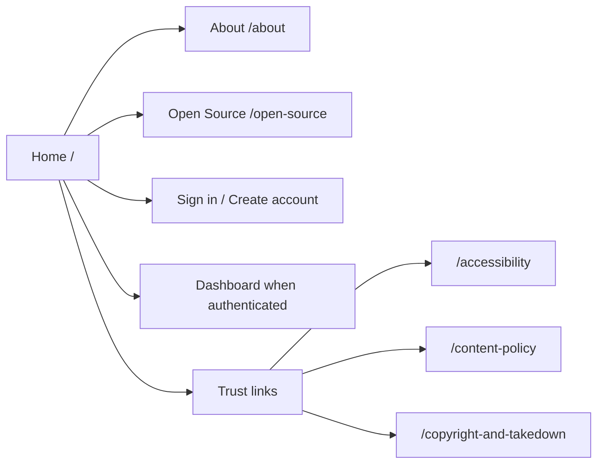
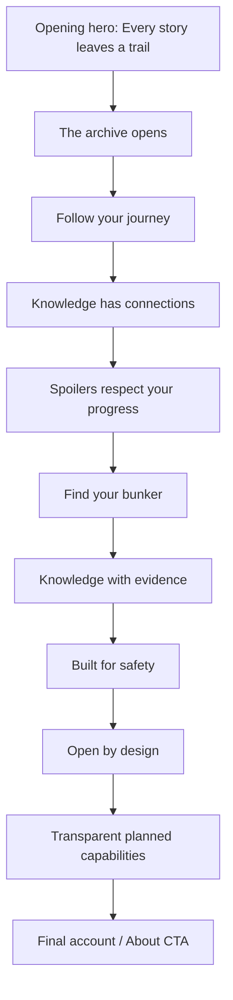
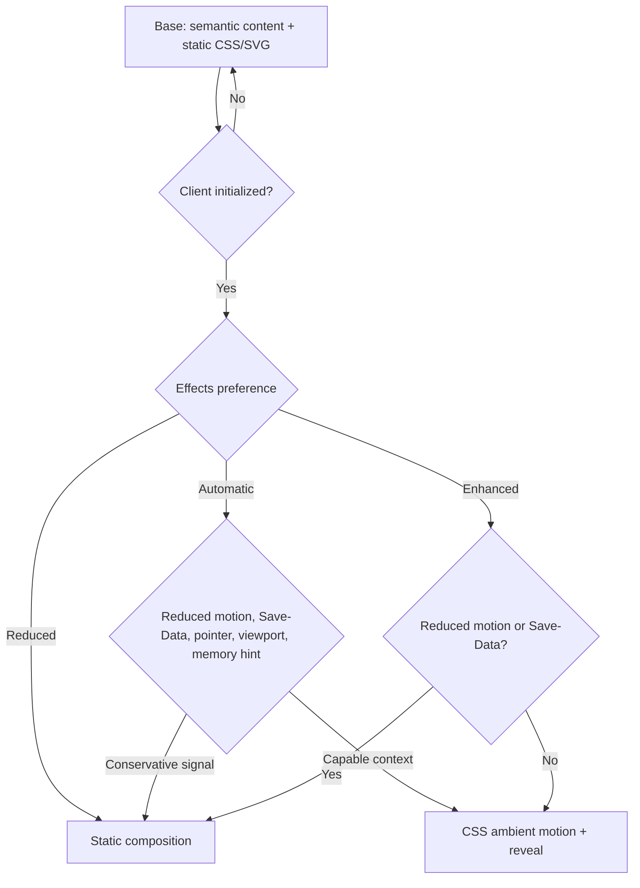
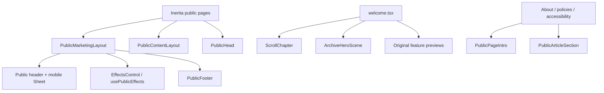
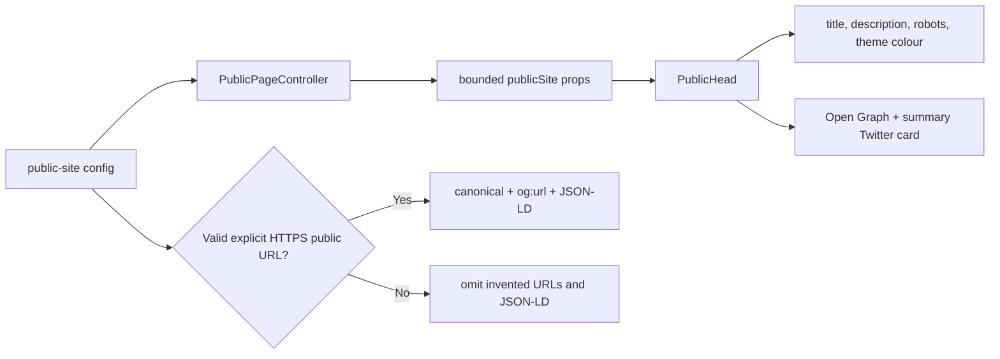
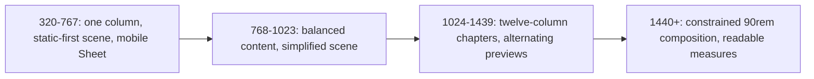

# Prompt 15 Public Website and Homepage

## Implemented scope

Prompt 15 replaces the Prompt 13 foundation preview with a complete, original public narrative and adds About, Open Source, Accessibility, Content Policy, and Copyright and Takedown pages. It enhances the existing Public Marketing and Public Content layouts, adds an accessible effects preference, metadata and structured-data foundations, responsive original CSS/SVG scenes, safe repository configuration, public-route tests, and a reusable footer. No database query, migration, dependency, remote asset, Canvas, WebGL, video, audio, Catalog/Lore/Search page, Community page, workspace, Messaging, or mobile code is introduced.

## Public information architecture

The primary header contains Home, About, and Open Source only. Guests receive Sign in and Create account; authenticated visitors receive Open app and remain permitted to browse public pages. Footer groups expose Product, Trust, Account, configured repository, active-development status, the unofficial-project disclaimer, and unresolved software-licence status. No deferred domain destination is linked.

## Homepage chapter flow

Copy is typed in `resources/js/content/public-site.ts`. Every major capability is labelled either `Foundation implemented` or `Public interface planned`; Messaging, chat, presence, Watch Rooms, Case Boards, gamification, events, NativePHP, push, and operational workspaces are explicitly listed as planned.

## Hero and original visual assets

`ArchiveHeroScene` composes an original perspective road, archive records, signal path, grid, fog-like gradients, and generated grain from semantic HTML, authored SVG, and CSS. No text is embedded in SVG. Decorative geometry is hidden from assistive technology. Reusable public previews provide the record stack, private Journey path, evidence graph, spoiler-state panel, Bunker network, and source ledger. They contain synthetic labels only and render as complete static compositions without JavaScript.

Canvas is not used because CSS and SVG provide the required atmosphere without an animation loop, fingerprinting surface, extra chunk, or non-semantic fallback. There are no image files or remote requests.

## Progressive enhancement and effects

The local `public-effects` preference stores only `automatic`, `enhanced`, or `reduced`. Automatic mode checks `prefers-reduced-motion`, `Save-Data`, coarse pointer, viewport, and a coarse device-memory hint without storing browser capability data. Reduced motion and Save-Data always win. Reduced mode disables ambient drift, signal movement, grain movement, and section spatial reveals while preserving focus, menus, state feedback, and content order.

`ScrollChapter` uses Intersection Observer only after hydration; content is present in server page data and visible by default. Hero animation activates only while its scene intersects the viewport and pauses when the document is hidden. No scroll hijacking, global scroll snapping, custom cursor, flashing, sound, or per-frame React state exists.

## Public component architecture

Public cinematic components do not import permissions, mutations, owner data, or domain Resources. Wayfinder owns every internal route. `PublicPageController` sends only site name, registration availability, validated repository URL, metadata, and structured data in addition to the existing safe shared auth identity.

## Metadata generation

Home may emit `WebSite`; Open Source may emit `SoftwareApplication`. No rating, review, organization, social handle, search action, fake inventory, or preview image is declared. JSON-LD is serialized from server-owned fixed values and escapes `<`. Repository links accept HTTPS URLs only, reject credentials, and allow GitHub, GitLab, or Codeberg hosts.

## Long-form pages

- About explains structured knowledge, private Journey, spoiler safety, Bunkers, evidence, moderation, open engineering, current/deferred status, and the unofficial boundary.
- Open Source explains the modular monolith, Laravel/React/Inertia/TypeScript stack, API-first contract, testing/static analysis, accessibility/security expectations, source/rights governance, contribution expectations, future NativePHP client, and unresolved software licence.
- Accessibility states a WCAG 2.2 AA implementation target, not certification; keyboard, focus, reflow, contrast, reduced motion, structured graph alternatives, current limitations, and configured-repository reporting guidance are explicit.
- Content Policy is a curated public summary rooted in the canonical repository policy and covers copyright, attribution, user content, prohibited rehosting, scraping, spoilers, abuse, sexual exploitation, illegal content, impersonation, spam, moderation, privacy, and appeals.
- Copyright and Takedown distinguishes linking, embedding, and hosting; prohibits episode/music/transcript rehosting; covers fan-art permission, required notice information, temporary restriction, private response where appropriate, repeat infringement, and operational/legal limitations without offering legal advice.

## Responsive transformations

Phone layouts reduce effects automatically, hide nonessential Journey labels, subordinate the hero scene, preserve visible CTAs, and avoid horizontal dependencies. Public long-form text remains constrained to 45rem. Touch controls use existing accessible Button/Radix sizing, and the mobile menu restores focus through Radix Sheet.

## Accessibility, performance, and threat review

The site has one page `h1`, semantic header/navigation/main/section/article/aside/footer landmarks, skip link and homepage skip-introduction link, ordered headings, keyboard-safe mobile navigation, visible focus, labelled effects state, decorative SVG exclusion, no Canvas-only text, no hover-only facts, reduced motion, forced-colour fallbacks, and 320px intent. Formal compliance is not claimed.

The production app uses route-level page chunks. The public homepage is 22.31 kB (7.23 kB gzip); long-form pages are 3.42–4.57 kB. The app chunk changes from 207.39 kB (61.06 kB gzip) to 218.24 kB (64.42 kB gzip), primarily for the shared public navigation/footer/effects contract. CSS changes from 177.94 kB (27.80 kB gzip) to 192.53 kB (31.02 kB gzip). No warning is emitted.

Threat review found no unsafe SVG, scriptable SVG, remote resource, iframe, open redirect, arbitrary external link, HTML injection, private Journey/notification/moderation/onboarding prop, role/permission array, Canvas fingerprinting, capability storage, analytics, or marketing tracking. External links use `noopener noreferrer`. Effects storage contains a single non-sensitive presentation enum.

## Deferred public work

All public Catalog, universe, franchise, work, season, episode, Lore, relationship, timeline, Search, Bunker, Community, viewing-order, and domain-detail interfaces remain Prompt 16 or later. Messaging, Watch Rooms, Case Boards, gamification, events, operational workspaces, NativePHP, and push remain later phases.
