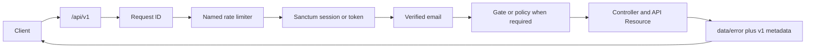
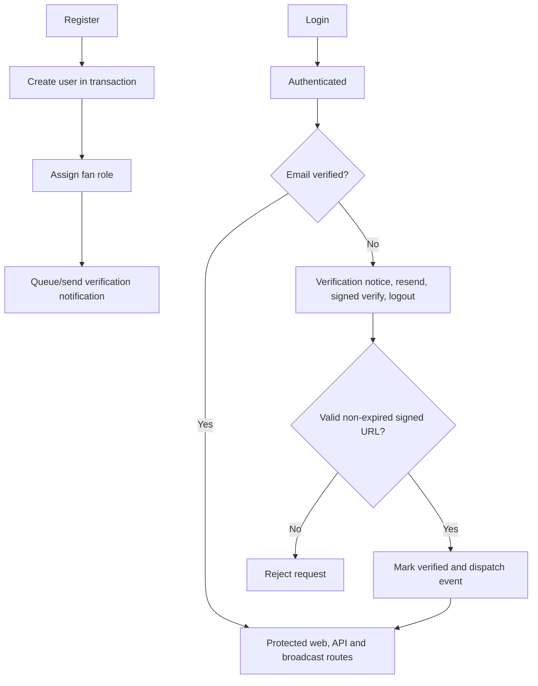
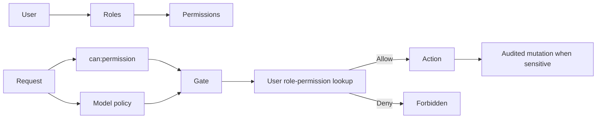
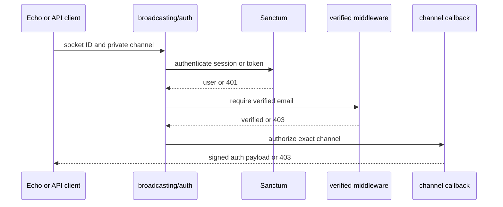
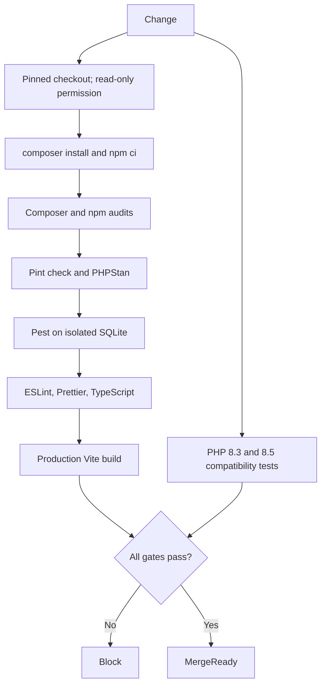

# Foundation Architecture

## Decisions and Boundaries

The application remains a Laravel modular monolith. Prompt 2 adds only cross-cutting security and the smallest fandom-neutral domain spine. Integer primary keys and standard Eloquent relationships match the existing repository. No repository pattern, CQRS, tenancy, package modules, UI administration, community feature, or external content ingestion is introduced.

Roles and permissions are first-party, database-backed reference data. Gates and policies are the backend authority. Role mutations go through actions that write sanitized audit records. Supernatural remains future data, never a shared-code discriminator.

## 1. Web Request Flow

```mermaid
flowchart LR
    Browser --> WebRoute["Web or Fortify route"]
    WebRoute --> Session["Cookies, session, CSRF"]
    Session --> RequestId["Assign request ID"]
    RequestId --> Auth["Authentication middleware"]
    Auth --> Verify["Verified-email enforcement"]
    Verify --> Gate["Gate or policy"]
    Gate --> Controller["Controller, Fortify action, or Inertia page"]
    Controller --> Model["Eloquent models"]
    Model --> Database[(Database)]
    Controller --> Browser
```



## 2. API Request Flow



The public health endpoint skips identity but remains rate limited. API errors are normalized centrally rather than ad hoc in controllers.

## 3. Authentication and Verification Flow



`EnsureVerifiedUserAccess` also covers authenticated Fortify management routes, while explicit `verified` middleware protects application/API/broadcast groups.

## 4. Authorization Flow



Frontend navigation may reflect permissions for usability but cannot grant access. Sanctum abilities are additive token restrictions, not authorization replacements.

## 5. Role and Permission Relationships

```mermaid
erDiagram
    USERS }o--o{ ROLES : role_user
    ROLES }o--o{ PERMISSIONS : permission_role
    USERS ||--o{ AUDIT_LOGS : actor
    USERS ||--o{ AUDIT_LOGS : auditable
    ROLES {
        bigint id PK
        string name UK
        string label
    }
    PERMISSIONS {
        bigint id PK
        string name UK
        string label
    }
    AUDIT_LOGS {
        bigint id PK
        bigint actor_user_id nullable
        string event
        string auditable_type nullable
        bigint auditable_id nullable
        json metadata nullable
        string request_id nullable
    }
```

`fan`, `contributor`, `moderator`, and `administrator` definitions are idempotently seeded. No administrator user or credential is seeded. Unique pivot constraints prevent duplicate assignments.

## 6. Universe, Source, License and Spoiler Foundation

```mermaid
erDiagram
    USERS ||--o{ UNIVERSES : creates
    USERS ||--o{ UNIVERSES : updates
    UNIVERSES ||--o{ SOURCES : contextualizes
    CONTENT_LICENSES ||--o{ SOURCES : governs
    UNIVERSES ||--o{ SPOILER_CONSTRAINTS : scopes
    SOURCES ||--o{ SPOILER_CONSTRAINTS : spoilerable
    UNIVERSES {
        bigint id PK
        string slug UK
        enum status
        boolean is_public
        json metadata
    }
    CONTENT_LICENSES {
        bigint id PK
        string slug UK
        boolean attribution_required nullable
        boolean commercial_use_allowed nullable
        boolean derivative_use_allowed nullable
    }
    SOURCES {
        bigint id PK
        bigint universe_id nullable
        bigint content_license_id nullable
        string canonical_url
        enum source_type
        json metadata
    }
    SPOILER_CONSTRAINTS {
        bigint id PK
        bigint universe_id FK
        string spoilerable_type
        bigint spoilerable_id
        enum severity
        json earliest_progress
        string warning
    }
```

Nullable license-right booleans preserve “unknown.” The polymorphic spoiler contract and `HasSpoilerConstraints` trait can later attach to series, seasons, episodes, characters, posts, messages, search documents, notifications and AI answers without hardcoding episode/season structures now. A source is the first valid spoilerable entity because external references may themselves reveal protected content.

## 7. Broadcasting Authorization Flow



Reverb defaults off, origins are explicit, client events default off, and future channels must validate membership/ownership or permission in addition to route authentication.

## 8. CI Quality-Gate Flow



CI never deploys, writes repository content, uses production services, or silently ignores a failure.

## Naming and Extension Points

- PHP enums use TitleCase cases and stable lowercase/string values.
- Permission names use `domain.action`; audit events use `domain.past_tense_action`.
- API routes/names use `api.v1.*`; breaking changes require a new URL version.
- Future domain models add factories, policies, source/license/spoiler relationships and tests before UI.
- Future administration and moderation UI may consume the existing protected capability routes but must remain distinct from the fan dashboard.

## Deferred Decisions

Software licensing, account deletion/retention, browser/accessibility test tooling, deployment/backup/monitoring, UI primitive consolidation, search, media storage/providers, content revisions, mobile token/device lifecycle, community, chat and immersive rendering remain deferred. No decision here grants rights to third-party content.
