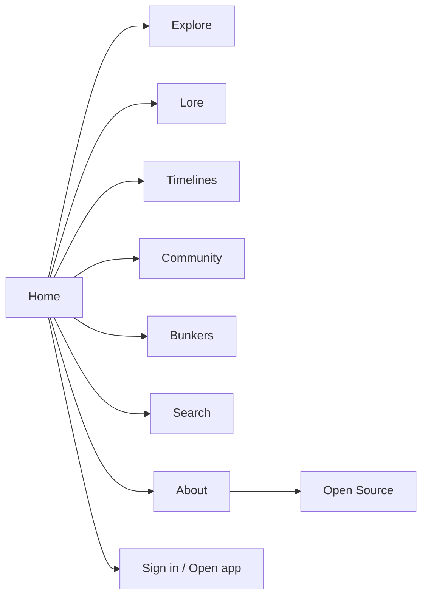
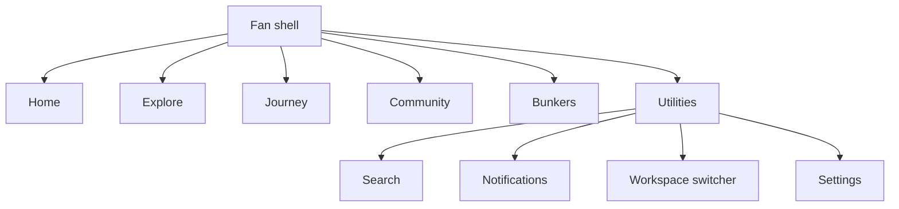
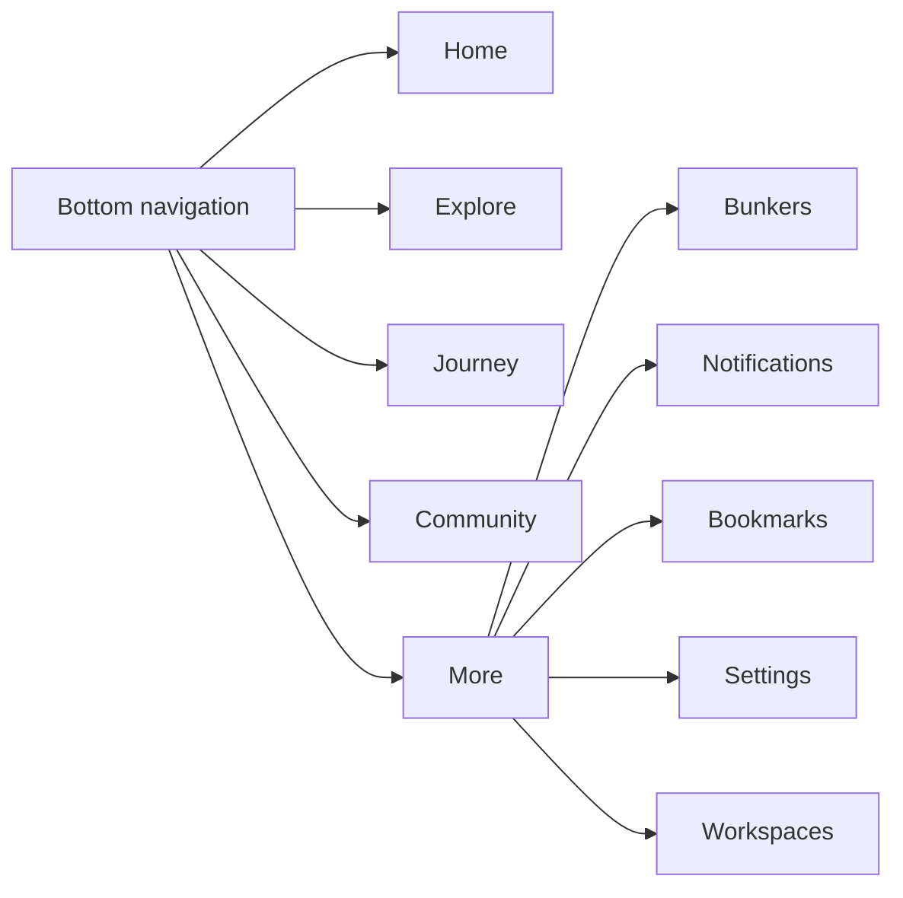
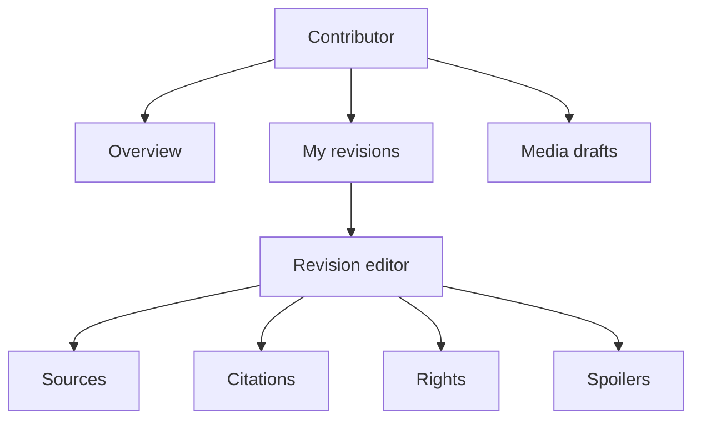
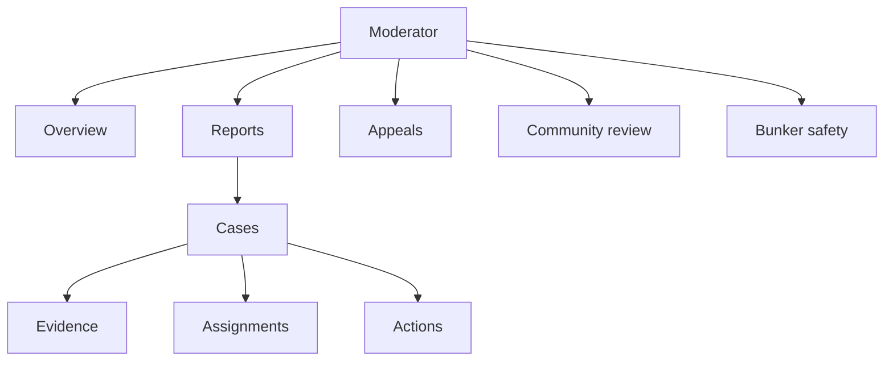
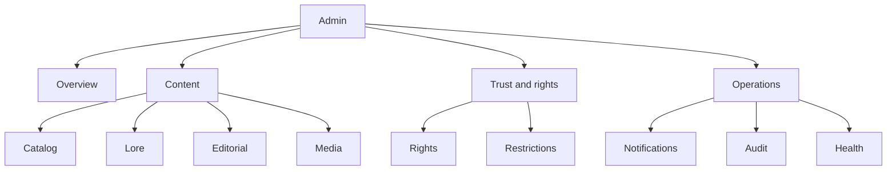

# Information Architecture

## Public navigation

Desktop primary: Explore, Lore, Timelines, Community, Bunkers, Search. Secondary utility: About, Open Source, Sign In; authenticated visitors receive “Open app.” “Archive” is the Explore landing label, not a duplicate destination.

Mobile uses a conventional menu sheet with the same hierarchy, visible Search, sign-in/app CTA, and policy/footer links. Essential destinations never depend on hover or an immersive canvas.

## Fan application navigation

Desktop uses a persistent left sidebar and compact top utility bar. Primary destinations are Home, Explore, Journey, Community, and Bunkers. Notifications, global Search, workspace switcher, help, and profile are utilities. Context sub-navigation appears within a feature rather than expanding the global sidebar.

## Mobile navigation

The bottom bar contains five reachable destinations: Home, Explore, Journey, Community, More. Bunkers, Notifications, Settings, reports, bookmarks, and eligible workspaces live in More; notifications also have a labelled header action. Search is a persistent header action and command overlay.

## Contributor workspace

Contributor status filters are Draft, In review, Changes requested, Approved, and Applied. A task switcher, not a giant sidebar, moves between evidence substeps. Submission remains a deliberate final action.

## Moderator workspace

Cases are the investigation context. Evidence, restrictions, and appeals are never free-browsing databases. Queues retain URL-backed filters and saved view state only where the backend supports it.

## Administration workspace

User, role, feature-flag, platform-setting, notification-operation, audit, and diagnostic screens stay absent or visibly “backend required” until safe operational APIs exist. Direct role editing is not designed as an active control.

## Navigation behaviour

- Breadcrumbs begin below the shell and use human record names only when authorized.
- Back links are supplemental; every screen has a stable hierarchy destination.
- Desktop sidebar collapse preserves accessible names/tooltips. Mobile sheets restore focus to their trigger.
- Workspace switcher lists only authorized surfaces and explains context; it does not enumerate permissions.
- Search results preserve query/filter state in the URL. Cursor pagination exposes next/previous navigation without fabricating page totals.

## Prompt 15 public navigation

Until Prompt 16 implements public knowledge routes, the live primary public navigation is Home, About, and Open Source. Accessibility, Content Policy, and Copyright and Takedown are footer Trust links. Guests receive Sign in/Create account; authenticated visitors receive Dashboard/Open app. Proposed Explore, Lore, Timeline, Search, Community, and Bunker links remain absent rather than dead.
