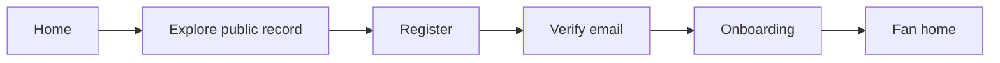
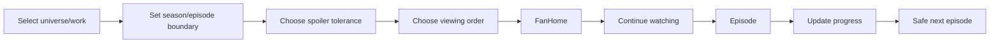
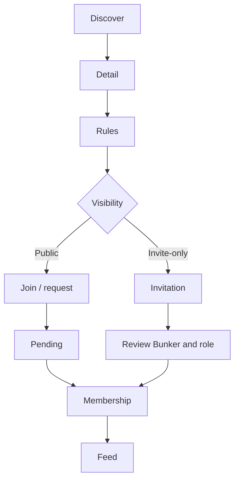
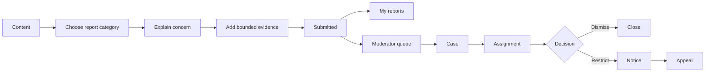
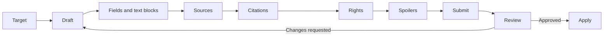

# Core User Flows

Every flow uses the shared state vocabulary in `11-forms-and-application-states.md`: skeleton during initial read, inline pending state for writes, request-ID-aware recovery, generic privacy-safe denial, and focus movement to the resulting heading/status.

## Visitor to registered fan

Entry points: public header, contextual save/join CTA, and homepage CTA. Registration and verification already exist; onboarding page flow is a minor backend gap because completion state and staged save semantics are not explicit. Failure preserves entered data; mobile uses one task per screen; all steps expose heading, progress text, and skip/return rules.

## First Journey and continue watching

Existing Journey, progress, preferences, viewing-order, and continue-watching APIs support the core. Onboarding orchestration is proposed. Optimistic progress may update visually but rolls back on conflict/network failure. A lock-version conflict opens a comparison/reload state. Screen readers receive the new progress value and next item via a polite live region.

## Bunker membership

Unauthorized private Bunkers return not found. Bans, expired invitations, blocks, and unavailable join paths use generic safe copy. Local role is shown after authorized membership only. Mobile rules remain readable before the sticky join action.

## Community post creation

The current API supports post, references, spoiler classification, eligible Media attachment, tags, mentions, polls, and publish-at-create behavior. A true server draft/preview lifecycle is not present, so preview is local and recoverable; draft persistence is a minor backend gap. Membership, restriction, mention safety, and Media rights are rechecked on submit.

## Reporting and moderation

Reporter identity, private evidence, internal notes, and unrelated Journey data never appear to subjects. Case access remains policy-scoped. Dangerous action forms summarize subject, scope, duration, reversibility, public reason, and private-note boundary before confirmation.

## Editorial review

Each step declares required evidence before submission. Optimistic-lock conflicts compare server/current versions without overwriting. Reviewers see attribution and evidence but not unrelated private data. Mobile supports review/read and bounded edits; complex diff editing is optimized for tablet/desktop without blocking keyboard use.

## Search to knowledge discovery

Open global Search → receive spoiler-safe suggestions → submit → apply URL-backed type/universe/locale filters → select a result → inspect related records, relationships, sources, and timeline context. Empty and spoiler-filtered states are distinct. Suggestions never contain text withheld by the backend.

## Block or mute

User action menu → select Block or Mute → plain-language impact summary → configure mute scope/expiry when applicable → confirm → remove affected content locally after server success. Errors never reveal direction. Target receives no notification. Reporting remains available.

## Flow-state completion matrix

| Flow | Entry points | Access boundary | Loading / error / restricted | Success | Mobile | Accessibility |
| --- | --- | --- | --- | --- | --- | --- |
| Visitor → fan | header/contextual CTA | guest; verified required after auth | Auth A1; preserve input; unverified returns to notice | focus Fan Home heading | one task/step | step title, error summary, announced completion |
| First onboarding | verification completion/settings | A/V owner; proposed completion state | O1; unsupported checkpoint labelled | summary then Fan Home | full-screen sequential steps | ordered progress text, fieldsets, back control |
| Continue watching | Fan Home/Journey/work | A/V owner | O1; conflict/offline rollback; spoiler state | progress and next item announced | sticky one-hand update | valued control, polite status, no forced focus |
| Join public Bunker | directory/detail | A/V; visibility, ban, restriction, block checks | C1; private is 404; pending explicit | membership status then feed | rules before sticky action | role/rules text, focused confirmation |
| Accept invitation | safe notification/action route | invited A/V only; token lifecycle | C1; expired/invalid generic | membership and Bunker link | full-screen review | role consequence before confirm |
| Create post | Community/Bunker CTA | A/V; membership/restriction/safety | C1; preserve safe draft locally; server field errors | navigate to published post | full-screen composer | labelled sections, summary, keyboard preview |
| Report content | record menu/restriction state | A/V; target visibility/report policy | S1; confidentiality maintained; rate limit | report reference and My Reports link | sequential form | category fieldset, evidence instructions, focus receipt |
| Block/mute | authorized user menu/settings | A/V owner; never target-readable | S1; generic error, no direction | local content reconciles after response | bottom sheet confirmation | consequence title, scope fieldset, target named safely |
| Editorial revision | contributor target/workspace | granular contributor/reviewer capabilities | W1; evidence checklist, lock conflict | status changes to In review/Approved/Applied | bounded edits; desktop diff | structured diff, field links, status announcement |
| Moderator case | queues/case link | permission and case scope | W1; no reporter/Journey leakage; conflict handling | immutable action/closure timeline update | card queue + full detail | table/card parity, dangerous confirmation, focus timeline |
| Search discovery | global control/public/fan shell | public or viewer-aware | P1; safe suggestion/empty/spoiler-filtered states | focus result page heading | full-screen overlay + filter drawer | combobox semantics, result count/status, list alternative |

## Prompt 14 implemented onboarding flow

Registration now creates an incomplete server checkpoint in the same transaction. Verification resolves that checkpoint; interruption resumes its stable route. Each current submission advances once, earlier steps remain editable, future/stale submissions show a 409 conflict, and completion redirects to Fan Home. Empty Catalog data skips interest-dependent progress/order while still requiring explicit spoiler and privacy confirmation. Platform suspension takes precedence and settings/security/logout remain recovery routes.
