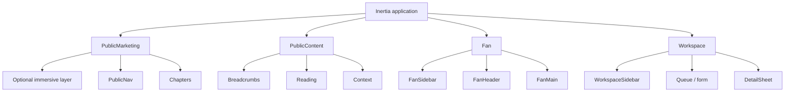

# Layout and Responsive System

## Layout hierarchy

## Public marketing layout

Full-bleed sections surround a semantic contained document. A sticky, contrast-safe navigation yields to content after scrolling. “Skip intro” targets the first substantive section. Ambient/video controls are labelled and persistent; sound is off until explicitly enabled. Essential text/CTA renders before and independently of cinematic code.

## Public content layout

Desktop: breadcrumbs, 7–8 column main reading area, 3–4 column context/source panel, then related content. Tablet stacks source/context below the lead. Mobile uses one column; sources open in a labelled full-screen sheet but remain reachable as an inline end section.

## Fan layout

Laptop+: 240–280px collapsible sidebar, 56px utility header, fluid main content up to 1440px, optional 320–400px detail panel. Tablet uses rail/sidebar sheet. Mobile uses safe-area bottom navigation, contextual top header, one-column main, and full-screen task sheets.

## Workspace layout

Laptop+: 256px dedicated sidebar, breadcrumb/header, filter toolbar, table/queue, optional 400–520px detail sheet. Wide desktop may show queue and detail split view. Tablet defaults to queue then full-width detail. Phone transforms tables into labelled record cards; bulk actions appear only where safe and remain keyboard accessible on larger screens.

## Breakpoint transformations

| Viewport | Navigation | Content | Overlays | Dense data |
| --- | --- | --- | --- | --- |
| 320–479 | five-item bottom bar; menu sheet | one column; edge padding 16px | full-screen dialog/drawer | labelled cards; no horizontal dependency |
| 480–767 | same, roomier controls | one column; optional two-up compact cards | full-screen sheets | cards or scrollable table with alternative |
| 768–1023 | rail or sheet; no permanent workspace sidebar | 8-column grid | side sheet where appropriate | table with column priority |
| 1024–1439 | persistent collapsible sidebar | 12-column content | modal/detail sheet | standard table + filters |
| 1440–1919 | persistent sidebar, optional split detail | wide 12-column | detail panel | more columns, not smaller type |
| 1920+ | centered max-width shell | whitespace/secondary context, never stretched prose | stable max widths | optional queue/detail/audit tri-pane |

## Domain transformations

- Relationship graph: graph + side panel on desktop; simplified graph plus searchable structured relationship list on mobile.
- Timeline: spatial/horizontal enhancement on desktop; vertical ordered list everywhere and primary on mobile.
- Community: feed/context sidebar on desktop; single column and full-screen composer on mobile.
- Filters: persistent sidebar/toolbar desktop; labelled Drawer/Sheet mobile with applied-filter summary.
- Actions: one obvious primary action; secondary actions in visible toolbar; destructive/rare actions in labelled overflow menus.
- Touch targets target at least 44×44 CSS pixels; sticky controls account for safe-area insets and do not cover validation or content.

## Prompt 13 implementation note

Public Marketing, Public Content, Fan, and configurable Workspace layouts are implemented. Only Public Marketing and Fan are mounted because no frontend workspace pages exist. The Fan shell uses the existing responsive Sidebar on tablet/desktop and safe-area bottom navigation on mobile.
