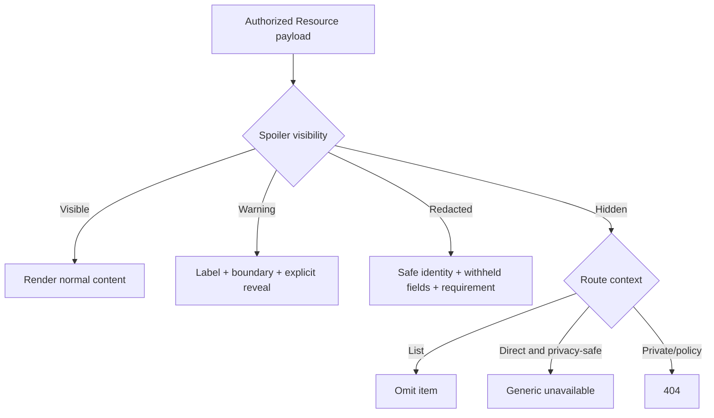

# Spoiler, Moderation, and Safety UI

## Spoiler component contract

Backend severity maps to labelled presentation: safe, minor, moderate, major, finale. Severity never decides authorization; the backend Resource state does.

| State | DOM/data rule | UI | Actions | Announcement |
| --- | --- | --- | --- | --- |
| Visible | normal authorized fields | standard component | normal actions | none |
| Warning | safe fields returned; protected fields only if backend allows reveal | amber label, severity, earliest-safe boundary | explicit Reveal; settings link | warning text before content |
| Redacted | protected fields absent/null | safe identity, field placeholders, reason/boundary | Reveal only when backend contract permits | “Spoiler-sensitive details withheld” |
| Hidden | item omitted or generic direct-route response | no leaked count/preview | return/search/preferences as appropriate | generic state heading |

Session reveal is page/session-local by default and resets on navigation/session end. A persistent preference change requires the existing Journey preference API and explains that future content may be revealed. CSS blur is decorative only; sensitive text must not exist in the DOM. Notification previews, polls, Media, search suggestions, related content, and link metadata follow the same contract.

## Distinct safety states

| State | User-facing treatment | Available actions | Private detail rule |
| --- | --- | --- | --- |
| Spoiler redaction | “Details withheld for your spoiler settings” | reveal if allowed, update preference, return | no protected text |
| Content restriction | “This content is unavailable” with public-safe reason when supplied | appeal/report/support when eligible | internal reason/note absent |
| User restriction | account-level notice with scope, duration, public reason | appeal, view notifications, sign out | no case notes/reporter identity |
| Bunker-local ban | Bunker-specific access notice when the user legitimately knows membership | local appeal/contact if supported, return | private notes absent; private Bunker remains 404 otherwise |
| Archived | neutral historical state | view retained record, navigate related | no active mutation |
| Deleted | authored record unavailable/deleted identity treatment | return/report retained evidence when eligible | no deleted personal data |
| Moderator removed | public-safe removal label | appeal/report/support where applicable | no moderator identity/private rationale |
| Rights/takedown | legal/rights unavailable state | rights contact/takedown policy | legal notes absent |
| Private Bunker | 404 for unauthorized visitor | return/search public Bunkers | existence/membership not confirmed |
| Blocked interaction | “This interaction is unavailable” | close, report remains available | no block direction |
| Muted personalization | owner-only settings state | change scope/expiry, unmute | target never notified |
| Permission denial | capability-safe denial | return/workspace switch if authorized | no permission keys |

## Moderator and operator views

Authorized moderation states may add case reference, attributable action timeline, public/private reason separation, scope, duration, lock version, and appeal status. Audit history is chronological and immutable-looking; private notes are never copied into ordinary user notices. Dangerous actions show target, scope, duration, evidence basis, reversibility, and downstream effects, and require explicit confirmation.

## Privacy invariants

- Reporter identity is not displayed to subjects or Bunker-local operators.
- Block/mute lists are owner-only; block direction never appears in errors or profiles.
- Private Bunker counts, names, and membership do not leak through search, breadcrumbs, or error copy.
- Moderation screens never surface private Journey, notes, bookmarks, ratings, or notification content without a future explicit case-scoped contract.
- Spoiler, moderation, rights, missing-data, and technical-error states use different labels/icons and do not collapse to one generic state except where privacy requires it.
