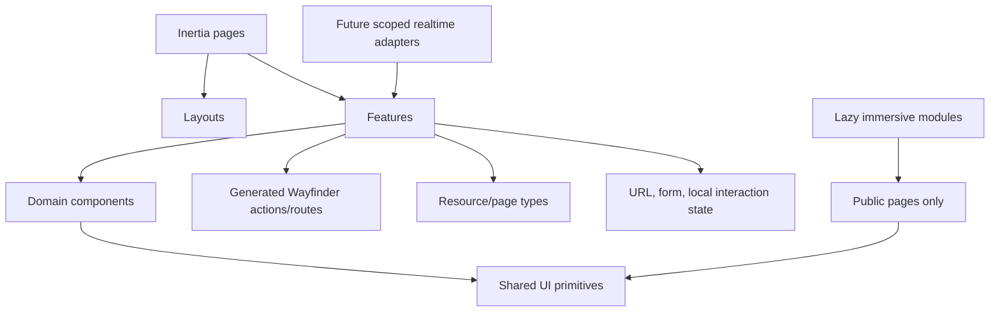

# Frontend Technical Architecture

## Current constraints

The application uses Inertia 3, React 19, TypeScript, Tailwind CSS 4, Wayfinder, shadcn/Radix, Sonner, TanStack Table, Recharts, and optional Echo configuration. Axios, a client query cache, Storybook, component test runner, accessibility runner, motion library, and WebGL library are not installed. Do not design current behavior around them.

## Feature architecture



## Recommended directory responsibilities

```text
resources/js/
├── app/                  # providers, error/event handling, capability-safe shared props
├── layouts/              # public-marketing, public-content, fan, workspace, auth, settings
├── pages/                # route entry points; thin orchestration only
├── features/
│   ├── catalog/          # components, hooks, mappers, types local to Catalog
│   ├── lore/
│   ├── journey/
│   ├── community/
│   ├── bunkers/
│   ├── notifications/
│   ├── interaction-safety/
│   ├── reporting/
│   ├── editorial/
│   └── moderation/
├── components/
│   ├── ui/               # existing shadcn source; generic primitives
│   ├── domain/           # intentionally cross-feature read components only
│   └── immersive/        # lazy public-only enhancement shells
├── hooks/                # truly shared hooks
├── lib/                  # error envelope, cursor, formatting, storage-safe helpers
├── types/                # shared API envelope, auth, navigation, capabilities
├── actions/              # generated; never hand edited
├── routes/               # generated; never hand edited
└── wayfinder/            # generated/runtime integration
```

Actual page routes continue using lowercase/kebab file paths and the existing `@/` alias. Feature folders are introduced only as Prompt 13+ needs them; no empty scaffolding is created.

## Data and state rules

- Inertia page props provide page identity, initial authorized Resource data, effective capabilities, flash, and request ID.
- `<Form>` handles conventional server mutations; `useForm` handles multi-step or richer local forms; `useHttp` handles JSON search/inline API actions. No Axios assumption.
- URL query parameters own shareable filters, sorts, selected tabs, and cursor direction. Unsupported filters are never sent.
- Cursor collections expose next/previous, not invented totals or page numbers.
- Optimistic UI is limited to reversible low-risk actions (progress, reactions, notification read) with automatic rollback. Reports, blocks, moderation, rights, and destructive changes wait for server success.
- Modal routing is used only when a task must be shareable/history-aware; otherwise Dialog/Sheet state is local and restores focus.
- Notification state starts with page/API data. Echo subscriptions remain absent until a later explicit delivery contract; Prompt 13 does not enable them.
- Sensitive Resources are never written wholesale to browser storage. Unsent safe text recovery is per form and documented.

## Error and permission mapping

One typed v1 envelope maps stable error codes/statuses to field, conflict, verification, rate-limit, forbidden, not-found, offline, and server states. Components receive effective human capabilities (`canCreatePost`, `canReviewRevision`) rather than raw permission-name arrays. Server policy remains authoritative.

## Animation and WebGL isolation

Immersive modules are dynamic imports inside public pages with a static fallback at the boundary. They cannot import feature mutation actions or private state. Rendering errors collapse to the fallback. Motion preferences live in a small effects context independent of appearance theme.

## Testing architecture

- **Unit:** formatters, safe error mapping, permission/capability presentation, spoiler-state mapping, cursor helpers, form mappers.
- **Component:** primitives after theme changes; spoiler/restriction states; notification item; Community post/poll; progress controls; revision diff; moderation forms.
- **Integration/browser:** auth/verification, onboarding, progress conflict, membership/invitation, post/report, block/mute, notification settings, workspace authorization.
- **Accessibility:** automated checks only after approved tooling; keyboard/focus/reduced-motion/manual screen-reader checks remain required regardless.
- **Visual regression:** shells, responsive navigation, state panels, spoiler variants, dense workspace tables, and public hero fallbacks.

Prompt 13 may recommend the minimum testing dependency set, but dependency installation requires explicit approval and must include maintenance/license/security review.

## Prompt 14 implementation note

`features/onboarding` owns types and shared step components; `layouts/onboarding` owns progress/navigation/focus; thin pages own local selection state; generated controller helpers own route contracts. Server props contain bounded published identity data only. Inertia `<Form>` owns mutations and error bags. No query cache, client store, Axios, test runner, or storage helper was introduced.
