# UI Implementation Sequence

## Roadmap

```mermaid
flowchart LR
    P13["Prompt 13: system + shells"] --> P14["Prompt 14: auth + onboarding"]
    P14 --> P15["Prompt 15: public website"]
    P15 --> P16["Prompt 16: Catalog + Lore + Search"]
    P16 --> P17["Prompt 17: Fan Journey"]
    P17 --> P18["Prompt 18: Community + Bunkers"]
    P18 --> P19["Prompt 19: Contributor"]
    P19 --> P20["Prompt 20: Moderation + Admin"]
    P20 --> Later["Later: Messaging / deferred domains"]
```

## Prompt 13 — Design system and application shells

- Scope: semantic tokens, typography, reusable state/status components, Public/Fan/Workspace layouts, responsive navigation, accessibility baseline, Story/fixture strategy using existing tooling unless dependencies are separately approved.
- Screens: shell-only states for PW-01/PW-04, FA-01, CW-01, MO-01, AD-01; do not connect domain data.
- Components: Button/Field/Card/Badge consistency audit; `PageHeader`, `StatePanel`, `StatusBadge`, `SpoilerBoundary` shell, navigation, breadcrumbs, command-search shell.
- APIs: `/api/v1/me` for capability-safe shell context only; no new product API.
- Tests: existing build/type/lint plus shell render, keyboard navigation, focus, responsive and reduced-motion checks using approved repository tooling.
- Exit: all shells render without privileged-data leakage; mobile/desktop navigation works; semantic tokens pass measured contrast; no cinematic bundle in Fan/workspace.
- Exclusions: onboarding, product data pages, WebGL, Messaging, domain mutations, backend redesign.

## Prompt 14 — Authentication and onboarding

Auth pages, verification, passkeys/2FA, suspended state, onboarding and spoiler/progress/order defaults. Depends on Prompt 13. Existing Fortify/settings/Journey APIs are reused; onboarding checkpoint/completion needs a minor backend decision. Exit: keyboard-complete auth and recoverable onboarding with explicit supported/deferred steps. Excludes public cinematic work and Community.

## Prompt 15 — Public website

Public navigation, homepage, About, Open Source, policy/accessibility pages, 404/restricted/maintenance states. Depends on public shell and approved original asset plan. APIs: health plus public summaries; no new domain mutations. Tests cover no-JS/static fallback, reduced motion, failed enhancement, SEO/landmarks. Excludes public detail catalogs until Prompt 16 and any copyrighted assets.

## Prompt 16 — Public Catalog, Lore, Search

PW-03–21 and CL/SE read surfaces: universe/work/season/episode, Lore, relationships, timelines, Media, sources, search/suggestions/related, spoiler state matrix. Depends on public content shell and backend public APIs. Tests cover hidden/redacted omission, cursor/filter URL state, private Bunker exclusion, structured alternatives to graphs. Excludes content editing.

## Prompt 17 — Fan dashboard and Journey

FA-01–15, fan versions of Catalog/Lore, watchlists, favourites, ratings, notes, notifications and privacy/spoiler settings. Uses existing owner APIs and conflict rules. Exit includes private-data boundaries, progress correction, mobile one-handed actions, and no exposed progress-event history by default. Search history remains excluded until a safe API exists.

## Prompt 18 — Community and Bunkers

CO-01–25, Community notifications/bookmarks, IS-01–06, and reporting entry points. Uses existing Community/Bunker/Interaction Safety APIs. Tests cover private Bunker 404, local roles, invitations, mention/block/mute behavior, feed spoiler states, report availability, and unsent composer recovery. Persistent post drafts and Community Search are not falsely added.

## Prompt 19 — Contributor workspace

CW-01–17: revisions, items/blocks, sources/citations, rights/spoiler requirements, eligible Media. Depends on workspace shell and contributor capability props. Tests cover ownership/reviewer boundaries, evidence requirements, private notes, optimistic conflicts, and upload/quarantine state. No broad Catalog administration.

## Prompt 20 — Moderation and administration

Implement backend-ready MO and AD screens first: reports/cases/actions/restrictions/appeals, Catalog/Lore/editorial/rights/Media/spoiler management. Missing operational APIs (users/roles, audit, flags/settings, notification registry/delivery diagnostics) remain disabled roadmap entries until separately implemented. Tests cover case scope, reporter anonymity, Journey isolation, dangerous confirmations, and mobile table alternatives.

## Deferred sequence

Messaging, Bunker chat, presence, typing, receipts, Watch Rooms, Case Boards, gamification, conventions/events, push/mobile, and realtime product delivery return only after backend phases exist and core web surfaces are usable. Existing generic chat primitives do not prove Messaging capability.

## Exact Prompt 13 objective

> Implement the approved Prompt 12 design-system foundation and responsive application shells only: replace the Laravel starter visual identity with original fandom-neutral semantic tokens and typography; build accessible Public Marketing, Public Content, Fan, Contributor/Moderator/Administration workspace shells; implement desktop, tablet, and mobile navigation; add reusable loading, empty, error, restricted, spoiler, conflict, and offline state components; reuse the existing Tailwind CSS 4, shadcn/Radix, Lucide, Inertia 3, React 19, and Wayfinder stack; preserve all backend/API behavior and uncommitted Prompt 10–12 work; add proportionate frontend/Pest accessibility and navigation coverage using existing dependencies unless any new dependency receives explicit approval; do not implement domain screens, onboarding, cinematic WebGL, Messaging, chat, realtime delivery, mobile, or copyrighted assets.

Prompt 13 is implemented. Prompt 14 is next, subject to the documented onboarding completion/checkpoint backend decision; Prompt 15 must not be pulled forward.

## Prompt 14 completion

Prompt 14 is implemented: branded auth regression improvements, platform suspension notice, server workflow state, existing-user completion backfill, Fortify lifecycle integration, seven resumable steps, typed domain persistence, empty-data paths, optimistic conflict UX, responsive/accessibility behavior, tests, and documentation. Prompt 15 is the next allowed phase and must stay limited to the public website/static policy/error surfaces described above.

## Prompt 15 completion

Prompt 15 is implemented: complete static-first cinematic homepage, supported public information/policy pages, route-safe public navigation and footer, effects preference, reduced-motion/Data Saver fallbacks, metadata/structured-data foundation, responsive original CSS/SVG visuals, tests, and documentation. Prompt 16 is next and remains responsible for public Catalog, Lore, Timeline, Search, Media/source, and viewing-order screens.
## Prompt 15B completion boundary

The cinematic runtime, homepage narrative, public navigation, media shells, rights gates, fallback modes, and restrained global transition layer precede Prompt 16. Prompt 16 may consume the runtime for real Catalog/Lore/Timeline/Media/Search pages but must not move domain data or rights decisions into Canvas/client-only state.
